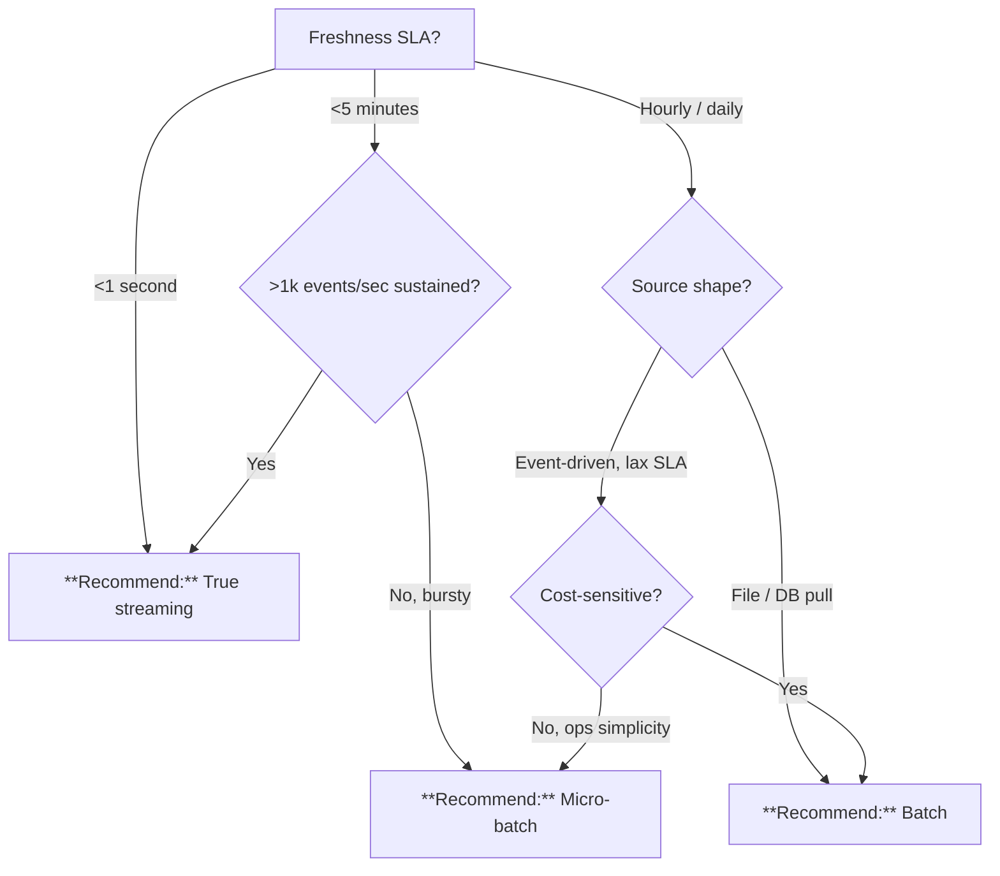

# Batch vs. Streaming Ingestion

> **Last Updated:** 2026-04-19 | **Status:** Active | **Audience:** Data Engineers

## TL;DR

<1 second SLA or >1k events/sec sustained: **True streaming** (Event Hubs + ADX / Structured Streaming). <5 minute SLA with bursty volume: **Micro-batch** (Delta Live Tables). Hourly/daily file-drop or DB pull: **Batch** (ADF + dbt).

## When this question comes up

- Onboarding a new telemetry source.
- Replacing a nightly SSIS job with something more responsive.
- Scoping latency SLAs with business owners.

## Decision tree

## Per-recommendation detail

### Recommend: True streaming

**When:** IoT, anomaly detection, real-time dashboards, operational alerting.
**Why:** Sub-second end-to-end.
**Tradeoffs:** Cost — always-on ($$$); Latency — sub-second; Compliance — Event Hubs + ADX GA in Gov IL4 (IL5 with qualifying SKUs); Skill — stream-processing patterns.
**Anti-patterns:**
- Reports consumed once a day.
- Streaming into a warehouse with no hot-path landing (ADX).

**Linked example:** [`examples/iot-streaming/`](../../examples/iot-streaming/)

### Recommend: Micro-batch

**When:** <5 minute SLA with bursty traffic, streaming semantics + batch economics.
**Why:** Right balance for "within 5 minutes" SLAs without always-on cluster costs.
**Tradeoffs:** Cost — cluster per trigger; Latency — 1-5 min; Compliance — same as Databricks (Commercial + Gov); Skill — Delta Live Tables reduces burden.
**Anti-patterns:**
- Sub-second SLA needs — trigger interval dominates.

**Linked example:** [`examples/noaa/`](../../examples/noaa/)

### Recommend: Batch

**When:** File drop / SFTP / DB pull on hourly/daily cadence.
**Why:** Cheapest and most mature.
**Tradeoffs:** Cost — lowest; Latency — minutes to hours; Compliance — full via ADF + self-hosted IR; Skill — lowest ramp.
**Anti-patterns:**
- Forcing batch when business needs <5 minutes — you will rebuild anyway.
- No bronze-layer raw copy.

**Linked example:** [`examples/usda/`](../../examples/usda/)

## Related

- Architecture: [Streaming Data Flow](../ARCHITECTURE.md#streaming-data-flow)
- Architecture: [Batch Data Flow](../ARCHITECTURE.md#batch-data-flow)
- Decision: [Kafka vs. Event Hubs vs. Service Bus](kafka-vs-eventhubs-vs-servicebus.md)
- Finding: CSA-0010
