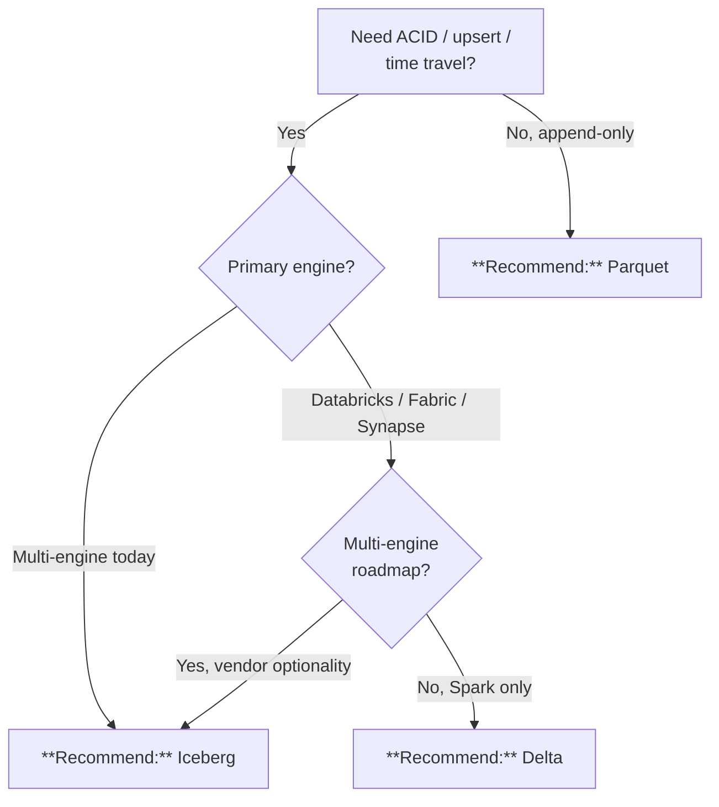

# Delta vs. Iceberg vs. Parquet

## TL;DR

Default to **Delta Lake** for the Microsoft ecosystem (Fabric, Databricks, Synapse, Direct Lake, Purview). Pick **Apache Iceberg** when multi-engine portability (Trino, Snowflake, Athena) is a hard requirement. Use plain **Parquet** only for append-only bronze landing.

## When this question comes up

- Choosing the table format for silver/gold in a new domain.
- Deciding whether to lock into Delta or preserve vendor optionality.
- Debating bronze file format for high-volume ingestion.

## Decision tree

## Per-recommendation detail

### Recommend: Delta Lake

**When:** Microsoft-ecosystem lakehouse, Direct Lake / Fabric / Databricks Spark as primary.
**Why:** First-class support everywhere in the stack; Photon; Liquid Clustering.
**Tradeoffs:** Cost — same as Parquet + tiny log overhead; Latency — sub-second with Direct Lake; Compliance — Commercial + Gov; Skill — default in Databricks.
**Anti-patterns:**
- Multi-engine (Trino / Snowflake external / Athena) is equal-citizen requirement today.

**Linked example:** [`examples/usda/`](../../examples/usda/)

### Recommend: Apache Iceberg

**When:** True multi-engine strategy (Spark + Trino + Flink + Snowflake + Athena).
**Why:** Broadest open-table-format engine support; spec-driven.
**Tradeoffs:** Cost — similar to Delta; Latency — comparable; Compliance — ADLS posture identical, catalog choice matters; Skill — lower adoption in Microsoft shops.
**Anti-patterns:**
- Pure Databricks / Fabric shop with no real multi-engine need.

**Linked example:** [`examples/commerce/`](../../examples/commerce/)

### Recommend: Parquet

**When:** Append-only bronze, archival, simple columnar storage.
**Why:** Simplest, cheapest, zero dependencies.
**Tradeoffs:** Cost — lowest; Latency — depends on partition layout; Compliance — ADLS posture; Skill — universal.
**Anti-patterns:**
- Silver / gold — loses ACID, schema evolution, time travel.
- UPSERT / MERGE semantics — promote to Delta/Iceberg.

**Linked example:** [`examples/iot-streaming/`](../../examples/iot-streaming/)

## Related

- Architecture: [Storage — OneLake Pattern](../ARCHITECTURE.md#%EF%B8%8F-storage--onelake-pattern)
- Decision: [Lakehouse vs. Warehouse vs. Lake](lakehouse-vs-warehouse-vs-lake.md)
- Finding: CSA-0010
