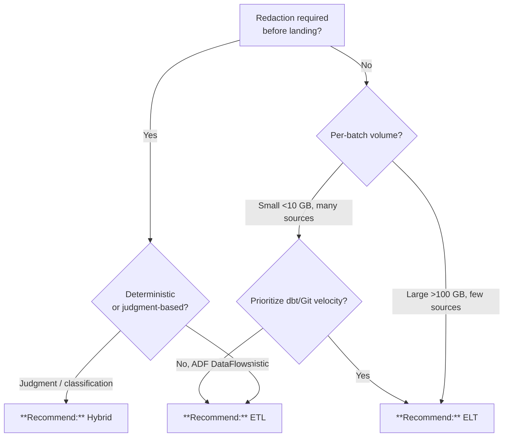

# ETL vs. ELT

## TL;DR

Default to **ELT** (land raw in bronze, transform with dbt + Databricks). Use **ETL** only when regulated data must be redacted before landing. Use a **hybrid** when redaction is narrow and the rest is ELT.

## When this question comes up

- Stand-up of a new ingestion pipeline touching PII/PHI.
- Migration of a legacy SSIS estate to Azure.
- Debate over whether to preserve raw for replay vs. discard for compliance.

## Decision tree

## Per-recommendation detail

### Recommend: ELT

**When:** Default modern pattern; raw can land; velocity matters.
**Why:** Version-controlled SQL transforms, replay from bronze, lowest $/TB.
**Tradeoffs:** Cost — cheapest; Latency — minutes; Compliance — requires bronze classification; Skill — SQL + dbt + Git.
**Anti-patterns:**
- Export-controlled data that cannot land.
- Skipping bronze classification — ELT's whole point is preserving raw.

**Linked example:** [`examples/usda/`](../../examples/usda/)

### Recommend: ETL

**When:** Sensitive data must be redacted in flight; legacy Mapping Data Flows practice.
**Why:** Strong PII/PHI posture — raw sensitive data never lands.
**Tradeoffs:** Cost — higher compute per run; Latency — depends on transform; Compliance — strongest; Skill — ADF designer or Spark.
**Anti-patterns:**
- "That's how we did it in SSIS."
- Complex ML transforms in Mapping Data Flows — move to Databricks/dbt.

**Linked example:** [`examples/tribal-health/`](../../examples/tribal-health/)

### Recommend: Hybrid

**When:** Narrow regulated fields need redaction; everything else can be ELT.
**Why:** Pragmatic Pareto — compliance + velocity.
**Tradeoffs:** Slightly higher cost than pure ELT; near-ELT latency; satisfies HIPAA/PII + preserves replay.
**Anti-patterns:**
- Redaction leg creeps into full transform pipeline.

**Linked example:** [`examples/tribal-health/`](../../examples/tribal-health/)

## Related

- Architecture: [Batch Data Flow](../ARCHITECTURE.md#batch-data-flow)
- Decision: [Batch vs. Streaming](batch-vs-streaming.md)
- Finding: CSA-0010
