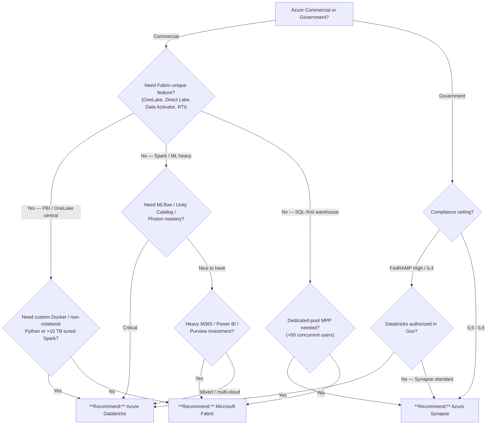

# Fabric vs. Databricks vs. Synapse

> **Last Updated:** 2026-04-19 | **Status:** Active | **Audience:** Architects + Engineering Leads

## TL;DR

For a greenfield Azure Commercial analytics workload that is Power BI-centric, pick **Microsoft Fabric**. For Spark/ML-heavy or multi-cloud workloads, pick **Azure Databricks**. For Azure Government or existing dedicated SQL pool estates, pick **Azure Synapse Analytics**.

## When this question comes up

- A new agency or business unit is scoping its first cloud analytics platform and wants one primary engine.
- An existing SQL DW or on-prem Hadoop workload is being modernized and must land on Azure.
- Leadership wants to consolidate multiple tools into a single "Fabric-equivalent" control plane.

## Decision tree

## Per-recommendation detail

### Recommend: Microsoft Fabric

**When:** Commercial tenant, Power BI / OneLake / Data Activator is central, notebooks and T-SQL cover the transformation needs.

**Why:** Unified control plane (OneLake, Data Factory, Warehouse, Power BI, Data Activator, Real-Time Intelligence) with Direct Lake eliminating Power BI semantic-model refresh cycles.

**Tradeoffs:**
- Cost: F-SKU capacity base cost ($$$) plus pay-as-you-use CU overage.
- Latency: Direct Lake sub-second over gold-layer Delta.
- Compliance: Commercial GA only; FedRAMP High not yet GA in Azure Gov.
- Skill match: Low — SQL + notebooks + Power BI.

**Anti-patterns:**
- Custom Docker images or non-notebook Python entry points.
- Any Azure Government workload today (2026-Q2).
- Teams with deep MLflow + Unity Catalog practice they do not want to give up.

**Linked example:** [`examples/commerce/`](../../examples/commerce/)

### Recommend: Azure Databricks

**When:** Spark, ML, streaming, or multi-cloud portability are critical; team has or wants MLflow + Unity Catalog expertise.

**Why:** Best-in-class Spark/Delta/Photon with the most mature lakehouse tooling; Unity Catalog gives fine-grained access control across workspaces.

**Tradeoffs:**
- Cost: DBU-based; right-sizing is an operational concern; Photon improves $/TB.
- Latency: Interactive seconds, streaming sub-minute, SQL Warehouses sub-second for BI.
- Compliance: Azure Commercial and Azure Gov (FedRAMP High, IL4, IL5 with qualifying SKUs).
- Skill match: Higher — Spark, Python/Scala, Unity Catalog required.

**Anti-patterns:**
- Pure SQL warehousing with no Spark needs.
- Workloads where Power BI Direct Lake and Data Activator are the primary requirement.

**Linked example:** [`examples/iot-streaming/`](../../examples/iot-streaming/)

### Recommend: Azure Synapse Analytics

**When:** Azure Government, existing dedicated-pool SQL DW, or IL5/IL6 compliance ceiling.

**Why:** Longest Gov compliance track record; mature dedicated MPP pools; serverless SQL for ad-hoc over ADLS.

**Tradeoffs:**
- Cost: Dedicated pools capacity-reserved ($$$); serverless SQL pay-per-TB-scanned.
- Latency: Dedicated pools sub-second for high concurrency.
- Compliance: Full FedRAMP High, IL4, IL5 in Azure Gov.
- Skill match: Medium — T-SQL first, Spark pools secondary.

**Anti-patterns:**
- Greenfield Commercial lakehouse — Fabric or Databricks wins on velocity.
- Intermittent / bursty workloads on dedicated pools — use serverless SQL or Databricks SQL Warehouse.

**Linked example:** [`examples/usda/`](../../examples/usda/)

## Related

- Architecture: [Architecture Layers](../ARCHITECTURE.md#-architecture-layers)
- Architecture: [Primary Tech Choices](../ARCHITECTURE.md#%EF%B8%8F-primary-tech-choices)
- Finding: CSA-0010 (ARCHITECTURE decision matrix lacks branching and scenario axes)
