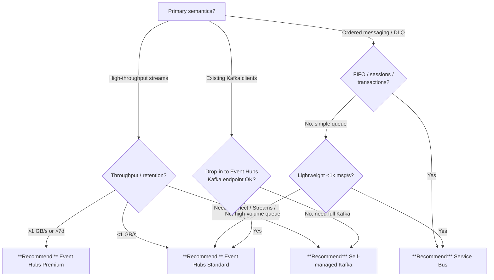

# Kafka vs. Event Hubs vs. Service Bus

> **Last Updated:** 2026-04-19 | **Status:** Active | **Audience:** Platform Architects + SREs

## TL;DR

Default to **Event Hubs (Standard)** — it speaks Kafka API and captures to ADLS. Use **Event Hubs Premium / Dedicated** for >1 GB/sec. Self-host **Kafka** only when full Kafka ecosystem (Connect, Streams, Schema Registry) is mandated. Use **Service Bus** for ordered, transactional message queuing.

## When this question comes up

- Choosing the streaming backbone for IoT, clickstream, or telemetry.
- Replacing an on-prem Kafka cluster.
- Picking between a queue and a stream for a new integration.

## Decision tree

## Per-recommendation detail

### Recommend: Event Hubs (Standard)

**When:** Default streaming backbone, <1 GB/sec, <7 day retention.
**Why:** Managed, Kafka-API compatible, Capture-to-ADLS.
**Tradeoffs:** Cost — TU-based, predictable; Latency — low ms; Compliance — Commercial + Gov IL4/IL5; Skill — Kafka API drop-in.
**Anti-patterns:**
- >1 GB/sec sustained.
- Queue-style semantics (sessions, transactions).

**Linked example:** [`examples/iot-streaming/`](../../examples/iot-streaming/)

### Recommend: Event Hubs (Premium / Dedicated)

**When:** Enterprise IoT / telemetry backbones with reserved performance needs.
**Why:** Isolated tenancy, customer-managed keys, VNet injection.
**Tradeoffs:** Cost — reserved ($$$); Latency — isolated; Compliance — same as Standard; Skill — no code change.
**Anti-patterns:**
- Bursty / intermittent — auto-inflate Standard is cheaper.

**Linked example:** [`examples/iot-streaming/`](../../examples/iot-streaming/)

### Recommend: Self-managed Kafka

**When:** Full Kafka ecosystem mandated (Connect, Streams, Schema Registry, ksqlDB).
**Why:** Vendor-neutral, full feature parity.
**Tradeoffs:** Cost — AKS + ops staff ($$$$); Latency — tuned brokers match Event Hubs; Compliance — depends on AKS; Skill — Kafka SRE.
**Anti-patterns:**
- Event Hubs Kafka API covers your case — you are paying for ops.

**Linked example:** [`examples/iot-streaming/`](../../examples/iot-streaming/)

### Recommend: Service Bus

**When:** Ordered, transactional business messaging.
**Why:** FIFO, sessions, dead-letter, transactions.
**Tradeoffs:** Cost — per-op pricing; Latency — low ms; Compliance — full Commercial + Gov; Skill — familiar enterprise pattern.
**Anti-patterns:**
- High-volume telemetry — Event Hubs is far cheaper.

**Linked example:** [`examples/commerce/`](../../examples/commerce/)

## Related

- Architecture: [Streaming Data Flow](../ARCHITECTURE.md#streaming-data-flow)
- Decision: [Batch vs. Streaming](batch-vs-streaming.md)
- Finding: CSA-0010
