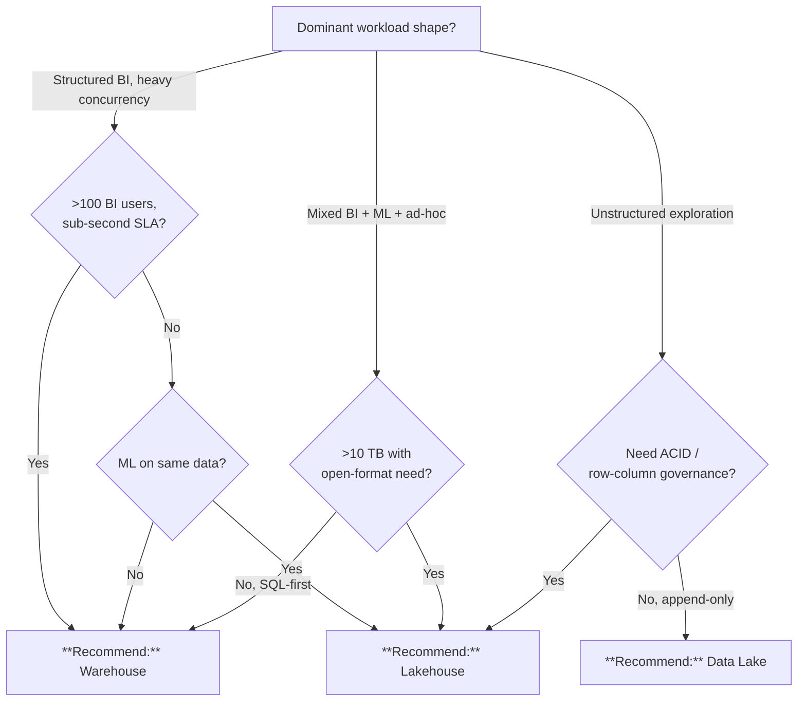

# Lakehouse vs. Warehouse vs. Data Lake

## TL;DR

Mixed BI + ML workloads on >10 TB of open-format data: pick a **Lakehouse**. Pure sub-second BI at >100 concurrent users: pick a **Warehouse**. Raw append-only exploration: a **Data Lake** is fine — but promote curated data to a lakehouse or warehouse.

## When this question comes up

- Designing the gold layer serving for a new agency workload.
- Evaluating whether to stand up Synapse dedicated pools or rely on a Delta-based lakehouse for BI.
- Debating whether to expose raw ADLS to analysts or insist on a curated tier.

## Decision tree

## Per-recommendation detail

### Recommend: Lakehouse (Delta/Iceberg on ADLS Gen2)

**When:** Mixed BI + ML, >10 TB growth, need for ACID + time travel + open formats.
**Why:** One copy of data serves all consumers with medallion tiering.
**Tradeoffs:** Cost — storage cheap, compute scales with pattern; Latency — sub-second with Direct Lake; Compliance — full Commercial + Gov via Databricks/Synapse; Skill — Delta literacy required.
**Anti-patterns:**
- No Spark/Delta expertise and <90-day timeline — start with a warehouse.
- Undifferentiated lakehouse with no bronze/silver/gold — becomes a data swamp.

**Linked example:** [`examples/usda/`](../../examples/usda/)

### Recommend: Warehouse (Synapse Dedicated Pool / Fabric Warehouse)

**When:** Pure BI at high concurrency, sub-second SLA, read-only gold consumption.
**Why:** Purpose-built MPP SQL, governed semantic models, best concurrency.
**Tradeoffs:** Cost — reserved capacity ($$$); Latency — sub-second at 100+ users; Compliance — full Commercial + Gov IL5; Skill — T-SQL first.
**Anti-patterns:**
- Sparse / intermittent workloads — idle capacity burns budget.
- ML feature generation inside the warehouse — export to lakehouse first.

**Linked example:** [`examples/usps/`](../../examples/usps/)

### Recommend: Data Lake (ADLS Gen2 raw)

**When:** Raw landing zone, archival, schema-on-read exploration.
**Why:** Cheapest storage, no lock-in, bring-your-own-compute.
**Tradeoffs:** Cost — lowest; Latency — variable, no caching; Compliance — Bronze posture; Skill — low bar.
**Anti-patterns:**
- Exposed directly to BI consumers — they will build brittle semantic layers.
- Used as system of record for curated products — promote to lakehouse/warehouse.

**Linked example:** [`examples/iot-streaming/`](../../examples/iot-streaming/)

## Related

- Architecture: [Storage — OneLake Pattern](../ARCHITECTURE.md#%EF%B8%8F-storage--onelake-pattern)
- Decision: [Delta vs. Iceberg vs. Parquet](delta-vs-iceberg-vs-parquet.md)
- Finding: CSA-0010
