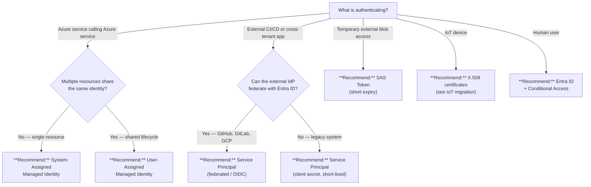

# Managed Identity vs Service Principal vs SAS Token

> **Comparative positioning note.** This document is written from the
> perspective of Microsoft Azure, Cloud Scale Analytics, and CSA Loom. Any
> description of third-party or competing products, services, pricing, or
> capabilities is derived from **publicly available documentation and sources**
> believed accurate at the time of writing, and is provided for **general
> comparison only**. We do not claim expertise in, or authority over, any
> non-Microsoft product or service; the respective vendor's official
> documentation is the authoritative source for their offerings, which may
> change over time. Nothing here is intended to disparage any vendor — where a
> competing product has genuine advantages, we aim to note them honestly.
> Verify all third-party details against the vendor's current official
> documentation before making decisions.

## TL;DR

**Managed identity** for Azure-to-Azure workloads (zero secrets to manage). **Service principal** for external integrations or cross-tenant access, preferring federated credentials (OIDC) over secrets. **SAS tokens** only for legacy or temporary blob access with short expiry.

## When this question comes up

- Granting an Azure service access to another Azure resource (Key Vault, Storage, SQL).
- Configuring a CI/CD pipeline (GitHub Actions, Azure DevOps) to deploy into Azure.
- Sharing blob data with an external partner or legacy system that cannot authenticate via Entra ID.
- Migrating from connection-string or key-based auth to identity-based auth.
- Designing an IoT device credential strategy.

## Decision tree

## Per-recommendation detail

### Recommend: System-Assigned Managed Identity

**When:** A single Azure resource (VM, App Service, Function, AKS pod) needs to call other Azure services.
**Why:** Zero secrets; lifecycle tied to the resource; auto-rotated by the platform.
**Tradeoffs:** Blast radius limited to one resource; deleted when the resource is deleted; no reuse across resources; supported only within Azure.
**Anti-patterns:**

- Trying to use managed identity from outside Azure (on-prem, other clouds).
- Creating a system-assigned identity then sharing its object ID across unrelated services.

**Linked example:** [Identity & Secrets Flow](../reference-architecture/identity-secrets-flow.md)

### Recommend: User-Assigned Managed Identity

**When:** Multiple Azure resources need the same identity (e.g., a set of microservices sharing RBAC roles).
**Why:** Decouples identity lifecycle from resource lifecycle; single RBAC assignment covers multiple consumers.
**Tradeoffs:** Slightly more management overhead (separate resource to create/track); still zero secrets; still Azure-only.
**Anti-patterns:**

- Creating one user-assigned identity per resource when system-assigned would suffice.
- Granting a single user-assigned identity overly broad permissions across unrelated workloads.

**Linked example:** [Security & Compliance Best Practices](../best-practices/security-compliance.md)

### Recommend: Service Principal (federated / OIDC)

**When:** External CI/CD (GitHub Actions, GitLab CI) or cross-tenant apps that support workload identity federation.
**Why:** No stored secrets; short-lived tokens exchanged via OIDC; auditable via Entra sign-in logs.
**Tradeoffs:** Requires IdP that supports federation; initial setup more complex than a client secret; token lifetime typically 1 hour.
**Anti-patterns:**

- Falling back to client secrets when OIDC federation is available.
- Granting the service principal Owner or Contributor at the subscription level.

**Linked example:** [Key Rotation Runbook](../runbooks/key-rotation.md)

### Recommend: Service Principal (client secret)

**When:** External system cannot federate and needs programmatic access; no alternative credential type is supported.
**Why:** Widely supported; works with any HTTP client.
**Tradeoffs:** Secret must be stored securely (Key Vault); requires rotation (90-day max recommended); auditable but higher risk if leaked; blast radius can be broad if over-permissioned.
**Anti-patterns:**

- Long-lived secrets (>6 months) with no rotation policy.
- Storing secrets in source code, environment files, or pipeline variables without vault backing.
- Using a single service principal for all environments (dev/staging/prod).

**Linked example:** [Key Rotation Runbook](../runbooks/key-rotation.md)

### Recommend: SAS Token

**When:** Sharing blob/container access with external parties that cannot authenticate via Entra ID; legacy integrations.
**Why:** Scoped to specific resource, permission, and time window; no Entra ID enrollment needed for the consumer.
**Tradeoffs:** Bearer token -- anyone with the token has access; no user-level audit trail; rotation requires re-distributing tokens; revocation requires rotating the storage account key or using stored access policies.
**Anti-patterns:**

- Embedding SAS tokens in source code or client-side JavaScript.
- Issuing SAS tokens with multi-year expiry.
- Using account-level SAS when service-level SAS would suffice.
- Choosing SAS over managed identity for Azure-to-Azure communication.

**Linked example:** [Identity & Secrets Flow](../reference-architecture/identity-secrets-flow.md)

## Related

- Architecture: [Identity & Secrets Flow](../reference-architecture/identity-secrets-flow.md)
- Best practices: [Security & Compliance](../best-practices/security-compliance.md)
- Runbook: [Key Rotation](../runbooks/key-rotation.md)
