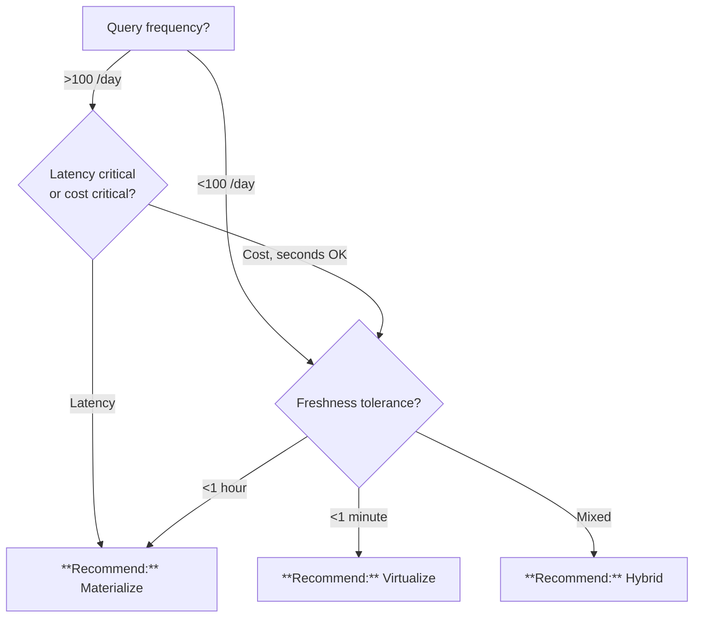

# Materialize vs. Virtualize

> **Last Updated:** 2026-04-19 | **Status:** Active | **Audience:** Data Platform + BI Leads

## TL;DR

High-volume, latency-sensitive queries: **Materialize** (Gold tables, MVs, Direct Lake). Ad-hoc, <1 min freshness: **Virtualize** (serverless SQL, external tables). Mixed: **Hybrid** — materialize the hot 20%.

## When this question comes up

- Designing the gold serving layer for a BI dashboard.
- Deciding whether a data product needs a physical copy or can query bronze/silver directly.
- Evaluating serverless SQL cost against Direct Lake.

## Decision tree

## Per-recommendation detail

### Recommend: Materialize

**When:** High-volume BI and APIs; <1 hour freshness acceptable.
**Why:** Pre-compute expensive joins; sub-second serving.
**Tradeoffs:** Cost — refresh + storage; Latency — sub-second; Compliance — inherits gold RBAC; Skill — dbt/SQL.
**Anti-patterns:**
- Refresh cadence slower than data change — stale consumers.
- Dozens of niche rollups — prune or costs creep.

**Linked example:** [`examples/commerce/`](../../examples/commerce/)

### Recommend: Virtualize

**When:** Ad-hoc exploration, <1 min freshness, low query volume.
**Why:** No refresh lag, no duplicate storage.
**Tradeoffs:** Cost — per-query ($/TB scanned); Latency — seconds; Compliance — source RBAC only; Skill — SQL-first.
**Anti-patterns:**
- High-volume BI dashboards — expensive repeated scans.
- Cross-region or hybrid networks — latency compounds.

**Linked example:** [`examples/epa/`](../../examples/epa/)

### Recommend: Hybrid

**When:** Most real CSA workloads — Pareto split.
**Why:** Materialize the 20% of queries driving 80% of traffic; virtualize the tail.
**Tradeoffs:** Balanced cost; sub-second hot paths + seconds cold; governance maturity required.
**Anti-patterns:**
- Implicit hot/cold split with no documentation.

**Linked example:** [`examples/noaa/`](../../examples/noaa/)

## Related

- Architecture: [Storage — OneLake Pattern](../ARCHITECTURE.md#%EF%B8%8F-storage--onelake-pattern)
- Decision: [Lakehouse vs. Warehouse vs. Lake](lakehouse-vs-warehouse-vs-lake.md)
- Finding: CSA-0010
