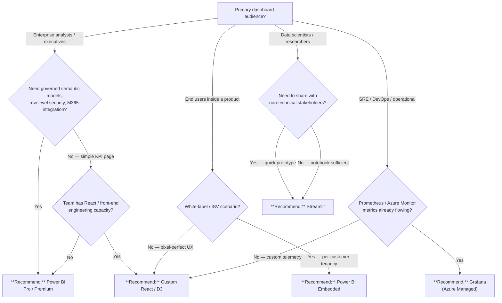

# Power BI vs Custom Dashboards

## TL;DR

Power BI for enterprise-wide BI with governance and self-service, Power BI Embedded for analytics inside your product, Grafana for operational monitoring, custom React/D3 for pixel-perfect control, and Streamlit for rapid data-science exploration.

## When this question comes up

- A project needs dashboards and the team is deciding between Power BI licensing and building custom UI.
- Analytics must be embedded inside a customer-facing application rather than a standalone portal.
- The workload is operational monitoring (uptime, metrics, alerts) rather than traditional BI.
- Data scientists want interactive exploration without waiting on a front-end team.

## Decision tree

## Per-recommendation detail

### Recommend: Power BI Pro / Premium

**When:** Enterprise-wide BI with self-service authoring, governed semantic models, row-level security, and Microsoft 365 integration.
**Why:** Best-in-class semantic layer (DAX), Direct Lake for sub-second refresh over lakehouses, built-in lineage via Purview, and familiar Excel-like authoring for business users.
**Tradeoffs:** Cost — Pro per-user or Premium capacity ($$$); Latency — sub-second with Direct Lake, minutes for import refresh; Compliance — FedRAMP High in Azure Gov; Skill — DAX + Power Query (low bar for analysts).
**Anti-patterns:**

- Embedding inside a SaaS product for external customers — use Power BI Embedded or custom React.
- Real-time operational alerting on infrastructure metrics — use Grafana.

**Linked example:** [Power BI Guide](../guides/power-bi.md) | [Power BI + Fabric Roadmap](../patterns/power-bi-fabric-roadmap.md)

### Recommend: Power BI Embedded

**When:** Analytics embedded inside a customer-facing application with per-customer row-level security, ISV multi-tenant scenarios, or white-label dashboards.
**Why:** Same Power BI rendering engine with app-owns-data authentication; A/EM SKU pricing scales with capacity rather than per-user; integrates with existing Azure AD B2C or custom auth.
**Tradeoffs:** Cost — A/EM capacity-based, can be expensive at scale; Latency — same as Power BI Premium; Compliance — inherits Power BI compliance posture; Skill — requires front-end integration work (JavaScript SDK).
**Anti-patterns:**

- Internal-only BI where Pro licensing is cheaper — use Power BI Pro.
- Need for full custom UX with non-Power-BI chart types — use React/D3.

**Linked example:** [Power BI Guide](../guides/power-bi.md)

### Recommend: Grafana (Azure Managed)

**When:** Operational monitoring, infrastructure dashboards, alerting on Prometheus, Azure Monitor, or Log Analytics data sources.
**Why:** Purpose-built for time-series visualization with native Prometheus, Azure Monitor, and Azure Data Explorer data sources; Azure Managed Grafana provides managed identity and VNet integration out of the box.
**Tradeoffs:** Cost — Azure Managed Grafana pricing by instance tier; Latency — real-time streaming panels; Compliance — inherits Azure compliance; Skill — PromQL / KQL familiarity needed.
**Anti-patterns:**

- Traditional BI with governed semantic models and self-service authoring — use Power BI.
- Customer-facing product analytics — use Power BI Embedded or custom React.

**Linked example:** [Power BI Guide](../guides/power-bi.md) (monitoring section)

### Recommend: Custom React / D3

**When:** Pixel-perfect control over visualization UX, custom chart types not available in Power BI, or deep integration into an existing React/Angular SPA.
**Why:** Full design freedom; any chart library (D3, Recharts, Visx, AG Charts); integrates natively with your app's auth, routing, and state management.
**Tradeoffs:** Cost — engineering time ($$$), ongoing maintenance; Latency — depends on API/data layer; Compliance — inherits app compliance posture; Skill — high (React + data viz + API development).
**Anti-patterns:**

- Enterprise BI with 50+ reports and self-service authoring — Power BI is faster to deliver and maintain.
- Teams without dedicated front-end engineers — use Power BI or Streamlit.

**Linked example:** [Power BI + Fabric Roadmap](../patterns/power-bi-fabric-roadmap.md) (custom integration patterns)

### Recommend: Streamlit

**When:** Data scientists need to share interactive exploration tools with stakeholders quickly, prototyping dashboards before investing in production UI.
**Why:** Python-native; deploy from a notebook to a shareable app in hours; integrates with pandas, Plotly, Altair, and ML model outputs directly.
**Tradeoffs:** Cost — minimal (App Service or Container Apps hosting); Latency — depends on backend compute; Compliance — deploy in your own Azure tenant; Skill — Python (low bar for data teams).
**Anti-patterns:**

- Production customer-facing dashboards requiring enterprise auth, RLS, and SLA — use Power BI or custom React.
- High-concurrency BI (>50 simultaneous users) — Streamlit is single-threaded per session.

**Linked example:** [Power BI Guide](../guides/power-bi.md) (comparison section)

## Related

- Guide: [Power BI](../guides/power-bi.md)
- Pattern: [Power BI + Fabric Roadmap](../patterns/power-bi-fabric-roadmap.md)
- Decision: [Fabric vs. Databricks vs. Synapse](fabric-vs-databricks-vs-synapse.md)
- Decision: [Lakehouse vs. Warehouse vs. Data Lake](lakehouse-vs-warehouse-vs-lake.md)
