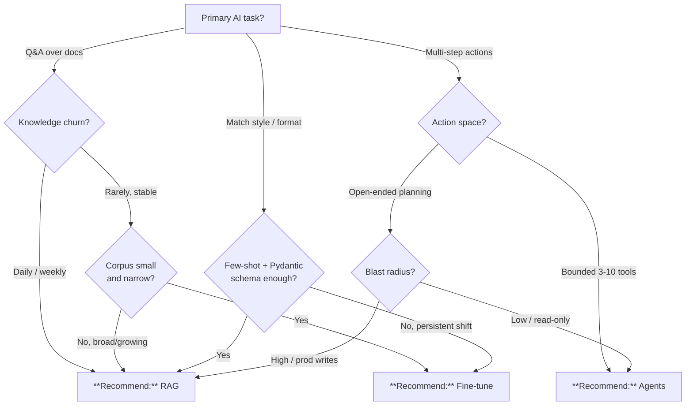

# RAG vs. Fine-Tuning vs. Agents

## TL;DR

Default to **RAG** for domain Q&A over changing knowledge. **Fine-tune** only for style or narrow syntax on a stable corpus. Use **Agents** for bounded, tool-using workflows with human-in-the-loop on write actions.

## When this question comes up

- Designing an AI feature over agency documents or operational data.
- Scoping an intelligent assistant that must take actions across systems.
- Evaluating whether to train a custom model vs. ground a general one.

## Decision tree

## Per-recommendation detail

### Recommend: RAG

**When:** Domain Q&A, changing knowledge, citable answers.
**Why:** Grounded; updates at ingest cadence; auditable.
**Tradeoffs:** Cost — embeddings + vector + LLM, scales linearly; Latency — seconds; Compliance — Azure OpenAI Commercial + Gov with data residency; Skill — Python + embedding SDKs + eval discipline.
**Anti-patterns:**

- One-shot transforms the base model already does (summarization, translation).
- Skipping evals — retrieval quality caps answer quality.

**Linked example:** [`examples/commerce/`](../../examples/commerce/)

### Recommend: Fine-tuning

**When:** Persistent style / syntax shift on stable, narrow corpus.
**Why:** Lock in domain syntax or brand voice.
**Tradeoffs:** Cost — training + custom inference ($$$); Latency — same as base; Compliance — training data residency must be proven; Skill — training data curation + eval.
**Anti-patterns:**

- Fine-tuning for fresh knowledge — use RAG.
- <1,000 examples — hurts base without meaningful gain.

**Linked example:** [`examples/tribal-health/`](../../examples/tribal-health/)

### Recommend: Agents

**When:** Bounded tool workflows (triage, classification, runbooks), human gates on writes.
**Why:** Automates multi-step reasoning over curated tools.
**Tradeoffs:** Cost — multiple LLM calls ($$$); Latency — seconds to minutes; Compliance — tool-use must be tamper-evident (CSA-0016); Skill — highest ramp.
**Anti-patterns:**

- Open-ended agent with production writes and no approval gate.
- Building an agent when a single RAG + structured output would do.

**Linked example:** [`examples/casino-analytics/`](../../examples/casino-analytics/)

## Related

- Architecture: [AI / ML Layer](../ARCHITECTURE.md#-ai--ml-layer)
- Finding: CSA-0010
- Finding: CSA-0016 (tamper-evident audit logging for agent tool use)
