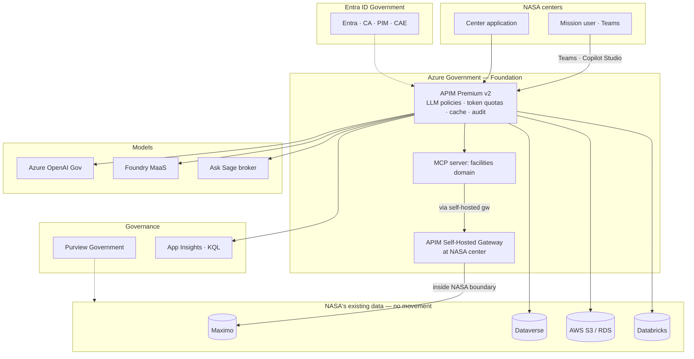

# NASA — API-First Multi-Model AI Ecosystem

## End-to-End Example

> **What this is.** A runnable, sequenced, copy-paste end-to-end deployment example that takes NASA from a clean Azure Government subscription to a working Copilot Studio facilities agent grounded in Maximo, with full FedRAMP-High posture, in roughly 90 days. Every command, payload, and KQL query below is the real artifact, not pseudocode.
>
> **The strategic narrative** (for repurpose as a whitepaper through the review chain) lives in the [NASA — API-First End-to-End Implementation use case](../use-cases/nasa-api-first-end-to-end.md). **This page is the deployment runbook.**
>
> **The Bicep starter** that this example uses sits at [`examples/apim-api-first-starter/`](https://github.com/fgarofalo56/csa-inabox/tree/main/examples/apim-api-first-starter) in the repo.

---

## What you'll build



**Outcome of this example:** A NASA maintenance manager in Teams asks *"What is the open work-order backlog at the launch complex by priority?"* — Copilot Studio routes through APIM, an MCP server queries Maximo through the self-hosted gateway at the NASA center (zero data movement), AOAI synthesizes the answer, and the entire transaction is identity-grounded, rate-limited, chargeback-tagged, audit-logged, and Purview-catalogued.

---

## Prerequisites

| Item | How to confirm |
|---|---|
| Azure Government subscription with Owner / Contributor + User Access Administrator | `az account show --query "{name:name, id:id}"` after `az cloud set --name AzureUSGovernment && az login` |
| Entra ID Government tenant with App Registration permissions | `az ad signed-in-user show` |
| ExpressRoute (or VPN) to at least one NASA center | Network architecture team |
| Maximo instance reachable from the gateway location | Facilities ops team |
| Purview Government account (or permissions to create one) | `az purview account list` |
| Power Platform Government environment with Copilot Studio | Power Platform admin |
| Repo cloned: `git clone https://github.com/fgarofalo56/csa-inabox.git` | Local |

---

## Step 1 — Deploy the API-first foundation (≈ 30 minutes)

The CSA-in-a-Box Bicep starter deploys APIM Premium v2, Log Analytics, App Insights, Key Vault, the user-assigned managed identity, an optional Azure OpenAI account with the LLM-policy chain pre-applied, and a role assignment so APIM calls AOAI via managed identity (no shared keys on disk).

```bash
# Switch to Azure Government
az cloud set --name AzureUSGovernment
az login
az account set --subscription "<subscription-id>"

# Resource group
az group create \
  --name rg-apifirst-foundation \
  --location usgovvirginia

# Deploy
az deployment group create \
  --resource-group rg-apifirst-foundation \
  --template-file examples/apim-api-first-starter/bicep/main.bicep \
  --parameters \
      apimPublisherEmail="apifirst-admin@your-tenant.onmicrosoft.us" \
      apimPublisherName="NASA API-First Platform" \
      apimSku="PremiumV2" \
      apimCapacity=2 \
      deployOpenAi=true \
      deploySampleBackend=false
```

Capture outputs for later steps:

```bash
APIM_NAME=$(az deployment group show -g rg-apifirst-foundation -n main \
              --query properties.outputs.apimName.value -o tsv)
APIM_GW=$(az deployment group show -g rg-apifirst-foundation -n main \
              --query properties.outputs.apimGatewayUrl.value -o tsv)
APPI_NAME=$(az deployment group show -g rg-apifirst-foundation -n main \
              --query properties.outputs.appInsightsName.value -o tsv)
KV_NAME=$(az deployment group show -g rg-apifirst-foundation -n main \
              --query properties.outputs.keyVaultName.value -o tsv)
AOAI_EP=$(az deployment group show -g rg-apifirst-foundation -n main \
              --query properties.outputs.aoaiEndpoint.value -o tsv)

echo "APIM:        $APIM_NAME ($APIM_GW)"
echo "App Insights: $APPI_NAME"
echo "Key Vault:    $KV_NAME"
echo "AOAI:         $AOAI_EP"
```

Smoke test:

```bash
SUB_KEY=$(az apim subscription show -g rg-apifirst-foundation \
              --service-name $APIM_NAME --sid master \
              --query primaryKey -o tsv)

curl -i -H "Ocp-Apim-Subscription-Key: $SUB_KEY" \
        -H "Authorization: Bearer $(az account get-access-token \
              --resource https://cognitiveservices.azure.com \
              --query accessToken -o tsv)" \
        -H "Content-Type: application/json" \
        -d '{"messages":[{"role":"user","content":"Say hello to NASA."}],"max_tokens":50}' \
        "$APIM_GW/aoai/openai/deployments/gpt-4o-mini/chat/completions?api-version=2024-10-21"
```

You should see a `200` response, plus `x-ratelimit-remaining-tokens` and `x-correlation-id` response headers — the LLM policy chain (token-limit, semantic cache, content safety, emit-token-metric) is live.

---

## Step 2 — Identity and Conditional Access (≈ 1 hour)

Register the API as an Entra application with scopes that downstream APIs will validate.

```bash
# Create app registration with API permissions
APP_ID=$(az ad app create \
  --display-name "NASA API-First Platform" \
  --sign-in-audience AzureADMyOrg \
  --query appId -o tsv)

# Define scopes
az ad app update --id $APP_ID --identifier-uris "api://$APP_ID"

# Export the app manifest to add scopes (Facilities.Read, Facilities.Write, etc.)
# (Use Azure Portal or graph PATCH for scope authoring — pattern documented in
#  docs/guides/apim-universal-gateway.md "Identity integration")
```

Author Conditional Access in the Entra portal on this app:

| Signal | Policy |
|---|---|
| Compliant device | Required (Intune-managed or hybrid-joined) |
| MFA | Required on every token issuance |
| Sign-in risk | Block on high; require MFA on medium |
| Client app | Approved app types only |
| CAE | Enabled — token revocation in minutes on risk change |

Enable PIM for `Facilities.Write` and `*.Admin` scopes — just-in-time elevation with approval gates.

---

## Step 3 — Self-hosted gateway at NASA centers (≈ 2 hours per center)

For Maximo and other on-prem mission systems, the data plane runs **inside the NASA center boundary**. The APIM control plane stays in Azure Gov; the gateway data plane runs as a container or AKS workload at each center.

```bash
# Generate a gateway token in Azure Gov APIM
GW_TOKEN=$(az rest --method post \
  --uri "https://management.usgovcloudapi.net/subscriptions/<sub>/resourceGroups/rg-apifirst-foundation/providers/Microsoft.ApiManagement/service/$APIM_NAME/gateways/nasa-center-east/token?api-version=2023-09-01-preview" \
  --body '{"keyType":"primary","expiry":"2027-05-16T00:00:00Z"}' \
  --query value -o tsv)

# Deploy as a Docker container on the NASA-center host
docker run -d \
  --name apim-gw-nasa-east \
  -p 8080:8080 -p 8081:8081 \
  -e config.service.endpoint="$APIM_NAME.configuration.azure-api.us" \
  -e config.service.auth="GatewayKey $GW_TOKEN" \
  -e logs.std="text" \
  mcr.microsoft.com/azure-api-management/gateway:2
```

Or on AKS via Helm:

```bash
helm install apim-gw-nasa-east \
  azure-marketplace/azure-api-management-gateway \
  --namespace apim-gw --create-namespace \
  --set gateway.configuration.uri="https://$APIM_NAME.management.azure-api.us" \
  --set gateway.auth.token="GatewayKey $GW_TOKEN"
```

Repeat per NASA center. The gateways pull configuration from Azure Gov on a schedule; outbound-only connectivity from the center suffices.

---

## Step 4 — Onboard Maximo as the first backend (≈ 1 day)

Document Maximo's REST surface as OpenAPI 3.x, normalize at APIM, import:

```yaml
# facilities-maximo.openapi.yaml — abbreviated example
openapi: 3.0.3
info:
  title: NASA Facilities (Maximo) via APIM
  version: 1.0.0
servers:
  - url: https://NAME.azure-api.us/facilities
paths:
  /work-orders:
    get:
      summary: List work orders
      parameters:
        - name: site
          in: query
          schema: { type: string }
        - name: status
          in: query
          schema: { type: string, enum: [open, in-progress, closed] }
        - name: priority
          in: query
          schema: { type: string, enum: [low, medium, high, critical] }
        - name: limit
          in: query
          schema: { type: integer, default: 50, maximum: 500 }
      responses:
        '200':
          description: Page of work orders
          content:
            application/json:
              schema:
                type: object
                properties:
                  value:
                    type: array
                    items: { $ref: '#/components/schemas/WorkOrder' }
                  '@odata.nextLink': { type: string }
components:
  schemas:
    WorkOrder:
      type: object
      properties:
        id: { type: string, format: uuid }
        site: { type: string }
        status: { type: string }
        priority: { type: string }
        assignedTo: { type: string }
        createdOn: { type: string, format: date-time }
```

Import and apply the policy chain:

```bash
az apim api import \
  --resource-group rg-apifirst-foundation \
  --service-name $APIM_NAME \
  --api-id facilities-maximo \
  --display-name "NASA Facilities (Maximo)" \
  --path facilities \
  --specification-format OpenApi \
  --specification-path facilities-maximo.openapi.yaml

# Apply the JWT + rate-limit + audit policy bundle to the API
az apim api policy create \
  --resource-group rg-apifirst-foundation \
  --service-name $APIM_NAME \
  --api-id facilities-maximo \
  --policy-format rawxml \
  --value @policies/facilities-maximo.xml

# Configure the backend to point at the self-hosted gateway at the NASA center
# (use mTLS for the leg into the boundary — pattern in docs/guides/zero-trust-api-governance-federal.md)
```

Set a subscription for a pilot consumer:

```bash
az apim subscription create \
  --resource-group rg-apifirst-foundation \
  --service-name $APIM_NAME \
  --sid facilities-pilot \
  --display-name "Facilities pilot consumers" \
  --scope "/apis/facilities-maximo"
```

---

## Step 5 — Zero-move data integration (≈ 2 days)

### 5a. Dataverse Web API behind APIM

Add Dataverse as an APIM API so it inherits the same identity, rate limit, audit, and Purview registration.

```bash
az apim api create \
  --resource-group rg-apifirst-foundation \
  --service-name $APIM_NAME \
  --api-id dataverse \
  --display-name "Dataverse (Power Platform)" \
  --path dataverse \
  --service-url "https://nasa-org.api.crm.microsoftdynamics.us/api/data/v9.2" \
  --protocols https \
  --subscription-required true
```

A Databricks notebook can now query Dataverse — zero data movement, identity preserved end-to-end. See the [Dataverse use case](../use-cases/dataverse-api-integration.md) for the full working code (the `azure-identity` + `httpx` example reading the `$metadata`-introspected entities).

### 5b. OneLake shortcuts to NASA AWS data

For NASA-owned S3 buckets, create OneLake shortcuts so Fabric / Databricks query in place. Pattern documented in [Multi-Cloud Data Virtualization](../use-cases/multi-cloud-data-virtualization.md). No data leaves AWS; no APIM façade required for cold analytic access.

For transactional AWS data (RDS, Redshift) where consumers need a REST surface, expose it via an APIM façade similar to Step 4.

### 5c. Microsoft Graph for M365 content

```bash
az apim api create \
  --resource-group rg-apifirst-foundation \
  --service-name $APIM_NAME \
  --api-id graph \
  --display-name "Microsoft Graph (M365)" \
  --path graph \
  --service-url "https://graph.microsoft.us/v1.0" \
  --protocols https \
  --subscription-required true
```

This is how Copilot Studio agents grounded in NASA's SharePoint and Teams content get the same governance treatment as Maximo and Dataverse.

---

## Step 6 — Model onboarding (≈ 1 day)

The starter already deployed AOAI. Add Foundry MaaS and Ask Sage as additional model backends in APIM so consumers see one consistent contract.

```bash
# Foundry MaaS — Llama, Mistral, Phi, DeepSeek per accreditation
az apim backend create \
  --resource-group rg-apifirst-foundation \
  --service-name $APIM_NAME \
  --backend-id foundry-maas-pool \
  --url "https://<foundry-project>.services.ai.azure.us/openai" \
  --protocol http

# Ask Sage broker — FedRAMP High partner product
az apim backend create \
  --resource-group rg-apifirst-foundation \
  --service-name $APIM_NAME \
  --backend-id asksage-broker \
  --url "https://<asksage-endpoint>" \
  --protocol http
```

Routing per consumer is policy-driven — see [Multi-Model AI Orchestration best practice](../best-practices/multi-model-ai-orchestration.md) for the routing strategies (cost-tiered, capability-bound, tenant-bound).

---

## Step 7 — MCP server tier (≈ 2 days for the first MCP)

Deploy a facilities-domain MCP server as a Container App that calls Maximo through APIM. The skeleton in [`examples/apim-api-first-starter/`](https://github.com/fgarofalo56/csa-inabox/tree/main/examples/apim-api-first-starter):

```python
# mcp_server_facilities.py
from mcp.server.fastmcp import FastMCP
from azure.identity import ManagedIdentityCredential
import httpx, os

app = FastMCP("nasa-facilities", version="1.0.0")
APIM_BASE = os.environ["APIM_BASE"]  # https://<apim>.azure-api.us
SUB_KEY = os.environ["APIM_SUB_KEY"]
cred = ManagedIdentityCredential()

def headers():
    token = cred.get_token("api://<your-app-id>/.default").token
    return {
        "Authorization": f"Bearer {token}",
        "Ocp-Apim-Subscription-Key": SUB_KEY,
    }

@app.tool()
async def get_work_orders(site: str | None = None, status: str = "open",
                          priority: str | None = None, limit: int = 50) -> list[dict]:
    """Return open work orders for facilities. Identity is the agent's; Maximo audit captures attribution."""
    params = {"status": status, "limit": str(limit)}
    if site: params["site"] = site
    if priority: params["priority"] = priority
    async with httpx.AsyncClient(timeout=30) as c:
        r = await c.get(f"{APIM_BASE}/facilities/work-orders",
                        params=params, headers=headers())
        r.raise_for_status()
        return r.json()["value"]

@app.tool()
async def get_overdue_preventive_maintenance(days: int = 30) -> list[dict]:
    """Buildings with preventive maintenance overdue more than N days."""
    async with httpx.AsyncClient(timeout=30) as c:
        r = await c.get(f"{APIM_BASE}/facilities/preventive-maintenance/overdue?days={days}",
                        headers=headers())
        r.raise_for_status()
        return r.json()["value"]

if __name__ == "__main__":
    app.run()
```

Deploy to a Container App in a private VNet — expose only to APIM via private link. Register the MCP-fronted endpoint in APIM with the same policy chain (the `azure-openai-token-limit` policy enforces the shared budget across all MCP servers behind APIM — solving the cross-tool token-exhaustion problem at the gateway, not in agent code).

Repeat per domain (financial procurement, Dataverse, Graph, Databricks, Palantir-broker, Ask Sage-broker). See [APIM + MCP Layered Orchestration](../guides/apim-mcp-layered-orchestration.md) for the full pattern.

---

## Step 8 — Copilot Studio facilities agent (≈ 1 day)

1. Open Copilot Studio in the NASA Power Platform Government environment.
2. Create a new agent: **NASA Facilities Assistant**.
3. **Add a connector** — Custom Connector → New from OpenAPI.
4. Point at the APIM Developer Portal OpenAPI export for the facilities API: `https://<APIM_NAME>.developer.azure-api.us/api/facilities-maximo/openapi.json`.
5. Configure **authentication** — OAuth 2.0 with the Entra app from Step 2; redirect URL `https://global.consent.azure-apim.us/redirect`.
6. Add **actions** that map to the OpenAPI operations (`get_work_orders`, `get_overdue_preventive_maintenance`).
7. Author the **topics**:
   - "What's the backlog at site {X}?" → calls `get_work_orders(site=X, status=open)`
   - "Which buildings have PM overdue?" → calls `get_overdue_preventive_maintenance(days=30)`
   - "Escalate work order {Y}" → calls a Power Automate flow that PATCHes the work order and creates an approval task
8. **Test** in the Copilot Studio test pane.
9. **Publish** to a pilot group of facilities managers at two NASA centers; surface in **Teams**.

The agent now answers facilities questions in Teams. Every call:

- Carries the user's Entra token through Copilot Studio → APIM → MCP → Maximo
- Is rate-limited per consumer
- Is rate-limited on tokens (`azure-openai-token-limit` in APIM)
- Returns from cache when the prompt is semantically similar to a recent one
- Emits a token-usage metric tagged with `subscription-id`, `model-id`, `api-name`
- Is logged to App Insights and lineaged in Purview

---

## Step 9 — Purview catalog (≈ 4 hours)

```bash
# Register APIM as a Purview catalog source
PUR_ACCOUNT="nasa-purview-gov"

az purview source create \
  --account-name $PUR_ACCOUNT \
  --name apim-prod \
  --type ApiManagementService \
  --properties "{\"endpoint\":\"$APIM_NAME.azure-api.us\"}"

# Register Dataverse via Power Platform connector
# (Purview Portal: Sources → Register → Power Platform → Dataverse)

# Register Databricks workspace
az purview source create \
  --account-name $PUR_ACCOUNT \
  --name databricks-nasa-east \
  --type AzureDatabricks \
  --properties "{\"workspaceUrl\":\"<workspace>.azuredatabricks.us\"}"

# Register AWS S3 (cross-cloud scan)
# (Purview Portal: Sources → Register → AWS S3 → supply IAM role)
```

Each source scans on a schedule. Sensitivity labels propagate from MIP. Lineage flows: data source → APIM endpoint → consuming agent → response. Every API gets ownership, SLA, classification.

---

## Step 10 — Cost governance dashboard (≈ 2 hours)

The LLM-policy chain already emits `Total tokens` metrics with `subscription-id`, `model-id`, and `api-name` dimensions. Build the dashboard:

```kql
// Token usage by NASA center, model, and API per day
customMetrics
| where timestamp > ago(30d)
| where name == "Total tokens"
| extend center = tostring(customDimensions["subscription-id"])
| extend model  = tostring(customDimensions["model-id"])
| extend api    = tostring(customDimensions["api-name"])
| summarize tokens = sum(value) by center, model, api, bin(timestamp, 1d)
| render columnchart

// Cost estimate (adjust rate per model)
let rate_per_1k_tokens = dynamic({"gpt-4o-mini": 0.000150, "gpt-4o": 0.005, "o3-mini": 0.0011});
customMetrics
| where name == "Total tokens"
| extend model  = tostring(customDimensions["model-id"])
| extend center = tostring(customDimensions["subscription-id"])
| extend rate = todouble(rate_per_1k_tokens[model])
| summarize cost_usd = sum(value * rate / 1000) by center, model, bin(timestamp, 1d)
| render columnchart

// Semantic cache hit rate
ApiManagementGatewayLogs
| where TimeGenerated > ago(7d)
| where ApiId == "aoai-chat"
| extend cached = iif(ResponseCode == 200 and Cache == "hit", 1, 0)
| summarize hits = sum(cached), total = count() by bin(TimeGenerated, 1h)
| extend hit_rate = (hits * 100.0) / total
| render timechart

// Rate-limit incidents
ApiManagementGatewayLogs
| where TimeGenerated > ago(24h)
| where ResponseCode == 429
| summarize incidents = count() by ApimSubscriptionId, ApiId
| top 20 by incidents
```

Set alerts on:

- Subscription-level token budget at 80% of monthly cap
- Sustained `429` rate > 5% over 15 min
- Backend ejection from APIM circuit breaker
- Auth failure spike

---

## Validate — the smoke test that proves it all works

```bash
# 1. Subscription key
SUB_KEY=$(az apim subscription show -g rg-apifirst-foundation \
              --service-name $APIM_NAME --sid facilities-pilot \
              --query primaryKey -o tsv)

# 2. Get a user token for the API
USER_TOKEN=$(az account get-access-token \
              --resource api://<your-app-id> --query accessToken -o tsv)

# 3. Hit the Maximo-backed facilities API through APIM
curl -i -H "Ocp-Apim-Subscription-Key: $SUB_KEY" \
        -H "Authorization: Bearer $USER_TOKEN" \
        "$APIM_GW/facilities/work-orders?site=launch-complex&status=open&priority=high"

# Expected: 200 response, page of work orders, X-RateLimit-Remaining headers,
#           X-Correlation-Id header you can trace in App Insights

# 4. Confirm the call landed in App Insights
az monitor app-insights query \
  --app $APPI_NAME \
  --analytics-query "requests | where timestamp > ago(5m) | where url contains 'facilities/work-orders' | project timestamp, url, resultCode, duration"

# 5. Confirm the LLM policy chain on a chat completion
curl -i -H "Ocp-Apim-Subscription-Key: $SUB_KEY" \
        -H "Authorization: Bearer $(az account get-access-token --resource https://cognitiveservices.azure.com --query accessToken -o tsv)" \
        -H "Content-Type: application/json" \
        -d '{"messages":[{"role":"user","content":"Brief NASA facilities AI status."}],"max_tokens":80}' \
        "$APIM_GW/aoai/openai/deployments/gpt-4o-mini/chat/completions?api-version=2024-10-21"

# Expected: 200 response, x-ratelimit-remaining-tokens header counted down, x-correlation-id

# 6. Confirm token metric emission
az monitor app-insights query \
  --app $APPI_NAME \
  --analytics-query "customMetrics | where timestamp > ago(5m) | where name == 'Total tokens' | project timestamp, value, customDimensions"
```

If all six steps return as described, the foundation is delivering: identity-grounded API calls, observability, cost telemetry, gateway policy enforcement, and zero data movement to Maximo.

---

## What you've built

| Capability | Where it lives | Evidence |
|---|---|---|
| Identity-grounded API gateway | APIM Premium v2 in Azure Gov | `validate-jwt` policy + Entra app registration |
| Multi-model LLM router | AOAI + Foundry MaaS + Ask Sage broker | APIM backends + LLM policy chain |
| Token budget per consumer | APIM `azure-openai-token-limit` | `x-ratelimit-remaining-tokens` header |
| Semantic cache | APIM `azure-openai-semantic-cache-*` | Cache hit rate KQL panel |
| Content safety | APIM `llm-content-safety` (when configured) | Blocked-prompt audit events |
| Cost chargeback | App Insights `emit-token-metric` + KQL dashboard | Per-center, per-model, per-API cost report |
| Zero data movement | Maximo behind self-hosted gateway; OneLake shortcuts to AWS | No copy jobs in pipeline inventory |
| Cross-cloud reach | OneLake shortcuts + APIM façades | Purview cross-cloud catalog entries |
| Identity to NASA centers | Self-hosted gateway + Entra federation | Per-center deployments active |
| Unified governance | Purview catalog + lineage + classification | Catalog inventory query |
| First mission agent in production | Copilot Studio facilities assistant in Teams | Agent published; pilot users transacting |

---

## Next steps

| Next | Where to go |
|---|---|
| Add the second domain (financial procurement) | Repeat Steps 4 + 7 + 8 for the procurement system |
| Cross-tenant federation to a partner agency | Entra B2B + APIM-to-APIM trust per [zero-trust governance guide](../guides/zero-trust-api-governance-federal.md) |
| Multi-region active-active for HA | APIM Premium v2 second region + Front Door per [APIM Universal Gateway guide](../guides/apim-universal-gateway.md) |
| Brokering Palantir endpoints | New APIM API per the cross-platform pattern in the [use case](../use-cases/cross-platform-integration-fabric.md) |
| MuleSoft strangler-fig migration | Per the [MuleSoft displacement playbook](../comparison/azure-vs-mulesoft.md) |
| AWS Bedrock co-existence | Per the [AWS API stack displacement playbook](../comparison/azure-vs-aws-api-stack.md) |
| Whitepaper for the review chain | The [NASA E2E use case](../use-cases/nasa-api-first-end-to-end.md) is the source of truth |

---

## Related material

- [NASA E2E implementation use case (whitepaper-ready)](../use-cases/nasa-api-first-end-to-end.md) — the strategic narrative
- [Whitepaper — API-First Data Strategy on Azure](../research/api-first-data-strategy-whitepaper.md)
- [Reference architecture — API-First Multi-Model Ecosystem](../reference-architecture/api-first-multi-model-ecosystem.md)
- [Guide — APIM as the Universal API Gateway](../guides/apim-universal-gateway.md)
- [Guide — APIM + MCP Layered Orchestration](../guides/apim-mcp-layered-orchestration.md)
- [Guide — Zero-Trust API Governance for Federal Mission Environments](../guides/zero-trust-api-governance-federal.md)
- [Use case — Dataverse API Integration](../use-cases/dataverse-api-integration.md)
- [Use case — Enterprise Asset Management through APIM](../use-cases/enterprise-asset-management-apim.md)
- [Use case — Cross-Platform Integration (Connective Tissue)](../use-cases/cross-platform-integration-fabric.md)
- [ADR-0025 — APIM as the Integration Fabric](../adr/0025-apim-as-integration-fabric.md)
- [Solution Store — Azure API-First Accelerators](../solution-store/index.md)
- [Bicep starter source](https://github.com/fgarofalo56/csa-inabox/tree/main/examples/apim-api-first-starter)
