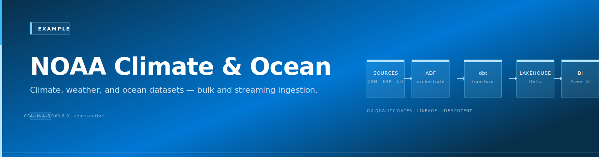

{ .architecture-hero loading="eager" }

> **Source:** [`examples/noaa/README.md`](https://github.com/fgarofalo56/csa-inabox/blob/main/examples/noaa/README.md) — this page is rendered live from that file.

--8<-- "_includes/cipsea-awareness.md"


