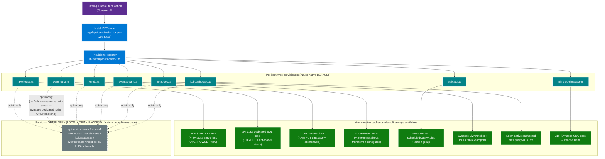
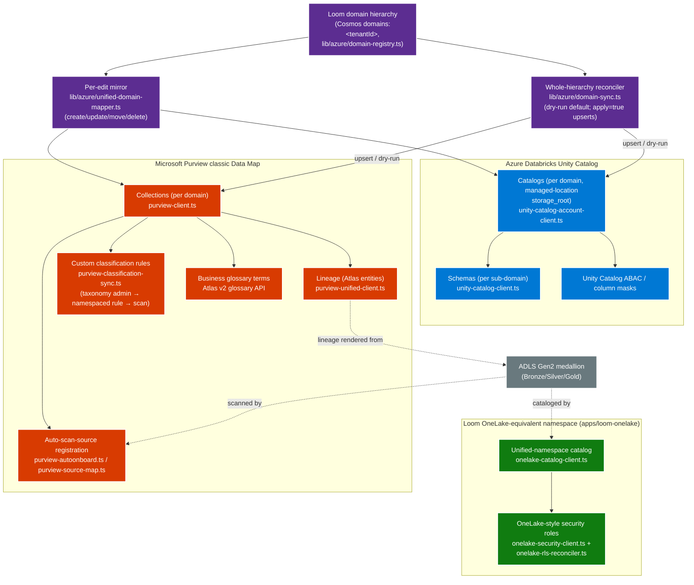
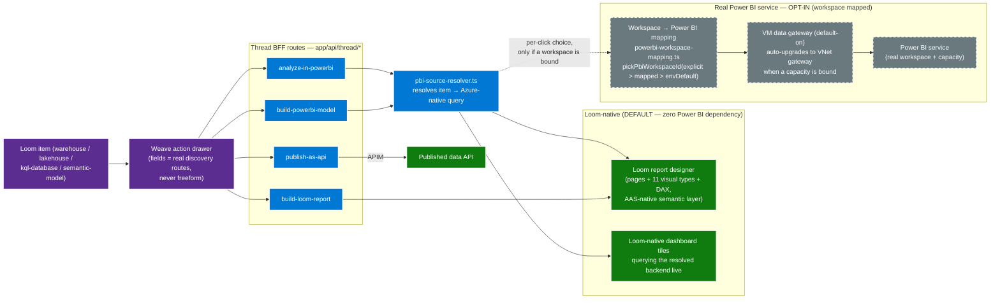
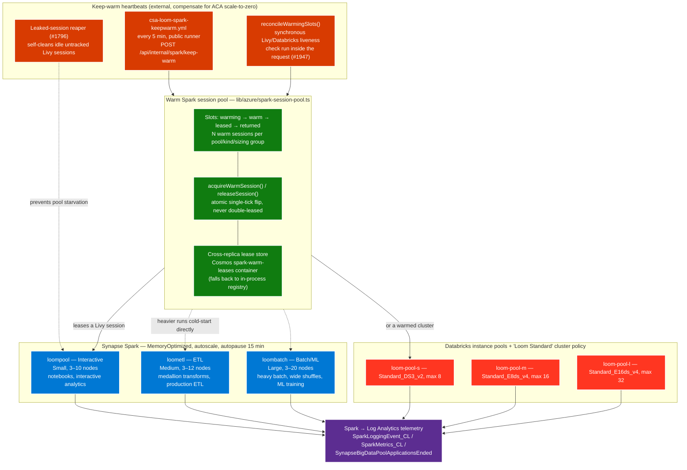
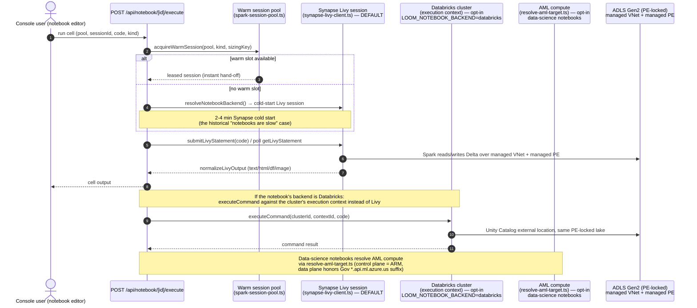
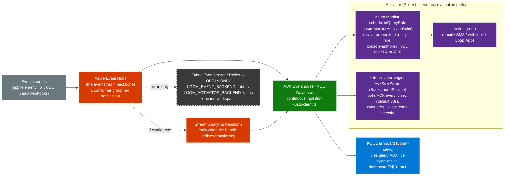

# CSA Loom — Complete Diagram Set

This page extends [Full-Picture Architecture](architecture-full-picture.md) (system
topology, identity/auth, deployment, medallion data flow) and
[Architecture Diagrams](diagrams/README.md) (tenant topology, deploy flows, RBAC,
domain-to-catalog data flow) with six additional diagrams that were missing from
the diagram set: item provisioning, the governance/lineage mesh, Weave → Power BI,
the compute topology, notebook execution, and the realtime/streaming path.

Every diagram here is grounded in code that exists on `main` today — no
aspirational boxes. Paths are called out under each diagram; see the
[component index](#component-index) at the bottom for the full list.

---

## 1. Item-provisioning flow — Azure-native default, Fabric strictly opt-in

Every catalog item's "Create" action resolves through the typed provisioner
registry (`apps/fiab-console/lib/install/provisioners/*.ts`). Per
`.claude/rules/no-fabric-dependency.md`, each provisioner's **default** path is
a real Azure backend call; a Fabric backend only runs when the item explicitly
opts in via `LOOM_<ITEM>_BACKEND=fabric` **and** a bound workspace — and even
then, an unbound workspace on the opt-in path falls back to Azure-native rather
than gating.

Notes:

- **Warehouse has no Fabric backend at all** — `warehouse.ts` reads
  `LOOM_WAREHOUSE_BACKEND` (default `synapse-dedicated`) and only ever targets
  Synapse dedicated SQL pools via `synapse-sql-client.ts`; there is no
  `fabric` value to opt into for this item type.
- **Eventstream / KQL dashboard / notebook / activator** transparently fall
  back to Azure-native even when `LOOM_<ITEM>_BACKEND=fabric` is set but no
  workspace is bound — never a hard gate (`eventstream.ts`, `kql-dashboard.ts`,
  `notebook.ts`, `activator.ts`).
- **Honest gates, not Fabric gates**: when an Azure backend's own config is
  missing (`LOOM_KUSTO_CLUSTER_URI`, `LOOM_EVENTHUBS_NAMESPACE`,
  `LOOM_LOG_ANALYTICS_RESOURCE_ID`, …) the provisioner returns
  `status:'remediation'` naming the exact env var — never "bind a Fabric
  workspace" (`no-vaporware.md`).

---

## 2. Governance / lineage mesh — Purview + Unity Catalog + OneLake catalog

CSA Loom's domain hierarchy (the authoritative Cosmos `domains:<tenantId>` doc)
mirrors into two independent, Azure-native governance back ends. Loom is
authoritative and the sync is one-directional and additive — a remote-only
object is reported as drift and never deleted
(`apps/fiab-console/lib/azure/domain-sync.ts`).

Notes:

- **Both targets are independently optional.** An unconfigured Purview or
  Unity Catalog account yields an honest `skipped` result with a hint, never
  an error — the reconciler still runs against whichever target IS
  configured (`domain-sync.ts` `TargetSummary.configured/gated/hint`).
- **Classification flows one way**: the tenant's custom classification
  taxonomy (`/admin/classifications`, stored in Cosmos) pushes a namespaced
  Purview custom classification rule + triggers a scan
  (`purview-classification-sync.ts`), then Purview's scan auto-applies the
  classification to matching columns.
- **The daily exercise-every-service probe** (`lib/admin/service-probes.ts`)
  runs a real dry-run domain sync as one of its real-data-path checks, not
  just a config-presence check.

---

## 3. Weave → Power BI flow — Loom-native default, real Power BI opt-in

Weave (`lib/thread/thread-actions.ts`) gives every PBI-sourceable item
(warehouse, lakehouse, KQL database, semantic model, data product — read from
the item-type manifest's `capabilities.pbiSourceable`) a one-click "Analyze in
Power BI" edge. The click always resolves a real Azure-native answer first;
a real Power BI workspace is an explicit, mapped, opt-in target layered on top.

Notes:

- **`pickPbiWorkspaceId`** (`lib/azure/powerbi-workspace-mapping.ts`) is the
  single precedence rule for which Power BI workspace an item targets:
  explicit per-item binding > workspace-level mapping >
  `LOOM_DEFAULT_FABRIC_WORKSPACE`. With nothing bound, the item is fully
  functional on the Loom-native path — no gate.
- **`build-powerbi-model`** is scoped to sources whose Azure-native backend
  can be read table-by-table today (`warehouse`, `synapse-dedicated-sql-pool`
  — `POWERBI_MODELABLE` in `thread-actions.ts`); other sources get the
  Loom-native semantic model instead.
- **Report "Get data"** (`lib/editors/report/get-data-gallery.tsx`) puts "Use
  a Loom item" first in the connector gallery; OneLake/Fabric shortcuts and
  Power BI semantic models sit in a clearly dashed, opt-in group at the
  bottom of the same gallery.

---

## 4. Compute topology — Synapse Spark tiers + Databricks pools + warm session pool

Three workload-tiered Synapse Spark pools and three Databricks instance pools
are provisioned at deploy time (`platform/fiab/bicep/modules/landing-zone/synapse-spark-pools.bicep`,
`scripts/csa-loom/provision-databricks-compute.sh`). A warm session pool sits
in front of both so a notebook run gets a live session handed off instead of
paying Synapse's 2–4 minute cold start.

Notes:

- **`loompool` is the only pool the warm session pool targets by default**
  (interactive notebook workload); `loometl`/`loombatch` and the Databricks
  pools serve heavier scheduled/batch runs that cold-start directly since
  their jobs are long-running enough that a warm hand-off doesn't matter.
- **Two historical root causes are both fixed on this path**: the
  fire-and-forget `pollLivyToIdle` loop starving under ACA's CPU throttling
  between requests (fixed by the synchronous `reconcileWarmingSlots()` in
  PR #1947), and ~700 leaked idle Livy sessions jamming `loompool` (fixed by
  the leaked-session reaper, PR #1889/#1796).
- **Every pool carries baked best-practice Spark config** (AQE,
  Kryo serializer, Delta optimize-write + auto-compact) from the same preset
  source the console's compute UI uses (`lib/databricks/cluster-presets.ts`,
  `lib/spark/config-presets.ts`), so pre-provisioned compute matches the UI.

---

## 5. Notebook execution path — Synapse Livy default, Databricks/AML opt-in

Opening a notebook cell run always attempts the warm pool first, then falls
back to a real cold-started session against whichever engine the notebook is
bound to. All engines reach the same PE-locked lake through a managed VNet /
managed private endpoint — there is no public-network path to the data plane.

Notes:

- **`resolveNotebookBackend()`** (`synapse-livy-client.ts`) and the
  per-notebook `LOOM_NOTEBOOK_BACKEND` setting are what select Synapse
  (default) vs Databricks (opt-in); Fabric is never on this path
  (`no-fabric-dependency.md`).
- **The PE-locked lake requires a managed VNet + managed private endpoint**
  for Synapse Spark to reach it at all — an unmanaged (public) Spark pool
  hangs indefinitely against a DLZ lake with no public network access (the
  root cause documented for the mirroring-engine CDC fix, and the same
  constraint applies to every notebook run).
- **A `%%configure` magic cell** is intercepted before submission and
  triggers the editor to recreate the session with new compute options,
  rather than being submitted as code.

---

## 6. Realtime / streaming — Event Hubs → ADX Eventhouse → dashboard / Activator

An eventstream is a real Azure Event Hub with one consumer group per
destination (`eventstream.ts`). Continuous ADX ingestion feeds both a
Loom-native KQL dashboard and the Activator, which itself has two real,
independent evaluation paths.

Notes:

- **Two Activator evaluation paths are both real, not redundant**: the
  console-authored `scheduledQueryRule` path (`activator.ts` +
  `activator-monitor.ts`) is what the editor's rules tab creates and manages
  per rule (Start/Stop/Enable/Disable/Delete/Trigger all key off this
  record); the sibling `fiab-activator-engine` service's `AdxRulePoller` is a
  lower-latency continuous poller that evaluates rules directly against ADX
  without waiting on Monitor's alert evaluation cadence.
- **A Fabric Eventstream/Reflex is opt-in and falls back silently** —
  selecting the Fabric backend without a bound workspace does not gate;
  it runs the Azure-native path (`eventstream.ts`, `activator.ts`).
- **No Fabric RTI dependency anywhere on the default path** — ADX Eventhouse
  is the Azure-native, always-available RTI backend
  (`no-fabric-dependency.md`).

---

## Component index

| Component | Where in the repo |
|---|---|
| Provisioner registry | `apps/fiab-console/lib/install/provisioners/*.ts` |
| Lakehouse / warehouse / KQL-DB / eventstream / activator / notebook / KQL-dashboard / mirrored-DB provisioners | `apps/fiab-console/lib/install/provisioners/{lakehouse,warehouse,kql-db,eventstream,activator,notebook,kql-dashboard,mirrored-database}.ts` |
| Domain hierarchy + per-edit mirror | `apps/fiab-console/lib/azure/{domain-registry,unified-domain-mapper}.ts` |
| Whole-hierarchy governance reconciler | `apps/fiab-console/lib/azure/domain-sync.ts` |
| Purview clients (Data Map, classification sync, autoscan) | `apps/fiab-console/lib/azure/purview-{client,classification-sync,autoonboard,source-map,unified-client}.ts` |
| Unity Catalog clients | `apps/fiab-console/lib/azure/unity-catalog-{account-,}client.ts` |
| OneLake-equivalent namespace + RLS | `apps/fiab-console/lib/azure/onelake-{catalog-client,security-client,rls-reconciler}.ts` · `apps/loom-onelake` |
| Weave edges + Power BI workspace mapping | `apps/fiab-console/lib/thread/thread-actions.ts` · `apps/fiab-console/lib/azure/powerbi-workspace-mapping.ts` |
| PBI source resolver + Get-data gallery | `apps/fiab-console/lib/azure/pbi-source-resolver.ts` · `apps/fiab-console/lib/editors/report/get-data-gallery.tsx` |
| Synapse Spark workload-tier pools | `platform/fiab/bicep/modules/landing-zone/synapse-spark-pools.bicep` |
| Databricks instance pools + cluster policy | `scripts/csa-loom/provision-databricks-compute.sh` · `apps/fiab-console/lib/databricks/cluster-presets.ts` |
| Warm Spark session pool | `apps/fiab-console/lib/azure/spark-session-pool.ts` |
| Notebook execute route + Livy client | `apps/fiab-console/app/api/notebook/[id]/execute/route.ts` · `apps/fiab-console/lib/azure/synapse-livy-client.ts` |
| AML target resolver | `apps/fiab-console/lib/azure/resolve-aml-target.ts` |
| Eventstream / Event Hubs client | `apps/fiab-console/lib/azure/eventhubs-client.ts` |
| Kusto (ADX) client | `apps/fiab-console/lib/azure/kusto-client.ts` |
| Activator Azure Monitor runtime | `apps/fiab-console/lib/azure/activator-monitor.ts` |
| Activator poller engine (sibling service) | `apps/fiab-activator-engine/src/LoomActivator/Polling/AdxRulePoller.cs` |

## Related

- [Full-Picture Architecture](architecture-full-picture.md) — system topology, identity/auth, deployment, medallion data flow
- [Architecture Diagrams](diagrams/README.md) — tenant topology, deploy flows, domain/RBAC model, domain-to-catalog data flow
- [Compute Tiers & Telemetry](compute-tiers-and-telemetry.md) — full pool/tier detail behind diagram 4
- [Reference Architecture](architecture.md) · [Model Strategy](model-strategy.md)
