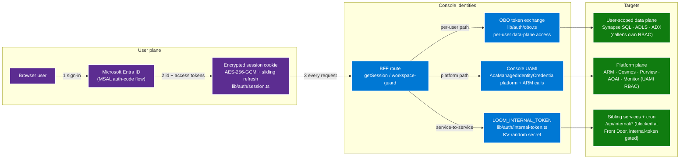
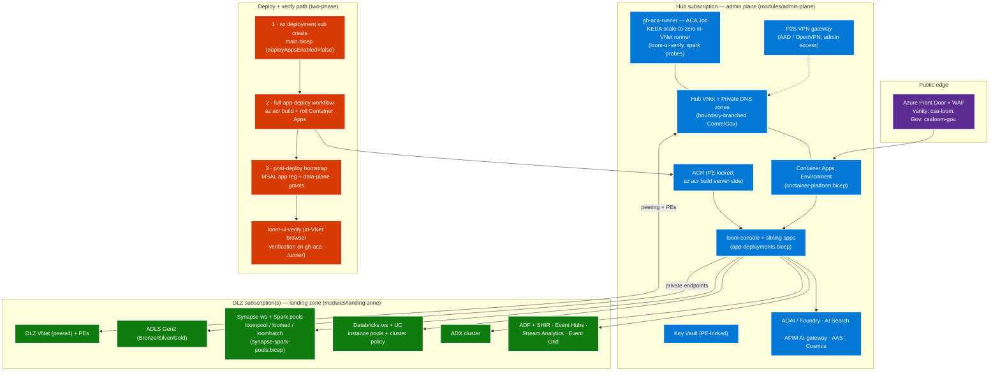
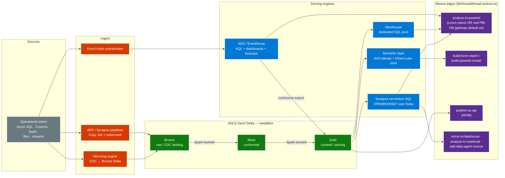

# CSA Loom — Full-Picture Architecture

This page is the single "whole system on one screen" reference for CSA Loom:
the console + BFF, every Azure backend it drives, the sibling backend services,
the identity/auth flows, the Commercial + Government deployment topology, and
the medallion data flow with the Weave edge graph on top.

Every box below is grounded in the actual code or bicep in this repo (paths in
the [component index](#component-index) at the bottom). Verified against `main`
2026-07-12. For focused views see
[Architecture Diagrams](diagrams/README.md),
[Reference Architecture](architecture.md),
[Model Strategy](model-strategy.md), and
[Compute Tiers & Telemetry](compute-tiers-and-telemetry.md).

---

## 1. Full system — console, BFF, backends, sibling services

The console is a Next.js App Router app (`apps/fiab-console`) whose `app/api/*`
routes form the BFF: every editor control calls a BFF route, which validates the
session, resolves the item via the typed **item-type manifest registry**
(`lib/items/manifest/`), and calls a real Azure data-plane / ARM client in
`lib/azure/*`. Fabric / Power BI is opt-in only — the default backend for every
item type is Azure-native (per `.claude/rules/no-fabric-dependency.md`).

```mermaid
flowchart TB
    subgraph edge["Edge"]
        FD["Azure Front Door<br/>csa-loom.<your-domain> (Comm)<br/>csaloom-gov.<your-domain> (Gov)"]
    end

    subgraph console["Console — apps/fiab-console (Container App)"]
        UI["Editors + canvases + admin<br/>Fluent v9 + Loom tokens"]
        BFF["BFF app/api/* routes<br/>session validate + structured JSON"]
        MAN["Item-type manifest registry<br/>lib/items/manifest/"]
        TR["AIF-12 model tier router<br/>lib/foundry/model-tier-router.ts"]
        UI --> BFF --> MAN
        BFF --> TR
    end

    subgraph siblings["Sibling backend services (apps/*, Container Apps / Jobs)"]
        ACT["fiab-activator-engine<br/>ADX rule poller + actions"]
        MIR["fiab-mirroring-engine<br/>CDC mirroring runtime"]
        DLS["fiab-direct-lake-shim<br/>TOM warm-cache refresh"]
        DLQ["loom-directlake<br/>columnar cache/scan service"]
        OLK["loom-onelake<br/>unified-namespace catalog"]
        UCS["loom-unity<br/>OSS Unity Catalog (Gov)"]
        CAP["loom-capacity-broker<br/>compute admission control"]
        ORC["fiab-setup-orchestrator<br/>deploy backend for Setup Wizard"]
        MCP["fiab-mcp-bridge + fiab-mcp-config<br/>MCP server catalog + stdio bridge"]
        CPL["copilot + copilot-maf<br/>RAG QA + MAF agent tier"]
        AUX["fiab-dbt-runner · fiab-wrangler-host<br/>fiab-report-subscriptions · fiab-label-propagation"]
    end

    subgraph data["Azure data + analytics backends"]
        SYN["Synapse<br/>serverless SQL + dedicated pools<br/>Spark: loompool / loometl / loombatch"]
        ADX["Azure Data Explorer<br/>Eventhouse / KQL DB / RTI"]
        ADLS["ADLS Gen2 + Delta<br/>Bronze / Silver / Gold"]
        DBX["Azure Databricks + Unity Catalog<br/>instance pools + Loom cluster policy"]
        ADF["Azure Data Factory<br/>pipelines + managed VNet IR"]
        EH["Azure Event Hubs<br/>eventstream backbone"]
        AAS["Azure Analysis Services<br/>tabular semantic layer"]
    end

    subgraph platform["Platform + AI backends"]
        COS["Cosmos DB<br/>items, workspaces, config,<br/>refresh policies, schedules"]
        PUR["Purview classic Data Map<br/>scan / classify / glossary"]
        AOAI["AOAI / AI Foundry<br/>GPT-5.x + embeddings<br/>via APIM AI-gateway (opt-in)"]
        SRCH["Azure AI Search<br/>RAG corpus"]
        MON["Azure Monitor + Log Analytics<br/>Spark telemetry, alerts, chargeback"]
        PBI["Power BI service (OPT-IN)<br/>via VM data gateway"]
    end

    FD --> UI
    BFF --> siblings
    BFF --> data
    BFF --> platform
    ACT --> ADX
    ACT --> MON
    MIR --> ADLS
    DLS --> AAS
    DLQ --> ADLS
    OLK --> ADLS
    UCS --> DBX
    CPL --> AOAI
    CPL --> SRCH
    SYN --> ADLS
    DBX --> ADLS
    ADF --> ADLS
    EH --> ADX
    AAS --> SYN
    TR --> AOAI
    PBI -.->|"opt-in only<br/>never on the default path"| BFF

    classDef edgeC fill:#5C2D91,stroke:#fff,color:#fff,stroke-width:2px
    classDef consoleC fill:#0078D4,stroke:#fff,color:#fff,stroke-width:2px
    classDef sibC fill:#038387,stroke:#fff,color:#fff,stroke-width:2px
    classDef dataC fill:#107C10,stroke:#fff,color:#fff,stroke-width:2px
    classDef platC fill:#D83B01,stroke:#fff,color:#fff,stroke-width:2px
    classDef optC fill:#69797E,stroke:#fff,color:#fff,stroke-width:2px,stroke-dasharray:6 4
    class FD edgeC
    class UI,BFF,MAN,TR consoleC
    class ACT,MIR,DLS,DLQ,OLK,UCS,CAP,ORC,MCP,CPL,AUX sibC
    class SYN,ADX,ADLS,DBX,ADF,EH,AAS dataC
    class COS,PUR,AOAI,SRCH,MON platC
    class PBI optC
```

Key reading of this diagram:

- **Every editor control terminates in a real backend call** (`no-vaporware.md`)
  — the BFF's `lib/azure/*` clients speak Azure REST, ARM, TDS/SQL, Kusto,
  Livy, and Databricks/UC REST directly.
- **The manifest registry** (`lib/items/manifest/item-manifest.ts` +
  `registry.ts`) is the typed source of truth for what each item type is, which
  backend serves it, and which routes/editors bind to it.
- **The AIF-12 tier router** resolves the best supported model per task per
  cloud at request time (day-one populated at deploy; see
  [Model Strategy](model-strategy.md)); AOAI traffic optionally flows through
  the **APIM AI-gateway** with automatic direct-with-managed-identity fallback
  where APIM LLM policies are unsupported (Gov).
- **Power BI is strictly opt-in** — dashed in the diagram because no default
  code path reaches `api.powerbi.com`.

---

## 2. Identity and auth flows

Four distinct identities move through the system: the signed-in user (MSAL),
the user's delegated token (OBO) for per-user data-plane access, the Console's
UAMI for platform calls, and the internal token that authenticates
console-to-sibling-service calls.

Flow notes:

- **MSAL user sign-in** (`lib/auth/msal.ts` + `authflow.ts`) mints the
  AES-256-GCM session cookie; `use-session-keepalive.ts` slides expiry.
- **OBO (on-behalf-of)** — shipped as EH-P1-OBO (#1922): BFF routes that touch
  user-attributable data exchange the session's access token for a data-plane
  token so Synapse SQL / ADLS / ADX see the **caller's own identity and RBAC**,
  not the platform identity.
- **Console UAMI** — all platform/ARM calls ride the Container App's
  user-assigned managed identity via the custom `AcaManagedIdentityCredential`
  (the stock `@azure/identity` ACA MSI path is broken; see
  `lib/azure/aca-managed-identity-credential`-adjacent clients).
- **Internal token** — sibling services and the 5-minute Spark keep-warm cron
  (`/api/internal/spark/keep-warm`, #1932) authenticate with
  `LOOM_INTERNAL_TOKEN`, derived from a Key-Vault-random secret; `/api/internal/*`
  is blocked at Front Door so it is reachable only in-VNet.
- **Authorization layers on top:** `workspace-guard.ts` / `item-access.ts`
  (ownership + tenant partition), `domain-role.ts` (domain roles), and the PDP
  engine (`lib/auth/pdp/`) for label-protection policies and OneLake-style
  security roles.

---

## 3. Deployment topology — Commercial + Government

One subscription-scope bicep entry point (`platform/fiab/bicep/main.bicep`)
deploys the hub (admin plane) and any number of data landing zones (DLZ) across
subscriptions. The same modules deploy Commercial and Gov; boundary-specific
endpoints, private-DNS zones, and model availability are parameterized.

Topology notes:

- **All data-plane traffic is private** — every backend is PE-locked into the
  VNet plane; admin access is via the AAD/OpenVPN P2S gateway; CI that must see
  the private plane (UI verification, Spark probes, KV reads) runs on the
  **in-VNet `gh-aca-runner`** ACA Job (KEDA scale-to-zero).
- **Commercial and Gov are the same shape.** Gov (live at
  `csaloom-gov.<your-domain>`) swaps endpoints (`*.us`,
  `*.usgovcloudapi.net`), boundary-branched private-DNS zones, Gov MSAL, and
  Power BI Embedded A1 — and the deploy-time model resolution picks the best
  **supported** Gov model set with APIM-policy auto-fallback (see
  [Model Strategy](model-strategy.md)).
- **Compute tiers are deploy-time** (#1931): three workload-tiered Synapse Spark
  pools (`loompool` interactive, `loometl` pipeline ETL, `loombatch` heavy
  batch), Databricks instance pools + a Loom cluster policy, and Spark →
  Log Analytics telemetry — details in
  [Compute Tiers & Telemetry](compute-tiers-and-telemetry.md). The keep-warm
  heartbeat (`/api/internal/spark/keep-warm`, 5-min cron) keeps `loompool`
  first-run-warm, with a faulted-pool recreate runbook probed in-VNet.

---

## 4. Data flow — medallion + the Weave edge graph

Data lands in Bronze, is refined to Silver/Gold on ADLS Delta, and is served
through four engines. On top of the item graph, **Weave** (thread actions)
gives every item one-click edges to downstream experiences — including
"Analyze in Power BI" from any PBI-sourceable item (W1–W6, #1902–#1913).

Data-flow notes:

- **Weave edges live in `THREAD_ACTIONS`** (`lib/thread/thread-actions.ts`),
  gated by `fromTypes`, with one BFF route per edge under `app/api/thread/*`
  (`analyze-in-powerbi`, `build-loom-report`, `build-powerbi-model`,
  `publish-as-api`, `mirror-to-lakehouse`, `analyze-in-notebook`,
  `mirror-to-notebook`, `add-data-agent-source`, `warehouse-tables`).
- **"Analyze in Power BI"** offers a per-click choice: Loom-native (default,
  zero Power BI dependency) or the real Power BI service when a workspace +
  capacity is bound — reached through the default-on **VM data gateway** that
  auto-upgrades to a VNet data gateway when a capacity is bound.
- **Report "Get data"** offers a "Use a Loom item" hero source (#1927) that
  auto-configures the connection per item type, so users pick Loom items, not
  Azure plumbing.
- **Governance rides the same graph:** domains (multi-library designer, #1924 —
  Federal Civilian, Defense & Intel, State & Local, Commercial libraries in
  `lib/domains/libraries/`) sync to **Unity Catalog catalogs with
  managed-location `storage_root`**, Purview collections, and the OneLake-style
  namespace (#1926/#1930) — Purview + UC + OneLake sync all green.

---

## Component index

| Component | Where in the repo |
|---|---|
| Console + BFF | `apps/fiab-console` (`app/api/*` routes, `lib/azure/*` clients) |
| Item-type manifest registry | `apps/fiab-console/lib/items/manifest/{item-manifest,registry}.ts` |
| Model tier router / availability matrix | `apps/fiab-console/lib/foundry/{model-tier-router,model-availability-matrix}.ts` |
| Session / MSAL / OBO / internal token | `apps/fiab-console/lib/auth/{session,msal,obo,internal-token}.ts` |
| PDP engine (protection policies, security roles) | `apps/fiab-console/lib/auth/pdp/` |
| Weave edges | `apps/fiab-console/lib/thread/thread-actions.ts` + `app/api/thread/*` |
| Spark keep-warm heartbeat | `apps/fiab-console/app/api/internal/spark/keep-warm` |
| Activator engine | `apps/fiab-activator-engine` (`AdxRulePoller.cs`) |
| Mirroring engine | `apps/fiab-mirroring-engine` |
| Direct Lake shim / cache-scan service | `apps/fiab-direct-lake-shim` · `apps/loom-directlake` |
| OneLake-equivalent namespace | `apps/loom-onelake` |
| OSS Unity Catalog (Gov) | `apps/loom-unity` |
| Capacity broker | `apps/loom-capacity-broker` |
| Setup orchestrator | `apps/fiab-setup-orchestrator` |
| MCP bridge + config | `apps/fiab-mcp-bridge` · `apps/fiab-mcp-config` |
| Copilot services | `apps/copilot` · `apps/copilot-maf` · `azure-functions/copilot-chat` |
| Domain libraries | `apps/fiab-console/lib/domains/libraries/` |
| Bicep entry + modules | `platform/fiab/bicep/main.bicep` + `modules/{admin-plane,landing-zone,compute,ai,integration,copilot,deploy-planner,shared}` |
| Spark pool tiers | `platform/fiab/bicep/modules/landing-zone/synapse-spark-pools.bicep` |
| Front Door / ACA / UDF / DAB / Airflow hosts | `platform/fiab/bicep/modules/admin-plane/{front-door,container-platform,udf-runtime,dab-runtime,airflow}.bicep` |
| In-VNet runner + UI verification | `.github/workflows/loom-ui-verify.yml` (runs on `gh-aca-runner`) |

## Related

- [Reference Architecture](architecture.md) — the narrative version
- [Architecture Diagrams](diagrams/README.md) — topology, deploy flows, RBAC
- [Model Strategy](model-strategy.md) — AIF-12 tiers, per-cloud model matrix
- [Compute Tiers & Telemetry](compute-tiers-and-telemetry.md) — pool tiers, Log Analytics
- [Parity Matrix](parity-matrix.md) · [UX Standards](ux-standards.md)
