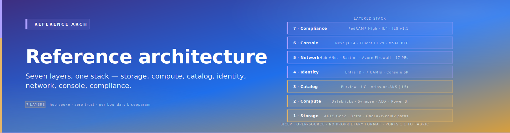
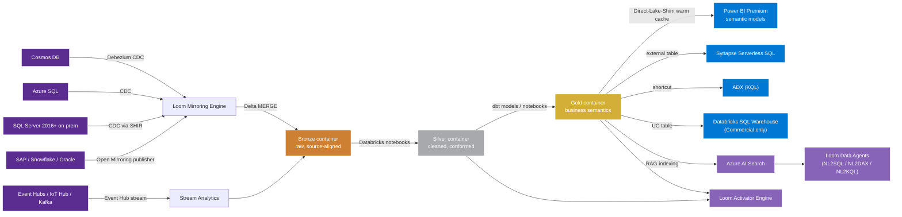
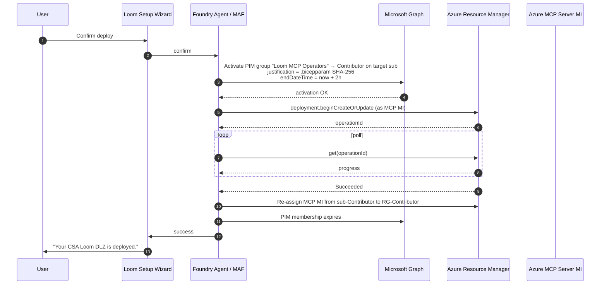

# CSA Loom — Reference Architecture

> **Comparative positioning note.** This document is written from the
> perspective of Microsoft Azure, Cloud Scale Analytics, and CSA Loom. Any
> description of third-party or competing products, services, pricing, or
> capabilities is derived from **publicly available documentation and sources**
> believed accurate at the time of writing, and is provided for **general
> comparison only**. We do not claim expertise in, or authority over, any
> non-Microsoft product or service; the respective vendor's official
> documentation is the authoritative source for their offerings, which may
> change over time. Nothing here is intended to disparage any vendor — where a
> competing product has genuine advantages, we aim to note them honestly.
> Verify all third-party details against the vendor's current official
> documentation before making decisions.


{ .architecture-hero loading="eager" }

This is the architecture contract. Every workload parity page, every
deployment guide, every runbook traces back to choices on this page.

## Architecture at a glance

```mermaid
flowchart TB
    classDef external fill:#5C2D91,stroke:#fff,color:#fff,stroke-width:2px
    classDef bootstrap fill:#0078D4,stroke:#fff,color:#fff,stroke-width:2px
    classDef admin fill:#107C10,stroke:#fff,color:#fff,stroke-width:2px
    classDef landing fill:#D83B01,stroke:#fff,color:#fff,stroke-width:2px
    classDef parity fill:#8764B8,stroke:#fff,color:#fff,stroke-width:2px
    classDef gov fill:#5D5A58,stroke:#fff,color:#fff,stroke-width:2px

    User["Federal customer<br/>(CIO / CDO / Platform team)"]:::external

    Azd["azd CLI<br/>(power-user path)"]:::bootstrap
    DTAB["Deploy to Azure button<br/>(GitHub README)"]:::bootstrap

    User -->|git clone + azd up| Azd
    User -->|Click button| DTAB

    Azd --> AdminPlane
    DTAB --> AdminPlane

    subgraph AdminPlane ["CSA Loom Admin Plane (Data Management Zone) — one sub per org"]
        direction TB
        Hub["Hub VNet + Azure Firewall<br/>+ Private DNS zones"]:::admin
        ACR["Azure Container Registry"]:::admin
        Console["Loom Console (Next.js + Fluent UI v9)<br/>Container App (Commercial/GCC) or AKS (GCC-H/IL5)"]:::admin
        Wizard["Loom Setup Wizard route<br/>inside Loom Console"]:::admin
        MCP["Self-hosted Azure MCP server<br/>Command channel"]:::admin
        Copilot["Loom Copilot runtime<br/>(extended apps/copilot + azure-functions/copilot-chat)"]:::admin
        Cat["Catalog overlay<br/>Purview (Commercial/GCC/GCC-H)<br/>Atlas-on-AKS (IL5)"]:::admin
        Foundry["Azure AI Foundry Hub (Commercial) /<br/>Azure ML Classic Hub (Gov)"]:::admin
        Search["Azure AI Search<br/>(vector + integrated vectorization)"]:::admin
        Monitor["Application Insights + Log Analytics<br/>+ Microsoft Sentinel"]:::admin
        KV["Azure Key Vault Premium HSM"]:::admin
    end

    AdminPlane -->|deploys + manages| DLZ1
    AdminPlane -->|deploys + manages| DLZ2
    AdminPlane -->|deploys + manages| DLZN["..."]

    subgraph DLZ1 ["CSA Loom Data Landing Zone — Domain A (one sub)"]
        direction TB
        Spoke1["Spoke VNet peered to Hub"]:::landing
        Databricks1["Azure Databricks Premium workspace<br/>(UC managed Commercial; Hive Gov)"]:::landing
        Synapse1["Synapse Serverless SQL pool"]:::landing
        ADX1["ADX cluster (shared) — Database for this domain"]:::landing
        Storage1["ADLS Gen2 storage account(s)<br/>(Bronze / Silver / Gold containers)"]:::landing
        PowerBI1["Power BI Premium workspace<br/>F-SKU in GCC-H/IL5; P-SKU in GCC"]:::landing
        WS1["Loom workspaces (data products)<br/>inside this DLZ"]:::landing

        subgraph Parity1 ["Parity services (per-DLZ)"]
            direction TB
            ActEng["Loom Activator Engine<br/>NRules + Redis + Function dispatcher"]:::parity
            MirEng["Loom Mirroring Engine<br/>Debezium + Event Hubs + Spark"]:::parity
            DLShim["Loom Direct-Lake Shim<br/>Event Grid → TOM partition refresh"]:::parity
        end
    end

    subgraph DLZ2 ["CSA Loom Data Landing Zone — Domain B"]
        direction TB
        DLZ2Brief["...same shape as Domain A..."]:::landing
    end

    subgraph GovServ ["Shared Azure services (Gov-available)"]
        direction TB
        AOAI["Azure OpenAI Service<br/>(GA at FedRAMP High + IL4 + IL5 + IL6)"]:::gov
        EventGrid["Azure Event Grid"]:::gov
        EventHubs["Azure Event Hubs"]:::gov
        APIM["Azure APIM Premium"]:::gov
        Entra["Microsoft Entra ID"]:::gov
    end

    Console -->|MSAL BFF auth| Entra
    Wizard -->|tool calls| MCP
    MCP -->|ARM deploys| DLZ1
    MCP -->|ARM deploys| DLZ2
    Copilot -->|inference| AOAI
    Copilot -->|RAG over schema/samples| Search

    ActEng -->|KQL queries| ADX1
    MirEng -->|Kafka protocol| EventHubs
    MirEng -->|Delta MERGE| Storage1
    DLShim -->|partition refresh| PowerBI1

    Cat -.scans.-> Databricks1
    Cat -.scans.-> Synapse1
    Cat -.scans.-> Storage1
    Cat -.scans.-> PowerBI1
```



## Tenancy model

### Subscription = Data Landing Zone

Loom aligns with Microsoft CAF's Data Landing Zone pattern.

| CAF / ESLZ concept | CSA Loom concept | Azure entity |
|---|---|---|
| Data Management Zone | Loom Admin Plane | One subscription per organization |
| Data Landing Zone | Loom Data Landing Zone | One subscription per domain / agency / mission |
| Data Product (RG inside DLZ) | Loom Workspace | Resource group inside DLZ |
| Data Product resources | Loom items (lakehouse, warehouse, semantic model, pipeline) | Mix of Azure resources + Console metadata |

**DLZ = subscription; workspace = data product inside the DLZ.** A
single DLZ can host multiple workspaces (one per business team /
project). Federal customers typically want subscription-level cost
separation per domain — not per workspace, which would explode
subscription count.

### Deployment modes

The Setup Wizard exposes two modes:

**Mode A — Single-sub** (trials, small agencies, single-mission POCs):
- Admin Plane + 1 DLZ in same subscription
- Maximum 1 DLZ; to add more, convert to multi-sub via Console
  "Convert to multi-sub" flow

**Mode B — Multi-sub** (production federal deploys):
- Admin Plane in sub-A
- Each DLZ in its own subscription (sub-B, sub-C, ..., sub-N)
- Spoke VNets in each DLZ peer to Admin Plane hub VNet
- Single Entra tenant; identical Entra groups across subscriptions
- DLZs added any time via Console "Add Data Landing Zone" action

## Per-boundary dispatch matrix

This table drives every Bicep parameter, every Console runtime
configuration, every documentation note.

| Component | Commercial / GCC | GCC-High / IL4 | DoD IL5 (v1.1) |
|---|---|---|---|
| Compute — Spark | Databricks Premium (Photon on clusters) | Databricks Premium classic (no UC) | Databricks Premium classic (no UC) |
| Compute — SQL Warehouse | Databricks SQL Warehouse | **Synapse Serverless** (Databricks SQL Warehouse not in Gov) | Synapse Serverless |
| Compute — KQL | Azure Data Explorer cluster | Azure Data Explorer cluster | Azure Data Explorer cluster |
| Storage | ADLS Gen2 HNS | ADLS Gen2 HNS | ADLS Gen2 HNS + HSM-CMK + double-encryption |
| Catalog (primary) | Databricks Unity Catalog managed | **Microsoft Purview** (UC managed not yet in Gov) | **Self-hosted Apache Atlas on AKS** (Purview not in IL5 audit scope) |
| Catalog (overlay) | Purview Unified Catalog | (none — Purview is primary) | (none — Atlas is primary) |
| Cross-engine catalog API | UC Iceberg REST endpoint | Synapse external tables + Purview asset references | Atlas REST API + ADLS path conventions |
| Power BI | Power BI Premium F-SKU + Direct Lake parity service | Power BI Premium F-SKU + Direct Lake parity service | Power BI Premium F-SKU + Direct Lake parity service |
| Direct Lake | Direct Lake on OneLake (when forward-migrating) | Premium Import + warm-cache materializer | Premium Import + warm-cache materializer |
| **GCC specific** | P-SKU only in GCC — **no F-SKU; no Direct Lake at all** even when Fabric Gov ships | n/a | n/a |
| Container compute | Container Apps | **AKS** (Container Apps not at IL4+) | **AKS** |
| Functions host | Flex Consumption | **Premium EP1** (Flex not in Gov) | Premium EP1 |
| APIM | Premium v2 | **Classic Premium** (v2 not confirmed in Gov) | Classic Premium |
| AI inference | Azure OpenAI (full catalog) | Azure OpenAI Gov (gpt-4o, gpt-4.1, o3-mini, gpt-5.1 in usgovvirginia / usgovarizona) | Same Gov catalog |
| Agent orchestration | Foundry Agent Service (GA Mar 2026) | **Microsoft Agent Framework 1.0** + AOAI direct | MAF 1.0 + AOAI direct |
| Embedding model | text-embedding-3-large any region | text-embedding-3-large **usgovarizona only** | Same |
| OpenAI Batch API | Available | **Not in Gov** | Not in Gov |
| OpenAI Content Safety | Available | **Not at IL4 audit scope** (Presidio self-host) | Not |
| Defender for Cloud AI Threat Protection | Available | **Commercial-only** (manual Sentinel + Content Safety pipeline) | Commercial-only |
| Foundry portal | Available | **Not at IL4** (use classic Azure ML Hub) | Not |
| Deployment shape | azd CLI + Deploy-to-Azure | azd CLI + Deploy-to-Azure | azd CLI + Deploy-to-Azure |

## Catalog two-track architecture

Per [ADR fiab-0003](adr/0003-catalog-layering.md):

### Track A — Commercial (and GCC, when UC managed catches up)

```
Databricks Unity Catalog (managed)              ◄── primary technical catalog
  - catalogs / schemas / tables / volumes / functions / models
  - ABAC + row filters + column masks + system tables
  - Iceberg REST endpoint: /api/2.1/unity-catalog/iceberg-rest

Microsoft Purview Unified Catalog               ◄── sensitivity / sovereignty overlay
  - scans UC nightly (system.access + system.lineage)
  - MIP sensitivity labels propagate to Power BI / downstream
  - Business glossary, data products, publication workflows
  - DSPM (GA May 2026 Commercial; July 2026 Gov)

Cross-engine consumption:
  - Power BI Premium → Direct Lake / Direct-Lake-Shim on Delta (via UniForm)
  - Synapse Serverless → external tables over ADLS Gen2 paths
  - ADX → OneLake-style shortcuts
  - Trino / DuckDB / Spark OSS → UC Iceberg REST endpoint
```

### Track B — Gov interim (IL4 — until UC managed Gov-GA arrives)

```
Microsoft Purview                               ◄── primary catalog
  - scans every ADLS Gen2 account
  - scans Synapse Serverless databases
  - scans Databricks Hive metastore (one-way connector)
  - scans Power BI semantic models
  - MIP sensitivity labels + business glossary + lineage

Databricks Hive metastore                       ◄── runtime catalog only
  - workspace-scoped (no cross-workspace governance)
  - manual lineage via Atlas REST API → Purview
```

### Track C — DoD IL5 (Purview not in audit scope)

```
Self-hosted Apache Atlas on AKS                 ◄── primary catalog
  - Solr + HBase + Kafka stack (Atlas dependencies)
  - Atlas REST API integration with Loom Console
  - JanusGraph for lineage storage
  - Custom ABFS scanners for ADLS Gen2
```

### Track promotion: when UC managed Gov-GA arrives

v1.1 ships a catalog migration tool (PRP-102) that:
1. Scans Purview for Loom-registered assets in the customer's tenant
2. Registers eligible assets in the newly-provisioned UC managed
   metastore
3. Updates Console UI to "Purview overlay" vs "Purview primary"
4. Maintains Purview overlay for sensitivity / sovereignty / audit

## Data flow — medallion architecture mapped through Loom



## Identity flow

### Identities

| Identity | Type | Purpose | Standing permissions |
|---|---|---|---|
| Loom Orchestrator MI | UAMI | Authenticate wizard / Console agent to AOAI / Foundry / AI Search | Cognitive Services OpenAI User |
| Loom MCP Server MI | UAMI | Execute ARM deploys with JIT elevation | Reader on every Loom sub; KV Secrets User; **PIM-eligible Contributor** on each sub |
| Workspace identities | UAMI (per workspace) | Workspace items authenticate to OneLake / Databricks / Synapse / Power BI | Storage Blob Data Contributor + UC roles or Hive grants |
| **Admin / Workspace / Steward Entra groups** | Entra groups | Human identity grouping | Console-managed; mapped to UC roles or Synapse roles |

### JIT elevation flow



Per [ADR fiab-0008](adr/0008-deployment-shape.md): service principals
can't be PIM-eligible directly → use **PIM-for-Groups** with the MCP
MI as a group member, OR use **time-bound active ARM role assignments**
via REST. v1 ships time-bound REST as default; PIM-for-Groups
available for orgs that already run on PIM.

## Network model — hub-spoke

```
        ┌──────────────────────────────────────────────────────────┐
        │   Admin Plane subscription                                │
        │                                                            │
        │   Hub VNet  (10.0.0.0/16)                                 │
        │     - AzureFirewallSubnet                                 │
        │     - GatewaySubnet (for ER/VPN)                          │
        │     - mcp-subnet                                          │
        │     - console-subnet                                      │
        │     - ai-subnet (Foundry / AOAI / Search)                 │
        │     - pe-subnet (central Private Endpoints)               │
        │                                                            │
        │   Private DNS zones (zone-per-service)                    │
        │     - privatelink.dfs.core.windows.net (.usgovcloudapi.net in Gov)
        │     - privatelink.openai.azure.com (.us in Gov)           │
        │     - privatelink.vault.azure.net (.usgovcloudapi.net in Gov)
        │     - privatelink.azuredatabricks.net (.databricks.azure.us in Gov)
        │     - privatelink.purview.azure.com (.us in Gov)          │
        │     - privatelink.kusto.windows.net                       │
        └──────────────┬─────────────────────────┬─────────────────┘
                       │ VNet Peering             │ VNet Peering
                       │                          │
        ┌──────────────▼───────┐    ┌────────────▼─────────────────┐
        │ DLZ Domain A          │    │ DLZ Domain B                  │
        │ Spoke VNet            │    │ Spoke VNet                    │
        │   - services          │    │   - services                  │
        │   - dbx-private       │    │   - dbx-private               │
        │   - dbx-public        │    │   - dbx-public                │
        │   - pe-subnet         │    │   - pe-subnet                 │
        │   - activator         │    │   - activator                 │
        │   - mirroring         │    │   - mirroring                 │
        │   - shim              │    │   - shim                      │
        └───────────────────────┘    └───────────────────────────────┘
```

All PaaS resources deploy with `publicNetworkAccess = disabled`.
Private endpoints for storage, KV, OpenAI, Databricks, Purview, ADX,
AI Search, ACR, Cosmos. Spoke VNets link to hub's Private DNS zones.
On-prem connectivity via ExpressRoute or VPN landing in hub.

## What customers can change without re-deploying

- ✅ Scale up / down Databricks workspace SKU
- ✅ Resize ADX cluster
- ✅ Adjust APIM throughput tier
- ✅ Add / remove Workspace member Entra groups
- ✅ Restart Container Apps / AKS workloads
- ✅ Trigger MCP-mediated reconfig deploys (add workspace, change OAP
  rule)
- ❌ Delete storage accounts (deny assignment)
- ❌ Delete Key Vault (deny assignment)
- ❌ Modify Workspace Outbound Access Protection rules without going
  through Setup Wizard's approval flow

## Where to read next

- [Workloads](workloads/index.md) — per-Fabric-workload parity design
- [Deployment](deployment/index.md) — quickstart + per-boundary guides
- [Governance](governance/catalog.md) — catalog two-track detail
- [Operations](operations/index.md) — capacity, monitoring, DR
- [ADRs](adr/README.md) — the durable rationale for every choice
