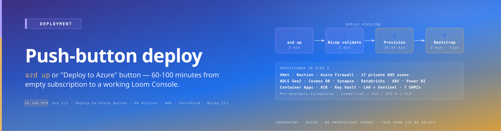

# CSA Loom — Deployment

{ .architecture-hero loading="eager" }

Deploying CSA Loom takes about 60-100 minutes from start to a working
Loom Console URL in your tenant. The platform is shipped as
infrastructure-as-code; you deploy it into your own Azure
subscription via one of two paths.

## Start here — greenfield or brownfield?

This is the first decision, and it is not a preference. It is determined by what
is already in your subscriptions.

<div class="grid cards" markdown>

-   :material-sprout: [**Greenfield** — empty subscription](greenfield.md)

    The target subscription contains no Azure resource Loom could adopt and no
    existing `rg-csa-loom-admin-*` hub. Every backing service is deployed new.
    Three phases: infrastructure → app images → post-deploy bootstrap.

-   :material-office-building-cog: [**Brownfield** — adopt what exists](brownfield.md)

    Your tenant already has a Purview account, a shared AI Search, an ADLS lake,
    an existing VNet, or a previous Loom hub. Loom inventories your
    subscriptions and you decide, per service, adopt / create / skip.

</div>

Three supporting references, used by both paths:

<div class="grid cards" markdown>

-   :material-magnify-scan: [**Discovery and adoption reference**](discovery-and-adoption.md)

    What Loom scans, what it uses each service for, what it **changes** about a
    service you let it adopt, and how to supply existing-infrastructure values
    by hand.

-   :material-folder-network: [**Resource-group layout, naming and tags**](resource-groups.md)

    The naming **contract**, the `single`/`default` trap that broke the
    post-deploy bootstrap, the `rg-csa-loom-` teardown blast radius, CAF tags,
    and the not-built function-RG split (t169).

-   :material-lifebuoy: [**Failure recovery**](failure-recovery.md)

    The eight failure classes — transient, eventual-consistency, registration,
    permission, quota, config, defect, unknown — with the ARM codes that map to
    each and the remediation per class.

</div>

> **Not sure which you are?** Run
> `bash scripts/csa-loom/discover-services.sh`. If it returns no candidates in
> any subscription you intend to use, you are greenfield. Greenfield working
> proves nothing about brownfield and vice versa — the two are verified
> independently.

## The in-Console setup wizard, step by step

`deploy-integrity.md` **R8** requires the wizard and the docs to agree — a wizard
step with no doc is drift, and a defect. This is that walkthrough: the `/setup`
rail, in the order it runs, measured against
`apps/fiab-console/lib/panes/setup-wizard.tsx` (`RAIL_STEPS`) on 2026-08-08.

| # | Step (rail label) | What you decide | Notes |
|---|---|---|---|
| 1 | **Cloud boundary** | Commercial · GCC · GCC-High / IL4 · IL5 | Selects the boundary parameter file *and* the workflow the deploy dispatches to. GCC is M365 GCC identity over Azure Public; GCC-High and IL5 are Azure Government |
| 2 | **Deployment mode** | single-sub or multi-sub | Single-sub puts the Admin Plane and one Data Landing Zone in the same subscription |
| 2b | **Deploy new, or wire existing?** | *only when mode = multi-sub* — deploy a new DLZ, or wire already-deployed DLZs into this Admin Plane (RBAC + env, no re-deploy) | A **dynamic** sub-step inserted after *Deployment mode*; it is not in the static rail. The *wire-existing* branch **skips steps 4–7 entirely** and goes straight to Review |
| 3 | **Subscription & region** | The deploy target | Region choice is load-bearing — see the region-caveat table in [Greenfield](greenfield.md#phase-1--infrastructure-4090-min) |
| 4 | **Domain name** | The landing-zone name, plus an optional **vanity URL** | Becomes `rg-csa-loom-dlz-<domain>-<location>` — see [resource-group layout](resource-groups.md) |
| 5 | **Capacity sizing** | Compute equivalence (F-SKU class, F2–F512) | Presented as an equivalence panel, not raw SKUs |
| 6 | **Analysis scope** | Which subscriptions Loom may **read** | Read-only. This is the R5 multi-subscription analysis |
| 7 | **Reuse or deploy** | **adopt / create / skip, per service** | The brownfield decision step — full reference in [Brownfield](brownfield.md#step-2--choose-adopt-or-create-per-service) |
| 8 | **Review & deploy** | Confirm the plan and launch. Also carries the Entra identity card, the deployment diagram, a bicep preview, a read-only networking scan panel, and a vCPU quota preflight | The **Deploy** button lives here |

Three transient steps (`intro`, `deploying`, `done`) bracket the rail and carry
no decisions.

> ### Two constraints the step list does not show
>
> Both are measured against the code on 2026-08-08, not inferred.
>
> 1. **The wizard is first-install-only.** It never submits a `topology`, so
>    `POST /api/setup/deploy` falls back to `topology='tenant'` and returns
>    **409** when a hub already exists in the tenant — pointing you at
>    `/admin` → *Add landing zone* (`topology=dlz-attach`) instead. That is the
>    correct invariant (a second Console can never be stamped), but it means the
>    wizard is not the tool for reconciling an existing estate. Use
>    `deploy-fiab-commercial.yml` with `allow_existing_hub=true` for that —
>    [Brownfield → adopting into an existing hub](brownfield.md#adopting-into-an-existing-loom-hub).
> 2. **A plan containing any `adopt` decision cannot be deployed from the
>    wizard.** The Deploy button is gated on `planBlockers()`, which blocks every
>    adopt decision that has no fitness verdict — and no production code path
>    ever attaches one. So **drive a brownfield install from the CLI**, and note
>    that `recommendFor()` picks `adopt` *by default* whenever one candidate is
>    found, so this is the default outcome on a brownfield tenant, not an opt-in.
>    Measurement and re-measure commands:
>    [Brownfield → blocking defect](brownfield.md#blocking-defect-the-wizard-cannot-deploy-a-plan-containing-an-adopt-decision).
>
> **Corrections to an earlier version of this box**, recorded rather than
> silently rewritten:
>
> - It said the wizard calls `POST /api/setup/scan-services` and that the good
>   scanner is elsewhere. **That route no longer exists** — the directory is
>   deleted. The wizard's scan runs on `POST /api/setup/estate-scan`, which
>   shares the coverage probe (#3015).
> - It said "**PR #3062, which is OPEN — not merged, not deployed**". #3062
>   **merged 2026-08-07**. Per `deploy-integrity.md` R2 that still is not
>   "deployed" — check `curl -s https://<your-console-hostname>/build-marker.txt`
>   against `origin/main` before relying on any of it.
> - It attributed the "use the CLI for brownfield" advice to **#3016**. #3016 is
>   fixed. The advice still holds, for the **#3014** fitness reason above.

### Wizard steps that have no walkthrough yet

Named here rather than left as silent drift (R8). Each is implemented in the
wizard and undocumented in the walkthroughs:

`intro` hero · the *Deploy new vs wire-existing* multi-sub sub-step (including
`POST /api/setup/wire-existing`, which does RBAC + env patching and no deploy) ·
the vanity-URL field · the capacity-equivalence panel · the storage /
organizational-visuals choice on the review step (whose
`existingLoomStorageAccount` value the deploy route declares but never reads) ·
the Entra identity card · the in-wizard quota preflight · the deployment
diagram · deploy-run streaming and re-attach.

## Deployment paths

<div class="grid cards" markdown>

-   :material-rocket-launch: [**Quick Start (60 minutes)**](quickstart.md)

    The fastest happy path against Azure Commercial. Use this if
    you're evaluating Loom and want the shortest path to a working
    Console.

-   :material-console-line: [**`azd up` CLI**](azd-cli.md)

    Power-user path with full Bicep visibility. Best for platform
    engineers + production deploys.

</div>

## Continuous-deployment pipelines

CI/CD-friendly paths that fit existing GitOps workflows. Each runs the
same `platform/fiab/bicep/main.bicep` template under environment-gated
approvals so customers can promote Dev → Stage → Prod.

<div class="grid cards" markdown>

-   :material-github: [**GitHub Actions**](pipelines/github-actions.md)

    OIDC federated-credential workflow with per-environment approvals.
    Copy-paste-ready YAML. The pattern used by this repo's own
    `.github/workflows/deploy-fiab-*.yml`.

-   :material-microsoft-azure-devops: [**Azure DevOps Pipelines**](pipelines/azure-devops.md)

    Multi-stage YAML with workload-identity federation + ADO Environment
    approval gates. The path most federal customers use.

-   :material-code-tags: [**Bicep CLI direct**](pipelines/bicep-cli.md)

    `az deployment sub create` with the canonical parameter file. No
    GitHub, no ADO, no azd. Bash + az CLI only.

-   :material-language-terraform: [**Terraform wrapper**](pipelines/terraform.md)

    `azurerm_resource_group_template_deployment` wrapping the same Bicep
    template. For shops standardized on Terraform / OpenTofu.

</div>

## Per-boundary guides

<div class="grid cards" markdown>

-   :material-cloud: [**Azure Commercial / GCC** — *GA*](commercial.md)

    The full Loom stack; UC managed catalog; Foundry Agent Service;
    Container Apps everywhere. **Both Azure Commercial and GCC are
    GA for Loom** — GCC customers run on Commercial regions under
    M365 GCC identity, and Loom bridges the tenant SP gap that
    blocks Fabric for GCC tenants.

-   :material-government: [**Azure Government — GCC pair (FedRAMP High)**](gcc.md)

    Azure Government FedRAMP High regions. Use this for FedRAMP High
    customers whose audit boundary requires Azure Government (not
    Azure Commercial). Azure-native semantic models by default; if the
    opt-in Power BI backend is selected it is P-SKU only (no F-SKU; no
    Direct Lake parity).

-   :material-shield-account: [**Azure Government — GCC-High / IL4**](gcc-high.md)

    Azure Government cloud. AKS instead of Container Apps; Purview-
    primary catalog; MAF + AOAI direct as orchestrator (no Foundry
    Agent Service in Gov).

-   :material-shield-star: **DoD IL5 (v1.1)**

    *Available in v1.1.* Atlas-on-AKS catalog (Purview not in IL5
    audit scope); HSM-CMK storage; customer-managed plan only.

</div>

## Tenancy modes

<div class="grid cards" markdown>

-   :material-domain: **Single-sub mode**

    Admin Plane + 1 DLZ in same subscription. Trials, small agencies,
    single-mission POCs. Convert to multi-sub later via Console.

-   :material-source-branch: [**Multi-sub mode**](multi-sub-multi-tenant.md)

    Admin Plane in sub-A; each DLZ in its own subscription. Production
    federal pattern; aligns with CAF Data Landing Zone model.

</div>

## Lifecycle

<div class="grid cards" markdown>

-   :material-update: [**Upgrade lifecycle**](upgrade.md)

    `azd up` re-run picks up new module versions. Console "Updates"
    pane shows release notes.

-   :material-storefront: [**Marketplace (deferred)**](marketplace.md)

    Azure Marketplace Managed Application listing is deferred to
    backlog per locked decision LD-4. See page for context + future
    pricing model placeholder.

</div>

## Prerequisites checklist

Before you start, you need:

| Item | Notes |
|---|---|
| Azure subscription with **Contributor + User Access Administrator** on the target sub | Single-sub mode needs one sub; multi-sub needs one per DLZ |
| Microsoft Entra tenant with admin rights to create Entra groups + role assignments | Loom uses Entra groups for Loom Admins / Workspace Admins / Domain Stewards |
| Available **/16 IP range per DLZ** (private address space, peerable to Admin Plane hub) | Hub default `10.0.0.0/16`; DLZ defaults `10.N.0.0/16` |
| `az` CLI installed (latest) | For `azd up` path |
| `azd` CLI installed | For `azd up` path |
| Quota for Databricks Premium workspace in target region | Check via `az vm list-usage` |
| Quota for ADX cluster (D14_v2 minimum recommended) | |
| Quota for Azure OpenAI capacity (TPM allocation) | gpt-4o or gpt-4.1; usgovvirginia for Gov |
| Internet egress for ACR image pulls (or pre-loaded ACR) | Container images come from a Microsoft public ACR; pre-mirror to your ACR if egress restricted |

> **Optional — only with `LOOM_SEMANTIC_MODEL_BACKEND=powerbi`.** Semantic models
> + reports run on the Azure-native tabular layer by default (Azure Analysis
> Services in Commercial/GCC; the Loom-native / Synapse Serverless path in
> GCC-High / IL5) — **no Power BI capacity is required**. A Power BI Premium
> capacity (F-SKU for GCC-H / IL5, P-SKU for GCC) is needed **only** if you opt
> into the Power BI / Direct-Lake-Shim backend.

Detailed per-boundary prerequisite checklists in the per-boundary
guides above.

## What gets deployed

A v1 multi-sub deploy creates roughly:

| Component | Quantity per Admin Plane | Quantity per DLZ |
|---|---|---|
| Resource groups | ~5 | ~6 |
| VNets | 1 hub | 1 spoke (peered to hub) |
| Private DNS zones | ~12 (centralized in hub) | 0 (linked to hub zones) |
| Storage accounts | 2 (KV + logging) | 3-5 (per workspace) |
| Container App Env or AKS cluster | 1 | 1 |
| Container Apps / AKS workloads | ~5 (Console, MCP, Copilot, etc.) | ~4 (parity services) |
| Databricks workspaces | 0 | 1 |
| Synapse workspaces | 0 | 1 |
| ADX clusters | 1 (shared) | 0 (database on shared) |
| Power BI Premium workspaces (opt-in only — `LOOM_SEMANTIC_MODEL_BACKEND=powerbi`) | 0 | 0 by default (1+ per workspace only if the Power BI backend is selected) |
| AI Foundry / Azure ML Hub | 1 | 0 |
| AI Search | 1 (S1+) | 0 |
| Purview accounts | 1 (Commercial/GCC/GCC-H) | 0 |
| Key Vault Premium HSM | 1 | 1 |

Cost estimate (Azure-native Commercial baseline): ~$2-4.5K/month
underlying Azure consumption + zero Loom IP cost in v1. The opt-in Power
BI Premium backend adds ~$1K/month if selected.

## Validation gates per deploy

After deploy completes, the Loom Console performs a built-in
health check:

- All Container Apps / AKS workloads passing `/health`
- All Private Endpoints resolving correctly
- Workspace Identity round-trip OK (Console can author a workspace
  via MCP)
- Catalog round-trip OK (read schema from UC / Purview)
- Power BI workspace creation via REST OK
- Sample data ingest + query OK (canary workspace)

Failures surface in Console "Monitoring" pane with remediation
suggestions.

## Bicep param-bag rule (ARM 256-param cap)

ARM hard-caps every template at **256 `param` declarations**.
`platform/fiab/bicep/modules/admin-plane/main.bicep` hit that cap on
2026-07-22 and was consolidated back to 232 (loom-next-level R0) by moving
related params into **typed config-object (bag) params** — `aasConfig`,
`adxConfig`, `eventsConfig`, `functionAppsConfig`, plus reserved
`observabilityConfig` / `drConfig` / `workspaceIdentityConfig` bags for
upcoming features. Each bag property keeps its former param name, and a shim
`var name = bag.?name ?? <default>` preserves the former default, so the
consolidation is behaviorally inert.

**The rule:** new deploy-time settings land as a property on one of these
bags (or as a nested-module param) — **never** as a new top-level `param` in
`admin-plane/main.bicep` or the top-level `main.bicep`. To add a setting: add a
typed property to the matching `*ConfigT` type, add the shim `var` with its
default, and wire the value from the caller's bag literal. CI enforces headroom
via `scripts/ci/check-bicep-param-cap.mjs` (warn ≥ 240, fail ≥ 250 on the
admin-plane module).

Re-measure rather than trusting a published number — these drift with every
merge. Measured 2026-08-08: the top-level `main.bicep` is at **222**.

```bash
grep -c '^param ' platform/fiab/bicep/main.bicep
grep -c '^param ' platform/fiab/bicep/modules/admin-plane/main.bicep
```

## Where to next

After your first deploy:

1. **Create your first workspace** — [Tutorial 01 — First workspace](../tutorials/01-first-workspace.md)
2. **Ingest your first dataset** — [Tutorial 02 — First lakehouse](../tutorials/02-first-lakehouse.md)
3. **Set up your first Direct Lake-parity semantic model** —
   [Tutorial 03 — Direct Lake parity](../tutorials/03-direct-lake-parity.md)
4. **Plan your forward migration** to Fabric —
   [Forward to Fabric runbook](../operations/forward-to-fabric.md)

## Help

- **Runbooks** for deploy failures: [Deploy failure runbook](../runbooks/deploy-failure.md)
- **Internal channel:** Microsoft `#csa-loom-build` Teams channel
- **External issues:** [GitHub Issues](https://github.com/fgarofalo56/csa-inabox/issues)
  labeled `csa-loom`
