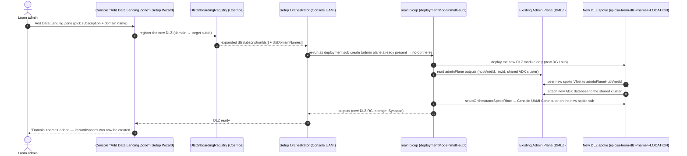
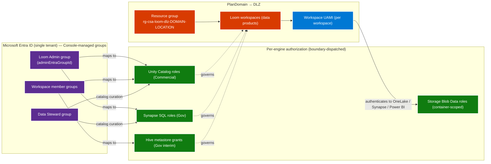
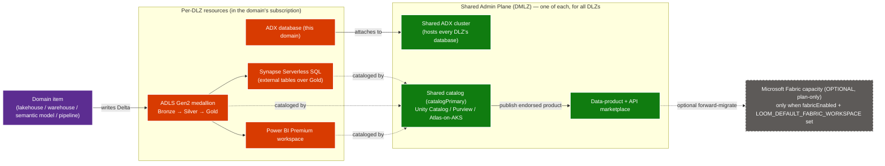
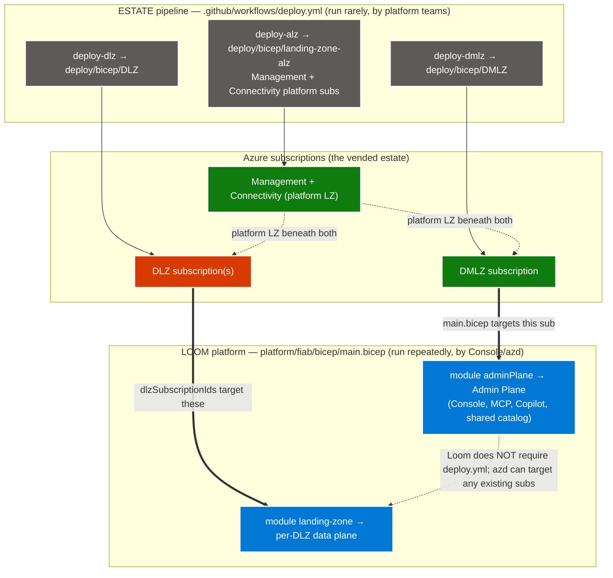

# CSA Loom — architecture diagrams

This page is the rendered home for the CSA Loom topology and deployment diagrams.
The committed source for each lives next to this file as a `.mmd` (Mermaid) — the
diff-friendly source of truth — and is mirrored here as a rendered Mermaid block.
The hand-drawn hero is committed as [`topology.excalidraw`](topology.excalidraw)
(open it in [excalidraw.com](https://excalidraw.com) or the VS Code Excalidraw
extension).

These diagrams are referenced from the [Reference architecture](../architecture.md)
and taught in [Tutorial 09 — Tenant topology](../tutorials/09-tenant-topology.md).
The topology shape (one DMLZ hub + N DLZ spokes + one Console) is **identical
across every cloud boundary** — only the per-node service substitution changes
(see the [per-boundary dispatch matrix](../architecture.md#per-boundary-dispatch-matrix)).

| Diagram | Source | Teaches |
|---|---|---|
| Tenant topology | [`tenant-topology.mmd`](tenant-topology.mmd) | DMLZ hub + N DLZ spokes + single Console |
| First-run deploy flow | [`deploy-flow-first-run.mmd`](deploy-flow-first-run.mmd) | Initial provision of Admin Plane + first DLZ |
| DLZ-attach deploy flow | [`deploy-flow-dlz-attach.mmd`](deploy-flow-dlz-attach.mmd) | Adding a DLZ to an existing Admin Plane |
| Domain / RBAC model | [`domain-rbac.mmd`](domain-rbac.mmd) | Entra groups → per-engine roles → workspace UAMIs |
| Data flow (domain → catalog) | [`data-flow-domain-to-catalog.mmd`](data-flow-domain-to-catalog.mmd) | Domain item → DLZ resources → shared catalog/marketplace |
| Estate pipeline vs Loom | [`estate-vs-loom.mmd`](estate-vs-loom.mmd) | How `deploy.yml` relates to `main.bicep` |

---

## Tenant topology — one DMLZ hub, N DLZ spokes, one Console

Source: `platform/fiab/bicep/main.bicep` (`adminPlaneRg` + `module adminPlane`;
`singleDlz` in single-sub, `dlz[*]` over `dlzSubscriptionIds` in multi-sub).

```mermaid
flowchart TB
    classDef tenant fill:none,stroke:#5C2D91,stroke-width:2px,stroke-dasharray:6 4,color:#5C2D91
    classDef admin fill:#107C10,stroke:#fff,color:#fff,stroke-width:2px
    classDef landing fill:#D83B01,stroke:#fff,color:#fff,stroke-width:2px
    classDef console fill:#0078D4,stroke:#fff,color:#fff,stroke-width:2px

    subgraph Tenant ["Single Microsoft Entra ID tenant — identical Entra groups across every subscription"]
        direction TB
        subgraph Admin ["Admin Plane = Data Management Zone (DMLZ) — one subscription (rg-csa-loom-admin-LOCATION)"]
            direction TB
            Console["Loom Console (one, serves all DLZs)<br/>Container App (Commercial/GCC) or AKS (GCC-H/IL5)"]:::console
            MCP["Self-hosted Azure MCP server"]:::admin
            Hub["Hub VNet + Azure Firewall + Private DNS zones"]:::admin
            Cat["Shared catalog (catalogPrimary):<br/>Unity Catalog / Purview / Atlas-on-AKS"]:::admin
            ADX["Shared ADX cluster (one cluster, N databases)"]:::admin
            Market["API + data-product marketplace"]:::admin
        end
        subgraph DLZ1 ["DLZ — Domain A (rg-csa-loom-dlz-A-LOCATION)"]
            direction TB
            S1["Spoke VNet (peered to Hub)"]:::landing
            R1["ADLS medallion · Synapse Serverless · ADX DB · Power BI · Cosmos · Weave PG"]:::landing
        end
        subgraph DLZ2 ["DLZ — Domain B (rg-csa-loom-dlz-B-LOCATION)"]
            direction TB
            S2["Spoke VNet (peered to Hub)"]:::landing
            R2["...same shape as Domain A..."]:::landing
        end
        DLZN["DLZ — Domain N ... (one per dlzDomainNames entry)"]:::landing
    end
    class Tenant tenant

    Console -->|deploys + manages| DLZ1
    Console -->|deploys + manages| DLZ2
    Console -->|deploys + manages| DLZN
    Hub <-->|VNet peering| S1
    Hub <-->|VNet peering| S2
    R1 -->|domain DB attaches to| ADX
    R2 -->|domain DB attaches to| ADX
    R1 -.scanned by.-> Cat
    R2 -.scanned by.-> Cat
    R1 -->|publish data product| Market
    R2 -->|publish data product| Market
```



---

## First-run deploy flow

Initial provision: `azd up` / Deploy-to-Azure button → `main.bicep` deploys the
Admin Plane, then the first DLZ. The `deploymentMode` parameter
(`single-sub | multi-sub`) is the topology knob.

```mermaid
sequenceDiagram
    autonumber
    actor Op as Operator (CIO / platform team)
    participant Boot as azd up / Deploy-to-Azure button
    participant Main as main.bicep (targetScope=subscription)
    participant AP as module adminPlane → rg-csa-loom-admin-LOCATION
    participant DLZ as module singleDlz / dlz[*]
    participant RBAC as setupOrchestrator*Rbac

    Op->>Boot: git clone + azd up  (or click the README button)
    Boot->>Main: az deployment sub create -p <boundary>.bicepparam<br/>param deploymentMode = 'single-sub' | 'multi-sub'
    Main->>AP: deploy Admin Plane (Hub VNet, Console, MCP, Copilot,<br/>shared catalog, shared ADX cluster)
    AP-->>Main: outputs (hubVnetId, lawId, consolePrincipalId, adxClusterPrincipalId)
    alt deploymentMode == 'single-sub'
        Main->>DLZ: deploy 1 DLZ (domainName='default') into rg-csa-loom-dlz-single-LOCATION
    else deploymentMode == 'multi-sub'
        loop for each (subId, name) in dlzSubscriptionIds / dlzDomainNames
            Main->>DLZ: deploy DLZ into subId / rg-csa-loom-dlz-<name>-LOCATION<br/>(spoke VNet peers to adminPlaneHubVnetId; ADX DB attaches to shared cluster)
        end
    end
    Main->>RBAC: grant Console UAMI Contributor on hub sub (+ each spoke sub if setupOrchestratorEnabled)
    Main-->>Boot: outputs (consoleUrl, mcpServerUrl, adminPlaneHubVnetId)
    Boot-->>Op: "Your CSA Loom Admin Plane + first DLZ are deployed."
```

---

## DLZ-attach deploy flow

Adding a Data Landing Zone to an **existing** Admin Plane: the Console
"Add Data Landing Zone" action registers the new domain in the
`DlzOnboardingRegistry`, then re-invokes `main.bicep` with an expanded
`dlzSubscriptionIds` / `dlzDomainNames`. The admin plane already exists, so the
run adds one spoke, peers it to the hub, attaches its ADX database, and grants
the spoke RBAC.



---

## Domain / RBAC model

Human Entra groups (one set, tenant-wide) map to per-engine roles. Each
`PlanDomain` becomes a DLZ resource group whose workspace items run as a
per-workspace user-assigned managed identity (UAMI).



---

## Data flow — domain item → DLZ resources → shared catalog / marketplace

A domain item lands in its DLZ resources, then surfaces through the **shared**
Admin-Plane catalog + ADX cluster + marketplace. Each DLZ attaches its own ADX
database to the single shared cluster. Microsoft Fabric is **optional / plan-only**
(no Fabric dependency on the default path).



---

## Estate pipeline (`deploy.yml`) vs the Loom platform (`main.bicep`)

The ESLZ estate pipeline **vends** subscriptions / networks; the Loom platform
**runs** inside them. They compose for full federal estates but Loom does not
require `deploy.yml` — `azd` / the Deploy button can target any existing
subscriptions. See [Relationship to the ALZ estate pipeline](../architecture.md#relationship-to-the-alz-estate-pipeline).


