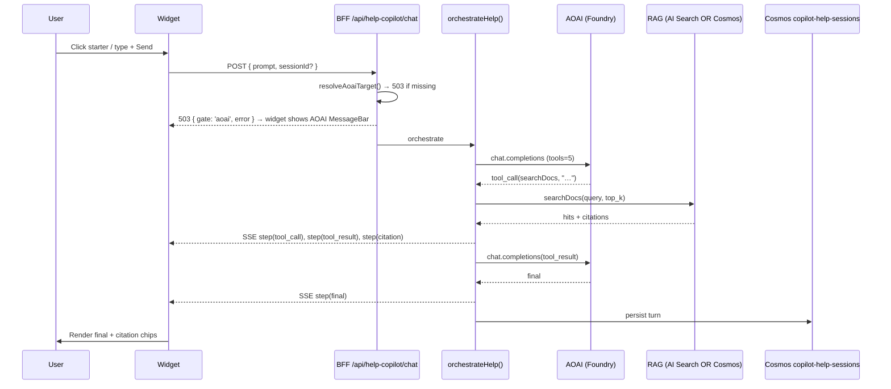

# Help Copilot — architecture

> **audit-t155 — unified Copilot window.** The floating Help Copilot widget is
> retired. The console mounts ONE chat window (`copilot-pane.tsx`) behind ONE
> launcher; `lib/azure/copilot-router.ts` classifies each global-launcher turn
> (forced-`tool_choice` AOAI call) and delegates to either THIS docs/help agent
> (`orchestrateHelp`) or the cross-item build agent (`orchestrate`), emitting an
> `agent` attribution step the window badges inline. The docs agent below is
> unchanged — the console UI now reaches it via `POST /api/copilot/orchestrate`
> (routed), while `POST /api/help-copilot/chat` remains the direct API. Where
> this page says "Widget", read "the unified Copilot window". See
> `docs/fiab/parity/copilot-help-widget.md` and ADR 0022 (the docs-site widget
> stays a separate, deliberate surface).

## Components

- **Unified window UI** — `apps/fiab-console/lib/components/copilot-pane.tsx`
  - the ONE floating panel; sole listener for `csaloom:open-copilot`,
    `csaloom:toggle-copilot`, `csaloom:copilot-context`,
    `csaloom:copilot-persona`, `csaloom:tutorial-step`, and `Ctrl + /`.
  - renders the docs agent's citation chips via
    `help-copilot/citations.tsx` (clickable source chips with hover preview),
    the per-turn agent attribution badge, and the in-window handoff button.
- **Intent router** — `apps/fiab-console/lib/azure/copilot-router.ts`
  - `routeCopilot()` — one `agent` step (id, name, why), then the chosen
    orchestrator's stream verbatim. Editor panes / explicit personas skip
    classification; a bound tutorial step forces the docs agent.
- **Backend orchestrator** — `apps/fiab-console/lib/azure/help-copilot-orchestrator.ts`
  - Reuses `resolveAoaiTarget()` from the cross-item orchestrator.
  - Registers 5 tools (see `index.md`).
  - Streams `HelpStep` events: `tool_call`, `tool_result`, `citation`,
    `handoff`, `final`, `error`.
- **RAG retriever** — `apps/fiab-console/lib/azure/loom-docs-index.ts`
  - Builds the corpus by walking `docs/`, `PRPs/active/csa-loom`,
    `docs/fiab/adr`, and `apps/fiab-console/lib/{azure,editors,components}`.
  - Pushes chunks to either Azure AI Search (`loom-docs` index) or a
    Cosmos `help-copilot-corpus` container (PK `/kind`).
- **BFF routes** — `apps/fiab-console/app/api/help-copilot/`
  - `chat/route.ts` — SSE stream.
  - `sessions/route.ts` — list + fetch persisted sessions.
  - `reindex/route.ts` — GET returns current backend; POST rebuilds corpus.
- **Cosmos containers** (auto-created idempotently)
  - `copilot-help-sessions` PK `/userId` — conversation history.
  - `help-copilot-corpus` PK `/kind` — RAG fallback corpus.

## Data flow — one turn



## Backend selection

| Env var                        | Backend chosen                   |
|--------------------------------|----------------------------------|
| `LOOM_AI_SEARCH_SERVICE` set   | Azure AI Search `loom-docs` index|
| `LOOM_AI_SEARCH_SERVICE` empty | Cosmos `help-copilot-corpus`     |

The Cosmos fallback runs a deterministic substring rank in-process. It
scales fine for the current ~10K-chunk corpus; if the corpus grows past
~50MB, switch to AI Search.

## Handoff to the build agent

When the user asks the docs/help agent to perform an **action** (create a
workspace, run a pipeline, etc.), the model emits a fenced `handoff`
block in its final message:

```
\`\`\`handoff
reason: this is an act (create workspace)
deepLink: /copilot?prompt=create%20workspace%20foo
suggestedPrompt: create workspace foo
\`\`\`
```

The unified window renders an **in-window** "Do it with the build agent"
button that re-sends `suggestedPrompt` through `/api/copilot/orchestrate`
(which routes it to the build agent) — no navigation, no second popup. The
`deepLink` is still honored by API consumers of `/api/help-copilot/chat`.

## Bicep deltas

For deployments that want AI Search-grade retrieval:

1. Set `aiSearchEnabled = true` in the per-boundary
   `params/*.bicepparam`. (Default is `true` in
   `commercial-full.bicepparam`.)
2. The Loom Console container app now exposes `LOOM_AI_SEARCH_SERVICE`
   pointing at the search service name (output `searchName` from
   `modules/admin-plane/ai-search.bicep`).
3. After the deployment finishes, call `POST /api/help-copilot/reindex`
   once as an admin to populate the index.

No AI Search? The widget still works — it'll surface the "running on
the Cosmos fallback" MessageBar so operators know what to do to upgrade.
