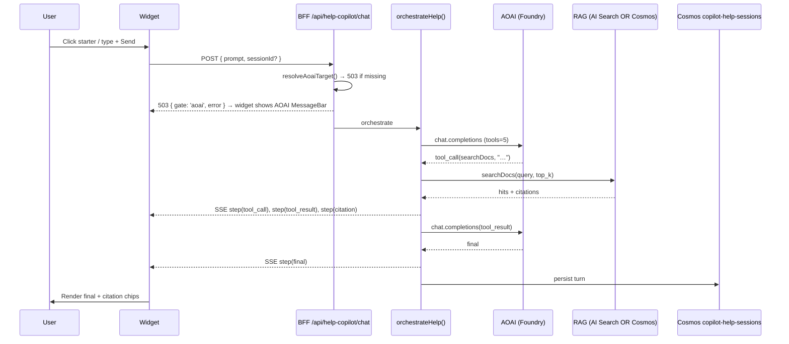

# Help Copilot — architecture

## Components

- **Widget UI** — `apps/fiab-console/lib/components/help-copilot/`
  - `widget.tsx` — floating panel; listens for `csaloom:open-copilot` and
    `Ctrl + /` to toggle.
  - `messages.tsx` — turns + tool-call rows + citation chips + handoff CTA.
  - `citations.tsx` — clickable source chips with hover preview.
  - `empty-state.tsx` — six baked-in starter prompts.
- **Backend orchestrator** — `apps/fiab-console/lib/azure/help-copilot-orchestrator.ts`
  - Reuses `resolveAoaiTarget()` from the cross-item orchestrator.
  - Registers 5 tools (see `index.md`).
  - Streams `HelpStep` events: `tool_call`, `tool_result`, `citation`,
    `handoff`, `final`, `error`.
- **RAG retriever** — `apps/fiab-console/lib/azure/loom-docs-index.ts`
  - Builds the corpus by walking `docs/`, `PRPs/active/csa-loom`,
    `docs/fiab/adr`, and `apps/fiab-console/lib/{azure,editors,components}`.
  - Pushes chunks to either Azure AI Search (`loom-docs` index) or a
    Cosmos `help-copilot-corpus` container (PK `/kind`).
- **BFF routes** — `apps/fiab-console/app/api/help-copilot/`
  - `chat/route.ts` — SSE stream.
  - `sessions/route.ts` — list + fetch persisted sessions.
  - `reindex/route.ts` — GET returns current backend; POST rebuilds corpus.
- **Cosmos containers** (auto-created idempotently)
  - `copilot-help-sessions` PK `/userId` — conversation history.
  - `help-copilot-corpus` PK `/kind` — RAG fallback corpus.

## Data flow — one turn



## Backend selection

| Env var                        | Backend chosen                   |
|--------------------------------|----------------------------------|
| `LOOM_AI_SEARCH_SERVICE` set   | Azure AI Search `loom-docs` index|
| `LOOM_AI_SEARCH_SERVICE` empty | Cosmos `help-copilot-corpus`     |

The Cosmos fallback runs a deterministic substring rank in-process. It
scales fine for the current ~10K-chunk corpus; if the corpus grows past
~50MB, switch to AI Search.

## Handoff to `/copilot`

When the user asks the Help Copilot to perform an **action** (create a
workspace, run a pipeline, etc.), the model emits a fenced `handoff`
block in its final message:

```
\`\`\`handoff
reason: this is an act (create workspace)
deepLink: /copilot?prompt=create%20workspace%20foo
suggestedPrompt: create workspace foo
\`\`\`
```

The widget renders a CTA card with that deep link. Clicking opens the
full Loom Copilot at `/copilot` with the prompt prefilled.

## Bicep deltas

For deployments that want AI Search-grade retrieval:

1. Set `aiSearchEnabled = true` in the per-boundary
   `params/*.bicepparam`. (Default is `true` in
   `commercial-full.bicepparam`.)
2. The Loom Console container app now exposes `LOOM_AI_SEARCH_SERVICE`
   pointing at the search service name (output `searchName` from
   `modules/admin-plane/ai-search.bicep`).
3. After the deployment finishes, call `POST /api/help-copilot/reindex`
   once as an admin to populate the index.

No AI Search? The widget still works — it'll surface the "running on
the Cosmos fallback" MessageBar so operators know what to do to upgrade.
