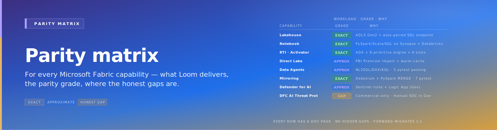

# CSA Loom — Parity Matrix

> **Comparative positioning note.** This document is written from the
> perspective of Microsoft Azure, Cloud Scale Analytics, and CSA Loom. Any
> description of third-party or competing products, services, pricing, or
> capabilities is derived from **publicly available documentation and sources**
> believed accurate at the time of writing, and is provided for **general
> comparison only**. We do not claim expertise in, or authority over, any
> non-Microsoft product or service; the respective vendor's official
> documentation is the authoritative source for their offerings, which may
> change over time. Nothing here is intended to disparage any vendor — where a
> competing product has genuine advantages, we aim to note them honestly.
> Verify all third-party details against the vendor's current official
> documentation before making decisions.

{ .architecture-hero loading="eager" }

The keystone artifact: for every Microsoft Fabric capability, what
CSA Loom delivers, the parity grade, and where to read the detail.

**Parity grades:**

- **Exact** — functional equivalent shipped; UX may differ; semantics
  match
- **Approximate** — functional intent matched; honest gap in
  performance, UX polish, or specific feature subset
- **Honest gap** — not delivered; documented explicitly
- **v1.1** / **v2** — tracked; landing in a later release

## Storage + namespace

| Fabric | CSA Loom | Grade | Detail |
|---|---|---|---|
| OneLake unified namespace | ADLS Gen2 + Console unified path tree + Shortcuts service | **Approximate** | engine-layer enforcement, not storage-protocol; see [OneLake parity](workloads/onelake-parity.md) |
| OneLake shortcuts (cross-cloud) | Custom shortcuts service over ADLS / S3 / GCS | **Approximate** | 20–80 ms latency overhead matches Fabric |
| OneLake Security (RLS / CLS / object-level, storage-protocol enforcement) | UC roles (Commercial) / Purview overlay (Gov) + per-engine RLS/CLS | **Approximate** | engine-layer, not storage-protocol |
| External Data Sharing across Entra tenants | Delta Sharing protocol from UC / Synapse | **Approximate** | functional; UI gap |

## Workspaces + capacities

| Fabric | CSA Loom | Grade | Detail |
|---|---|---|---|
| Workspace + Capacity model | Loom workspace (RG) + Loom capacity (Databricks + Synapse Serverless + ADX + Power BI Premium aggregation) | **Approximate** | concept mapped; not single F-SKU billing |
| Domains / Subdomains | Console domain hierarchy + per-domain settings | **Exact** | metadata abstraction; full parity |
| Workspace Identity | UAMI per workspace; Console-managed | **Exact** | |
| Workspace Outbound Access Protection (OAP) | NSG egress + Azure Firewall app rules | **Approximate** | functional intent matched |
| Capacity smoothing / bursting | Per-service auto-scale + Console capacity dashboards | **Approximate** | no unified CU pool semantics |

## Governance + lineage

| Fabric | CSA Loom | Grade | Detail |
|---|---|---|---|
| OneLake Catalog | Console "Catalog" pane backed by UC + Purview (Commercial / GCC) or Purview-primary (Gov-IL4) or Atlas (IL5) | **Approximate** | discovery UX simpler than Fabric's |
| Purview integration | Native (Microsoft Purview is the catalog overlay regardless of Loom) | **Exact** | |
| Automatic lineage across items | Spark + ADF + Synapse lineage published to Purview | **Approximate** | requires disciplined Purview registration |
| Sensitivity labels (MIP) propagation | MIP labels in Purview → UC tags (one-way connector) | **Approximate** | one-way (Purview → UC); not bidirectional |
| Workspace RBAC + admin model | Entra groups + Console role bindings + per-engine RBAC | **Approximate** | multi-engine roles vs single Fabric role |

## Data Factory + ingestion

| Fabric | CSA Loom | Grade | Detail |
|---|---|---|---|
| Data Factory pipelines | Azure Data Factory pipelines | **Exact** | same engine 1:1 |
| Dataflows Gen2 | ADF Mapping Data Flows | **Approximate** | same engine; different authoring UI |
| Copy Job | ADF Copy activity | **Exact** | |
| dbt Job (Fabric DF native) | dbt Core in ADF / Databricks Workflows | **Exact** | dbt-azuresynapse / dbt-databricks adapters |
| On-Premises Data Gateway | ADF Self-Hosted IR | **Exact** | |
| VNet data gateway | ADF Managed VNet + Private Endpoints | **Approximate** | functional parity |

## Mirroring

| Fabric source | CSA Loom support | Grade | Detail |
|---|---|---|---|
| Azure SQL DB / Azure SQL MI | Debezium SQL Server connector + Spark Streaming | **Approximate** | same protocol surface; UX gap on first-touch |
| Cosmos DB | Cosmos Spark connector with change feed | **Approximate** | sub-minute latency matches |
| SQL Server 2016-2025 (on-prem / VM) | Debezium SQL Server + Self-Hosted IR | **Approximate** | |
| Azure DB for PostgreSQL | Debezium Postgres connector | **Approximate** | |
| Snowflake | Custom poller via Snowflake streams API | **Approximate** | no native Debezium |
| Oracle | Debezium Oracle with LogMiner | **Approximate** | |
| Open Mirroring publishers (SAP / SAP Datasphere / Qlik / Striim / Informatica) | Honors Open Mirroring landing-zone protocol (`__rowMarker__`) | **Exact** | publishers can drop Parquet directly |
| Fabric SQL DB auto-mirror | n/a (no Fabric SQL DB in Loom) | **Honest gap** | not applicable |

## Data Engineering / Lakehouse

| Fabric | CSA Loom | Grade | Detail |
|---|---|---|---|
| Lakehouse item | Databricks lakehouse on Delta + UC catalog (Commercial) / Hive (Gov) | **Exact** | functional |
| Spark notebooks + environments | Databricks notebooks + cluster policies | **Exact** in Commercial; **Approximate** in Gov | no Photon-via-SQL Warehouse in Gov |
| Native Execution Engine (NEE) | Databricks Photon (Commercial only) | **Approximate** | NEE is Microsoft-proprietary; Photon is Databricks-proprietary |
| Materialized Lake Views (MLVs) | Databricks DLT (Commercial) or scheduled `CREATE OR REPLACE TABLE` Jobs (Gov) | **Approximate** | |
| User Data Functions | Azure Functions (Premium EP1 in Gov; Flex Consumption Commercial) | **Exact** | |
| Spark Job Definitions | Databricks Jobs (CLI / API) | **Exact** | |

## Data Warehouse (Polaris)

| Fabric | CSA Loom | Grade | Detail |
|---|---|---|---|
| Polaris engine | Databricks SQL Warehouse (Commercial) / Synapse Serverless (Gov) | **Approximate** | |
| T-SQL DML (INSERT / UPDATE / DELETE / MERGE) on Delta | Databricks SQL Warehouse (Commercial) | **Exact** in Commercial; **Honest gap** in Gov (Synapse Serverless is read-only; writes via Databricks Spark) |
| Stateless / horizontally elastic | Databricks Serverless SQL (Commercial) | **Approximate** | |
| Cross-warehouse / cross-lakehouse queries | UC three-level naming (Commercial); Synapse external-table cross-DB (Gov) | **Approximate** | |
| SQL Analytics Endpoint | Synapse Serverless over Delta | **Exact** | functionally |
| AI Functions in T-SQL (sentiment, translation, etc.) | Databricks `ai_query()` (Commercial only); Notebook UDFs calling AOAI (Gov) | **Approximate** in Commercial; **Honest gap** in Gov |

## Real-Time Intelligence

| Fabric | CSA Loom | Grade | Detail |
|---|---|---|---|
| Real-Time Hub | Console "Real-Time Hub" pane | **Approximate** | UX simpler than Fabric's curated discovery |
| Eventstream (no-code stream ingestion) | Azure Stream Analytics jobs | **Approximate** | |
| Eventhouse + KQL DB | Azure Data Explorer (same engine) | **Exact** | KQL queries portable |
| KQL Queryset | Console "Queryset" pane + Cosmos store | **Exact** | |
| Real-Time Dashboard | ADX dashboards (embedded in Console) | **Exact** | |
| OneLake availability (KQL DB → Delta export) | ADX `ContinuousExport` to ADLS Gen2 | **Exact** | |
| Fabric Maps | Azure Maps / Mapbox / PMTiles in Console (**v2 deferred**) | **v2** | |

## Data Activator / Reflex

| Fabric Reflex primitive | CSA Loom Activator | Grade | Detail |
|---|---|---|---|
| `increasesAbove(threshold)` | NRules rule | **Exact** | |
| `decreasesBelow(threshold)` | NRules rule | **Exact** | |
| `is above` | NRules rule | **Exact** | |
| `is below` | NRules rule | **Exact** | |
| `changesTo(value)` | NRules rule | **Exact** | |
| `andStays(duration)` | NRules + Redis state machine | **Exact** | |
| `noPresenceOfData(seconds)` | Cron-based stale detection on Redis | **Exact** | |
| `everyNthTime(n, seconds)` | NRules occurrence counter | **Exact** | |
| Per-object state tracking | Redis hash keyed by entity ID | **Approximate** | exactly-once semantics unverified vs Fabric |
| Action surface (Teams / Email / Power Automate / Notebook / Pipeline / UDF / webhook) | Function App dispatcher | **Exact** | |
| Visual rule designer | Console "Activator" pane (v1: functional; v1.1: polished) | **Approximate** | Fabric's drag-drop UX more polished |
| Latency profile | 5-30 s end-to-end | **Exact** | matches Fabric Reflex |

## Data Science / ML

| Fabric | CSA Loom | Grade | Detail |
|---|---|---|---|
| Notebook ML | Databricks notebooks | **Exact** in Commercial; **Approximate** in Gov |
| MLflow | Databricks-managed MLflow (Commercial); OSS MLflow on AKS (Gov interim) | **Approximate** in Gov |
| Model Registry | UC MLflow (Commercial); OSS MLflow (Gov) | **Approximate** in Gov |
| Model Serving | Databricks (Commercial); Azure ML or AKS-MLflow (Gov) | **Approximate** in Gov |
| Vector Search | Databricks (Commercial); Azure AI Search vector (Gov) | **Exact** functionally |
| SynapseML | Pip-installed in Databricks notebooks | **Exact** | |
| AI Functions library (Spark DataFrame) | Custom `apps/fiab-ai-functions/` PyPI package | **Exact** | |
| Semantic Link (read/write Power BI semantic models from notebook) | `semantic-link-labs` (open-source) via Power BI XMLA | **Exact** | |

## Data Agents (formerly AI Skills)

| Fabric capability | CSA Loom delivery | Grade | Detail |
|---|---|---|---|
| Agent over Lakehouse (NL2SQL) | `nl2sql` tool in Loom Data Agents | **Approximate** | |
| Agent over Warehouse (NL2SQL) | Same `nl2sql` tool with warehouse data source | **Approximate** | |
| Agent over Power BI semantic model (NL2DAX) | `nl2dax` tool | **Approximate** | NL2DAX maturity gap vs NL2SQL |
| Agent over KQL DB / Eventhouse (NL2KQL) | `nl2kql` tool | **Approximate** | |
| Microsoft Graph queries | `graph_search` tool | **Exact** | |
| Custom AI Search index grounding | `custom_search` tool | **Exact** | |
| Per-source example queries (few-shot grounding) | Cosmos DB store of Q→Query pairs | **Exact** | |
| Verified answers (pinned Q→A pairs) | Cosmos DB store | **Exact** | |
| Field descriptions | UC tags / Purview classifications + custom annotations | **Approximate** | |
| Identity-passthrough execution | OBO via MSAL BFF | **Exact** | |
| Foundry integration (one Foundry agent attaches one Loom Data Agent) | **Exact** in Commercial; **Honest gap** in Gov until Foundry Agent Service Gov-GAs |
| Sensitivity / RAI policy binding | Purview Access Restriction Policies (preview) | **Approximate** | |
| External Python client | Custom REST client | **Approximate** | |

## Direct Lake — the hardest item

| Fabric capability | CSA Loom delivery | Grade | Detail |
|---|---|---|---|
| Direct Lake on SQL Endpoint (DL/SQL) | Premium Import + warm-cache materializer | **Approximate** | 5-30 s freshness (honest gap vs sub-second) |
| Direct Lake on OneLake (no fallback) | Not delivered | **Honest gap** | requires VertiPaq transcoder ownership |
| Framing (vs refresh) | TOM partition-scoped refresh via Direct-Lake-Shim service | **Approximate** | seconds-to-minutes vs Fabric's seconds |
| V-Order Parquet sort | Not implemented; Delta tables written via Databricks (no V-Order) | **Honest gap** | only matters when Fabric reads our tables; mitigated by OneLake shortcut + Fabric re-compaction |
| Composite models | Power BI Desktop native composite-model authoring | **Exact** | |
| **GCC: any Direct Lake at all** | Not deliverable | **Honest structural gap** | F-SKU unavailable in GCC; structural; not timing-fixable |

See [Direct Lake parity](workloads/direct-lake-parity.md) for the
detailed mechanics and the honest discussion of the freshness gap.

## Power BI in Loom

| Fabric | CSA Loom | Grade | Detail |
|---|---|---|---|
| Power BI semantic models | Power BI Premium (P-SKU in GCC; F-SKU in GCC-H/IL5) | **Exact** | |
| Power BI Reports + Dashboards | Power BI Premium | **Exact** | |
| Composite models | Power BI Desktop native | **Exact** | |
| Power BI Direct Lake (GCC-H / IL5) | Direct-Lake-Shim warm-cache | **Approximate** | |
| Power BI Direct Lake (GCC) | Not deliverable | **Honest structural gap** | |
| Org Apps | Power BI Apps | **Exact** | |

## Copilot in Loom

| Fabric workload Copilot | CSA Loom Copilot persona | Grade | Detail |
|---|---|---|---|
| Notebook Copilot (slash commands) | `/explain`, `/fix`, `/comments`, `/optimize` in Loom notebook magics | **Approximate** | |
| NL2SQL in Warehouse pane | Loom Data Agents NL2SQL tool | **Approximate** | |
| NL2DAX in Semantic Model designer | Loom Data Agents NL2DAX | **Approximate** | |
| NL2KQL in Real-Time pane | Loom Data Agents NL2KQL | **Approximate** | |
| Fix-with-Copilot on Spark failures | Notebook integration | **Approximate** | |
| Cross-workload context continuity | Per-pane in v1; cross-pane in v1.1 | **v1.1** | |

## Lifecycle (Git + Deployment Pipelines)

| Fabric | CSA Loom | Grade | Detail |
|---|---|---|---|
| Workspace ↔ Git binding | Console "Git" pane → Databricks Repos + ADF Git + TMDL Git | **Exact** functionally | |
| Deployment Pipelines (dev/test/prod) | Console "Deployment Pipelines" pane | **Approximate** | fewer stages; simpler promotion |
| Variable Libraries | Cosmos-backed Variable Library | **Exact** | |
| fabric-cicd Python lib / Fabric CLI deploy | `fiab-cli` wrapping azd + Bicep + workspace-create REST | **Approximate** | |
| Branched Workspaces (preview at FabCon 2026) | v1.1 | **v1.1** | |

## Fabric IQ family (v2 deferred)

| Fabric IQ item | CSA Loom delivery | Grade |
|---|---|---|
| Ontology | **v2** | Cosmos + AI Search vector index sketched |
| Plan (agent orchestration recipes) | **v2** | Container App executor sketched |
| Graph / FabricGraph | **v2** | Cosmos for Apache Gremlin or TinkerPop on AKS |
| Operations Agent | **v1.1** | extension of Loom Copilot with write-tools |
| Maps | **v2** | Azure Maps / Mapbox / PMTiles |
| Fabric Databases (SQL DB, Cosmos DB, HorizonDB) | **v2** | HorizonDB-equivalent via Postgres Flexible Server |

## Operations + Monitoring

| Fabric | CSA Loom | Grade | Detail |
|---|---|---|---|
| Monitoring Hub | Console "Monitoring" pane aggregating App Insights + Log Analytics + Sentinel | **Approximate** | |
| Capacity / CU dashboards | Synthesized CU-equivalent dashboard | **Approximate** | summed from DBU + DPU + vCore + Power BI memory |
| Activity Log | Azure Activity Log + per-engine audit logs | **Exact** | |
| Audit + DSPM | Purview Unified Catalog + DSPM (Gov GA July 2026) | **Approximate** | |

## Compliance + Sovereignty (the headline differentiator)

| Boundary | Microsoft Fabric | CSA Loom |
|---|---|---|
| **Azure Commercial / GCC** ([note](#gcc-runs-on-azure-commercial)) | **GA** (Commercial only) | **GA** |
| GCC-High / IL4 | `Forecasted` | **Available v1** |
| DoD IL5 | `Forecasted` | **v1.1** |
| Azure Government Secret / IL6 | `Forecasted` | Not authorized (out of scope) |
| HIPAA BAA (Commercial + Gov) | Commercial only | **All boundaries** |
| CMMC L2 / L3 | Commercial only | **GCC-High via FedRAMP High inheritance** |
| StateRAMP | Pending | **Available** via FedRAMP High inheritance |
| ITAR (in GCC-High) | Not yet in Gov | **Available in GCC-High** |

#### GCC runs on Azure Commercial

GCC ("Government Community Cloud") customers run their workloads on
**Azure Commercial** regions under an M365 GCC identity boundary —
they do *not* sit on Azure Government. That means a GCC customer's
audit boundary covers Azure Commercial resources, and the
Microsoft Fabric Commercial GA covers them. **However**, the M365 GCC
tenant identity rules block direct use of Fabric's tenant-level SP
flows that customers in pure Commercial enjoy. Loom is the bridge:
the same Bicep that deploys against Azure Commercial deploys against
the same regions under GCC identity, and the post-deploy bootstrap
issues the AAD app-roles that the GCC identity boundary requires.
Bottom line: **Azure Commercial and GCC are both GA for CSA Loom,**
because both audit boundaries are FedRAMP-High-on-Commercial.

## Summary by parity grade

| Grade | Count of capabilities |
|---|---|
| **Exact** | ~30 |
| **Approximate** | ~40 |
| **Honest gap** | ~5 (Direct Lake on OneLake no-fallback; GCC Direct Lake; V-Order; some Foundry-only Gov features) |
| **v1.1** | ~6 |
| **v2** | ~7 (Fabric IQ family + Fabric Databases) |

For the workload-by-workload deep design, see [Workloads](workloads/index.md).
For the per-boundary deployment dispatch, see [Reference architecture](architecture.md).
For the honest treatment of the gaps, see [Direct Lake parity](workloads/direct-lake-parity.md)
and per-workload pages.
