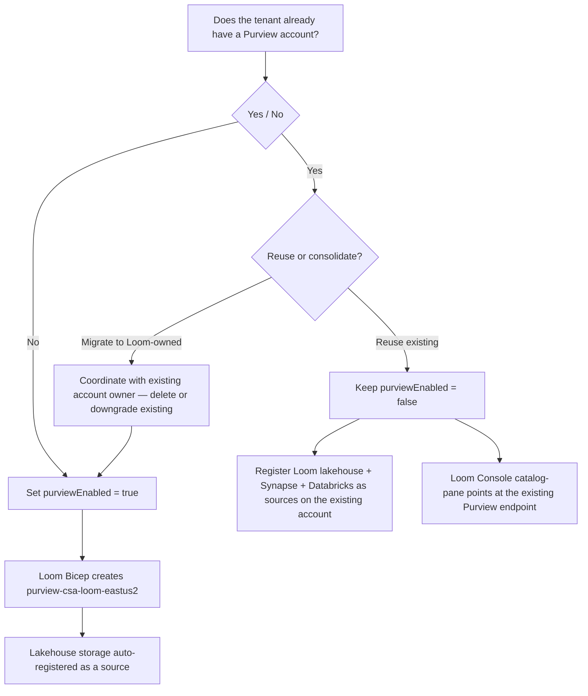

# Purview tenant-existing-account reuse

The first Commercial what-if validation (2026-05-23) surfaced an
operational truth: many enterprise Microsoft tenants already have an
**Enterprise-tier tenant-level Purview account**, and only **one** is
allowed per tenant. CSA Loom defaults `purviewEnabled = false` so the
deploy doesn't collide. This runbook is the decision tree the
operator walks before flipping it on.

## Decision tree



## Path 1 — Tenant has no Purview yet (greenfield)

The simplest case. Toggle on:

```bicep
// platform/fiab/bicep/params/commercial.bicepparam
param purviewEnabled = true
```

Re-dispatch the deploy. The `catalog.bicep` module creates
`purview-csa-loom-<region>`, assigns the admin group as Purview Data
Curator, and exposes the endpoint as a module output that the DLZ
storage modules wire as a source.

## Path 2 — Existing Purview account, reuse it (recommended for most enterprises)

This is the right call when:
- The existing Purview account is the official tenant data catalog
- You want a single pane for catalog/lineage across all data estates
- Avoiding the political problem of running parallel catalogs

Keep:
```bicep
param purviewEnabled = false
```

Then **register Loom data sources** on the existing Purview account:

```bash
# Set the existing Purview account
EXISTING_PURVIEW="purview-corp-prod"   # operator fills in
PURVIEW_TENANT_FQDN="${EXISTING_PURVIEW}.purview.azure.com"
LOOM_DLZ_RG="rg-csa-loom-dlz-default-eastus2"

# Discover the storage account that came up via the DLZ deploy
LOOM_LAKEHOUSE=$(az storage account list \
  --resource-group "$LOOM_DLZ_RG" \
  --query "[?starts_with(name, 'saloom')] | [0].name" -o tsv)

# Register lakehouse as a Purview source (one-time per DLZ)
az purview source create \
  --account-name "$EXISTING_PURVIEW" \
  --source-name "csa-loom-lakehouse-default" \
  --properties "{
    \"endpoint\": \"https://${LOOM_LAKEHOUSE}.dfs.core.windows.net\",
    \"kind\": \"AdlsGen2\",
    \"resourceGroup\": \"${LOOM_DLZ_RG}\",
    \"subscriptionId\": \"$(az account show --query id -o tsv)\"
  }"

# Schedule a scan
az purview scan create \
  --account-name "$EXISTING_PURVIEW" \
  --source-name "csa-loom-lakehouse-default" \
  --scan-name "weekly-scan" \
  --properties '{
    "kind": "AdlsGen2Msi",
    "scanRulesetName": "AdlsGen2",
    "scanRulesetType": "System"
  }'

az purview scan trigger create \
  --account-name "$EXISTING_PURVIEW" \
  --source-name "csa-loom-lakehouse-default" \
  --scan-name "weekly-scan" \
  --trigger-name "weekly" \
  --recurrence "{\"frequency\": \"Week\", \"interval\": 1}"
```

Then point the Loom Console catalog pane at the existing Purview
endpoint:

```bash
# Update the workspace-registry Cosmos record for this DLZ
az cosmosdb sql container query \
  --account-name "cosmos-loom-default-<unique>" \
  --database-name workspace-registry \
  --container-name workspaces \
  --query-text "UPDATE c SET c.catalogEndpoint = 'https://${PURVIEW_TENANT_FQDN}' WHERE c.id = 'ws-default'"
```

The Loom Console catalog pane (Loom Data Agents grounding, lineage
view, sensitivity labels) reads from this endpoint at request time.

## Path 3 — Consolidate to a Loom-owned account

Only do this when the existing Purview account:
- Is unused / abandoned
- Belongs to a retired data estate
- Has no operational dependencies

You'll need the existing account owner to delete or downgrade it
first. Then switch to Path 1.

## Verification

After whichever path you chose, run the Loom Data Agents pane and ask
*"What tables are in the finance lakehouse and what are their
sensitivity labels?"* — the agent's `custom_search` or schema-lookup
tool should return results sourced from Purview.

## Related

- Bicep:
  [`platform/fiab/bicep/modules/admin-plane/catalog.bicep`](https://github.com/fgarofalo56/csa-inabox/blob/main/platform/fiab/bicep/modules/admin-plane/catalog.bicep)
- ADR: [fiab-0007 Catalog strategy](../adr/0007-catalog-strategy.md)
- [Loom LAW monitoring + alert pack](loom-law-monitoring.md)
- [Purview scan stuck](purview-scan-stuck.md)
