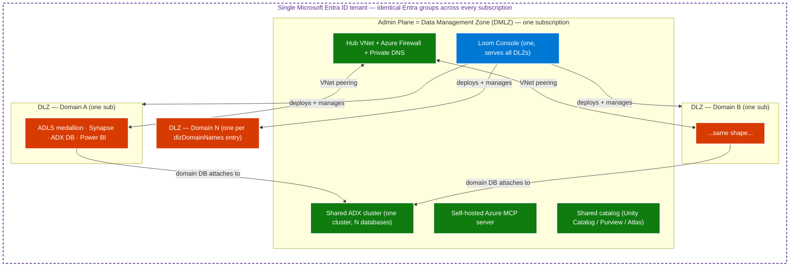
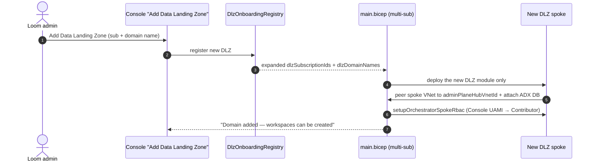
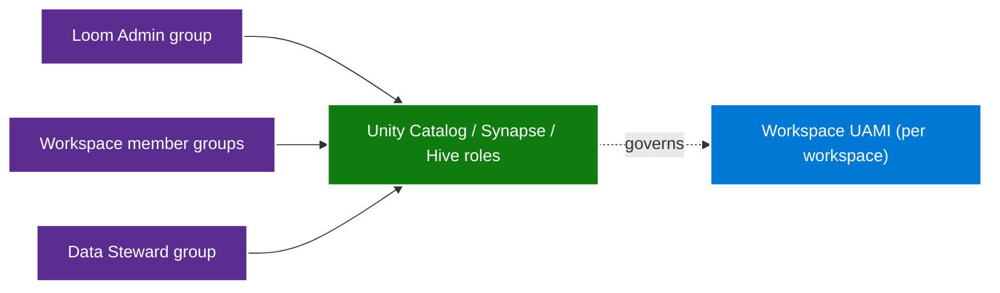
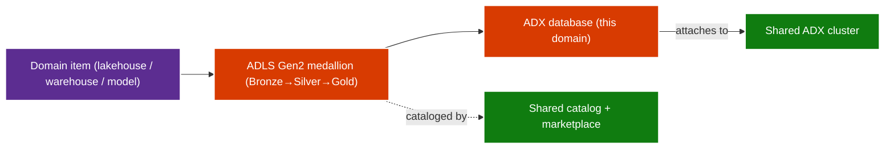

# Tutorial 09 — Tenant topology (DMLZ hub + N DLZ spokes + one Console)

!!! info "Comparative positioning note"
    This document is written from the
    perspective of Microsoft Azure, Cloud Scale Analytics, and CSA Loom. Any
    description of third-party or competing products, services, pricing, or
    capabilities is derived from **publicly available documentation and sources**
    believed accurate at the time of writing, and is provided for **general
    comparison only**. We do not claim expertise in, or authority over, any
    non-Microsoft product or service; the respective vendor's official
    documentation is the authoritative source for their offerings, which may
    change over time. Nothing here is intended to disparage any vendor — where a
    competing product has genuine advantages, we aim to note them honestly.
    Verify all third-party details against the vendor's current official
    documentation before making decisions.


Understand how a CSA Loom tenant is shaped — **one Data Management Zone (DMLZ)
hub, N Data Landing Zone (DLZ) spokes, and a single Console** — and how the two
deployment flows (first-run and DLZ-attach) build it. **~15 minutes, conceptual.**

This tutorial is the narrative companion to the
[Reference architecture](../architecture.md) and the committed diagram sources
under [`docs/fiab/diagrams/`](../diagrams/README.md).

## The model in one picture

CSA Loom maps directly onto Microsoft CAF's Cloud-Scale Analytics pattern: the
**Admin Plane is the DMLZ** (one subscription per organization), each **DLZ is a
domain / agency / mission** (its own subscription in production), and a **single
Loom Console** serves every DLZ from the Admin Plane.



Key facts that fall out of this shape:

- **One Console, one Admin Plane, one Entra tenant.** The Console, MCP server,
  shared catalog (`catalogPrimary`), and shared ADX cluster all live once in the
  Admin Plane. Entra groups are identical across every subscription.
- **DLZ = subscription; workspace = data product inside the DLZ.** A single DLZ
  hosts many workspaces (one per team / project).
- **Each DLZ attaches its own ADX database to the single shared cluster** — there
  is one ADX cluster for the whole tenant, not one per DLZ.

## Single-sub vs multi-sub

The topology is the `deploymentMode` parameter on
`platform/fiab/bicep/main.bicep`:

| Mode | Shape | When |
|---|---|---|
| `single-sub` | Admin Plane + exactly 1 DLZ in the **same** subscription | Trials, small agencies, single-mission POCs |
| `multi-sub` | Admin Plane in sub-A; each DLZ in its **own** sub (B, C, … N) | Production federal deploys |

The in-app [Deployment planner](../parity/deploy-planner.md) exposes this as a
per-subscription Dropdown and emits `param deploymentMode` into the exported
`.bicepparam`, so the plan you draw and the real `az deployment sub create` stay
in sync.

## Flow 1 — First-run (initial provision)

`azd up` or the Deploy-to-Azure button runs `main.bicep` once. It always brings
up the Admin Plane first, then the first DLZ.

```mermaid
sequenceDiagram
    autonumber
    actor Op as Operator
    participant Boot as azd up / Deploy button
    participant Main as main.bicep
    participant AP as module adminPlane
    participant DLZ as singleDlz / dlz[*]

    Op->>Boot: git clone + azd up
    Boot->>Main: deploymentMode = 'single-sub' | 'multi-sub'
    Main->>AP: deploy Admin Plane (Console, MCP, shared catalog, shared ADX)
    AP-->>Main: outputs (hubVnetId, lawId, adxClusterPrincipalId)
    alt single-sub
        Main->>DLZ: 1 DLZ (domainName='default')
    else multi-sub
        loop each domain in dlzDomainNames
            Main->>DLZ: DLZ in its sub (spoke peers to hub; ADX DB attaches to cluster)
        end
    end
    Main-->>Op: consoleUrl + "Admin Plane + first DLZ deployed"
```

## Flow 2 — DLZ-attach (add a domain later)

Adding a domain after the platform is up does **not** redeploy the Admin Plane.
The Console's **"Add Data Landing Zone"** action registers the new domain in the
`DlzOnboardingRegistry`, then re-runs `main.bicep` with an expanded
`dlzSubscriptionIds` / `dlzDomainNames`. Only the new spoke is created — it peers
to the existing hub, attaches its ADX database to the shared cluster, and the
`setupOrchestratorSpokeRbac` grant gives the Console UAMI Contributor on the new
spoke subscription.



## Domain & RBAC model

Human Entra groups (one set, tenant-wide) map to per-engine roles. Each domain
becomes a DLZ resource group whose workspace items run as a per-workspace
user-assigned managed identity (UAMI).



See the [full domain/RBAC diagram](../diagrams/README.md#domain--rbac-model) and
the [Identity flow](../architecture.md#identity-flow) for the JIT elevation
sequence.

## Data flow — domain item to shared catalog

A domain item lands in its DLZ resources (ADLS medallion → Synapse Serverless,
the per-DLZ ADX database), then surfaces through the **shared** Admin-Plane
catalog and marketplace. Microsoft Fabric is **optional / plan-only** — the
Azure-native lake is the default and works with `LOOM_DEFAULT_FABRIC_WORKSPACE`
unset.



## How this relates to the estate pipeline

CSA Loom has **two** Bicep layers. The
[`.github/workflows/deploy.yml`](https://github.com/fgarofalo56/csa-inabox/blob/main/.github/workflows/deploy.yml)
estate pipeline **vends** the subscriptions and networks (ESLZ Cloud-Scale
Analytics: management groups + Management/Connectivity platform subs + raw
DMLZ/DLZ scaffolding). `platform/fiab/bicep/main.bicep` then **runs Loom inside
them**. Loom does not require the estate pipeline — `azd` can target any existing
subs. Full explanation:
[Relationship to the ALZ estate pipeline](../architecture.md#relationship-to-the-alz-estate-pipeline).

## Per-cloud note

The topology shape is identical across every boundary; only the per-node service
substitution changes (per the
[per-boundary dispatch matrix](../architecture.md#per-boundary-dispatch-matrix)):

| Boundary | Default region | Container host | Catalog primary | Agent orchestrator |
|---|---|---|---|---|
| Commercial | `eastus2` | Container Apps | Unity Catalog managed | Foundry Agent Service |
| GCC | `usgovvirginia` | Container Apps | Microsoft Purview | Foundry Agent Service |
| GCC-High / IL4 | `usgovvirginia` | **AKS** | Microsoft Purview | MAF + AOAI direct |
| IL5 | `usgovarizona` | **AKS** | **Atlas-on-AKS** | MAF + AOAI direct |

## Where to read next

- [Reference architecture](../architecture.md) — the full contract
- [Diagram sources](../diagrams/README.md) — committed `.mmd` + `.excalidraw`
- [Deployment planner parity](../parity/deploy-planner.md) — emit your own `.bicepparam`
- [Tenant bootstrap](../v3-tenant-bootstrap.md) — post-deploy one-time config
