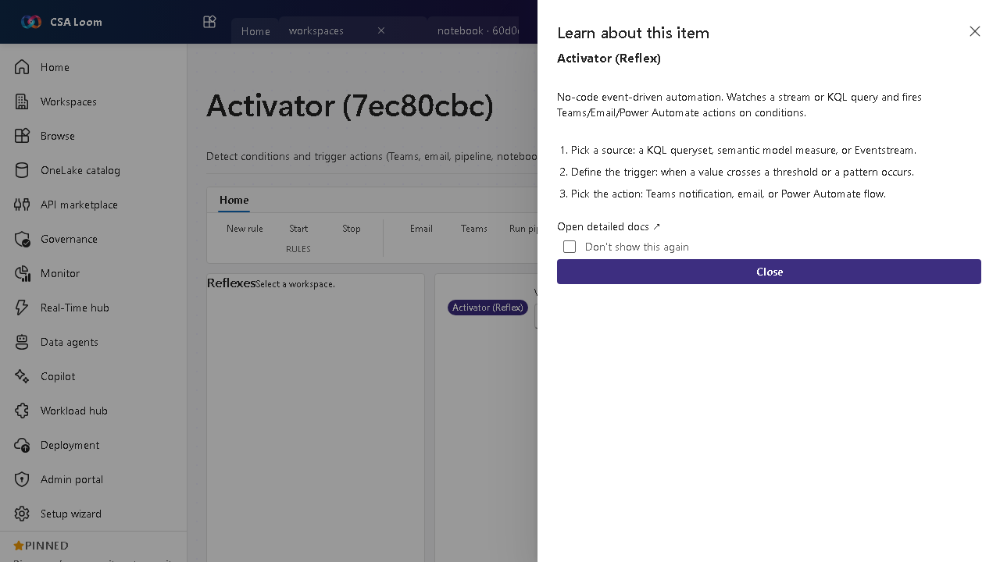

<!-- auto-generated by tools/uat-report.mjs — edits below this line are preserved on re-gen -->
# Tutorial: Activator editor

> CSA Loom `activator` editor — verified working against a live console by the UAT harness on 2026-07-01.

## Open the editor

1. Sign in to your **CSA Loom Console** (for example `https://<your-console-host>`).
2. Open or create a workspace from the **Workspaces** page.
3. Click **+ New item** and choose **Activator** from the catalog.
4. The editor opens at `/items/activator/<id>`:

## What this editor does

An Activator (Reflex) detects conditions on real-time data and fires actions — Teams, email, webhook, SMS, Logic App, pipeline, notebook, or Power Automate. In Loom the DEFAULT rule source is an **Eventhouse / KQL database on Azure Data Explorer**: the rule's KQL evaluates against real stream data via the ADX-native Activator runtime — no Microsoft Fabric required. Log Analytics KQL and Event Hub sources are alternatives backed by Azure Monitor scheduled-query alerts. The editor has two tabs: **Rules** and **Run history**.

## Getting started

1. **Pick a source** — The default source is **Eventhouse / KQL Database (ADX)**: pick the database and table from the live pickers (resolved from the shared ADX cluster). **KQL query (Log Analytics)** and **Event Hub** are alternative sources.
2. **Define the trigger** — Use the guided condition builder (property, operator, threshold) against the selected table, or supply a verbatim KQL query — the rule fires when it returns rows.
3. **Pick the action** — Choose a Teams notification, email, webhook, SMS, Logic App, pipeline run, notebook, or Power Automate flow — delivered through a real Azure Monitor action group.
4. **Evaluate and watch history** — **Trigger / Preview** evaluates ADX rules on demand against real Eventhouse data; set `LOOM_ADX_ALERT_SCOPE` (the ADX cluster resource id, with the alert identity granted Database Viewer) for hands-off scheduled evaluation. Log Analytics rules evaluate continuously via Azure Monitor. The **Run history** tab lists fired alerts.

> Tip: **Author rule with Copilot** drafts the KQL from a plain-English description, suggests a threshold from real history, and creates the rule after you approve.

## Learn more

- Azure Data Explorer (the ADX-native rule source): [https://learn.microsoft.com/azure/data-explorer/data-explorer-overview](https://learn.microsoft.com/azure/data-explorer/data-explorer-overview)
- Microsoft Learn reference (Fabric Activator parity source): [https://learn.microsoft.com/fabric/data-activator/activator-introduction](https://learn.microsoft.com/fabric/data-activator/activator-introduction)

## Verified by the UAT harness

- Tested at: `2026-05-26T13:51:40.730Z`
- Verdict: **A** (renders cleanly, real backend responded)
- Test source: [`apps/fiab-console/e2e/editors.uat.ts`](https://github.com/fgarofalo56/csa-inabox/blob/main/apps/fiab-console/e2e/editors.uat.ts)

<!-- end auto-generated -->