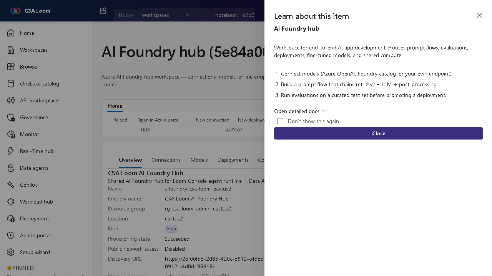

<!-- auto-generated by tools/uat-report.mjs — edits below this line are preserved on re-gen -->
# Tutorial: AI Foundry hub editor

> CSA Loom `ai-foundry-hub` editor — verified working against a live console by the UAT harness on 2026-07-01.

## Open the editor

1. Sign in to your **CSA Loom Console** (for example `https://<your-console-host>`).
2. Open or create a workspace from the **Workspaces** page.
3. Click **+ New item** and choose **AI Foundry hub** from the catalog.
4. The editor opens at `/items/ai-foundry-hub/<id>`:

## What this editor does

An AI Foundry hub is an Azure AI Foundry hub workspace (Microsoft.MachineLearningServices/workspaces kind=Hub) — connections, models, online endpoints, computes, datastores, and jobs. In Loom it is the shared parent for projects, prompt flows, and evaluations.

## Getting started

1. **Connect models** — Add connections to Azure OpenAI, the Foundry catalog, or your own endpoints.
2. **Create a project** — Spin up an AI Foundry project under the hub that inherits its connections and datastores.
3. **Build a prompt flow** — Chain retrieval, LLM, and post-processing nodes in a prompt flow.
4. **Evaluate before deploy** — Run evaluations on a curated test set before promoting a deployment.

## Learn more

- Microsoft Learn reference: [https://learn.microsoft.com/azure/ai-studio/concepts/architecture](https://learn.microsoft.com/azure/ai-studio/concepts/architecture)

## Verified by the UAT harness

- Tested at: `2026-05-26T13:54:17.624Z`
- Verdict: **A** (renders cleanly, real backend responded)
- Test source: [`apps/fiab-console/e2e/editors.uat.ts`](https://github.com/fgarofalo56/csa-inabox/blob/main/apps/fiab-console/e2e/editors.uat.ts)

<!-- end auto-generated -->