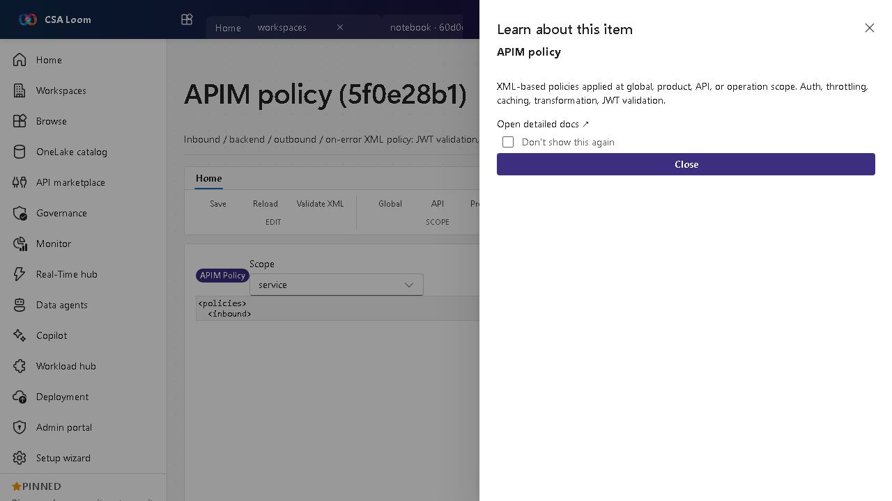

<!-- auto-generated by tools/uat-report.mjs — edits below this line are preserved on re-gen -->
# Tutorial: APIM policy editor

> CSA Loom `apim-policy` editor — verified working against a live console by the UAT harness on 2026-07-01.

## Open the editor

1. Sign in to your **CSA Loom Console** (for example `https://<your-console-host>`).
2. Open or create a workspace from the **Workspaces** page.
3. Click **+ New item** and choose **APIM policy** from the catalog.
4. The editor opens at `/items/apim-policy/<id>`:

## What this editor does

An APIM policy is inbound/backend/outbound/on-error XML applied at a scope — JWT validation, rate-limit, cache, transform, mock. In Loom you load the policy XML for a scope, it validates well-formed XML client-side, and Save issues a real PUT.

## Getting started

1. **Pick a scope** — Choose the global, product, API, or operation scope whose policy you want to edit.
2. **Edit the XML** — Author inbound/backend/outbound/on-error sections; the editor checks the XML is well-formed.
3. **Add common policies** — Insert JWT validation, rate-limit, cache, transform, or mock policies.
4. **Save** — Save PUTs the policy to the chosen APIM scope.

## Learn more

- Microsoft Learn reference: [https://learn.microsoft.com/azure/api-management/api-management-howto-policies](https://learn.microsoft.com/azure/api-management/api-management-howto-policies)

## Verified by the UAT harness

- Tested at: `2026-05-26T13:54:06.839Z`
- Verdict: **A** (renders cleanly, real backend responded)
- Test source: [`apps/fiab-console/e2e/editors.uat.ts`](https://github.com/fgarofalo56/csa-inabox/blob/main/apps/fiab-console/e2e/editors.uat.ts)

<!-- end auto-generated -->