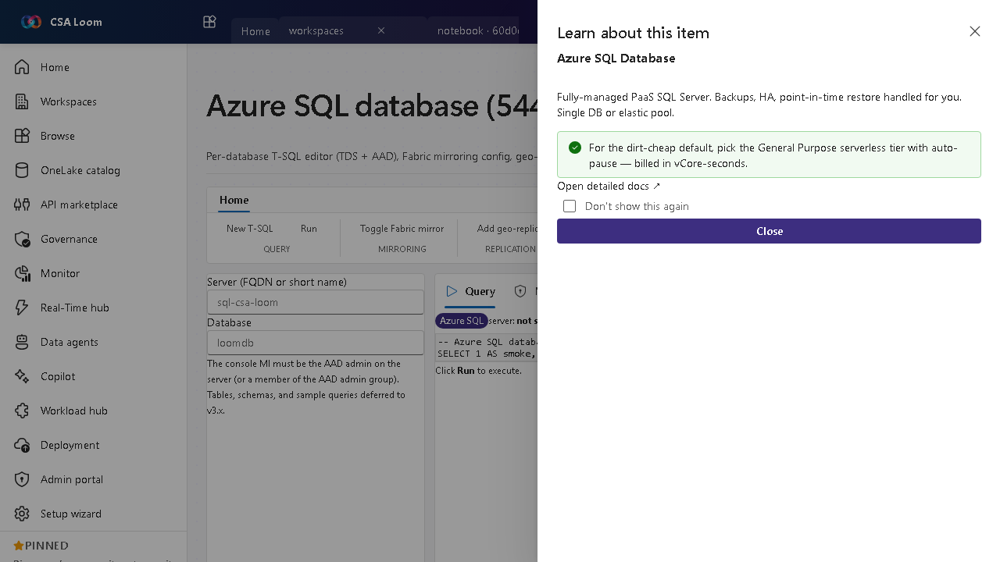

<!-- auto-generated by tools/uat-report.mjs — edits below this line are preserved on re-gen -->
# Tutorial: Azure SQL database editor

> CSA Loom `azure-sql-database` editor — verified working against a live console by the UAT harness on 2026-07-01.

## Open the editor

1. Sign in to your **CSA Loom Console** (for example `https://<your-console-host>`).
2. Open or create a workspace from the **Workspaces** page.
3. Click **+ New item** and choose **Azure SQL database** from the catalog.
4. The editor opens at `/items/azure-sql-database/<id>`:

## What this editor does

An Azure SQL database is a fully-managed PaaS database. In Loom you get a per-database T-SQL editor (TDS + AAD), geo-replication, and a native vector index — wired via ARM and TDS through the azure-sql-client. (Mirroring the database into Fabric/OneLake is opt-in only, never the default.)

## Getting started

1. **Run T-SQL** — Query the database over TDS with AAD auth from the editor.
2. **Build a vector index** — Create a native vector column + index for similarity search over embeddings, all in T-SQL. (Mirroring the database into Fabric/OneLake is available as an opt-in, disclosed if not enabled — not the default.)
3. **Set geo-replication** — PUT a geo-replication configuration for resilience.
4. **Pick a low-cost tier** — Choose the serverless General Purpose tier with auto-pause, billed in vCore-seconds.

## Learn more

- Microsoft Learn reference: [https://learn.microsoft.com/azure/azure-sql/database/sql-database-paas-overview](https://learn.microsoft.com/azure/azure-sql/database/sql-database-paas-overview)

## Verified by the UAT harness

- Tested at: `2026-05-26T13:56:10.963Z`
- Verdict: **A** (renders cleanly, real backend responded)
- Test source: [`apps/fiab-console/e2e/editors.uat.ts`](https://github.com/fgarofalo56/csa-inabox/blob/main/apps/fiab-console/e2e/editors.uat.ts)

<!-- end auto-generated -->