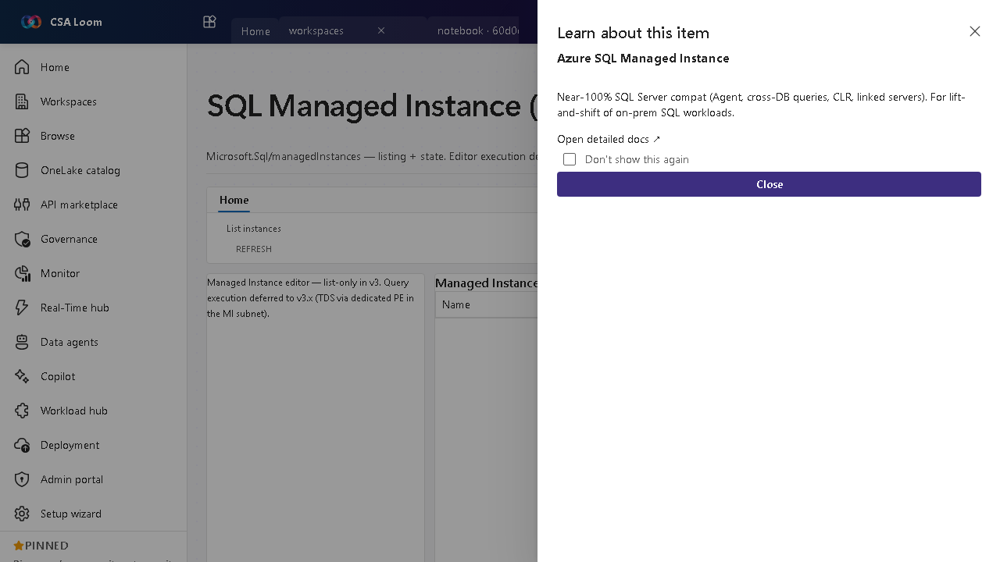

<!-- auto-generated by tools/uat-report.mjs — edits below this line are preserved on re-gen -->
# Tutorial: SQL Managed Instance editor

> CSA Loom `azure-sql-managed-instance` editor — verified working against a live console by the UAT harness on 2026-07-01.

## Open the editor

1. Sign in to your **CSA Loom Console** (for example `https://<your-console-host>`).
2. Open or create a workspace from the **Workspaces** page.
3. Click **+ New item** and choose **SQL Managed Instance** from the catalog.
4. The editor opens at `/items/azure-sql-managed-instance/<id>`:

## What this editor does

An Azure SQL Managed Instance (Microsoft.Sql/managedInstances) gives near-100% SQL Server compatibility for lift-and-shift. In Loom this surface lists instances and state; editor execution (TDS via private endpoint) is deferred to a later v3.x release.

## Getting started

1. **List instances** — The editor lists managed instances and their state via ARM.
2. **Inspect an instance** — Review SKU, vCores, and networking.
3. **Know the deferral** — TDS query execution over a private endpoint is deferred to v3.x; the editor says so rather than faking results.
4. **Plan migration** — Use MI for lift-and-shift of on-prem SQL with Agent, cross-DB queries, and linked servers.

## Learn more

- Microsoft Learn reference: [https://learn.microsoft.com/azure/azure-sql/managed-instance/sql-managed-instance-paas-overview](https://learn.microsoft.com/azure/azure-sql/managed-instance/sql-managed-instance-paas-overview)

## Verified by the UAT harness

- Tested at: `2026-05-26T13:56:15.054Z`
- Verdict: **A** (renders cleanly, real backend responded)
- Test source: [`apps/fiab-console/e2e/editors.uat.ts`](https://github.com/fgarofalo56/csa-inabox/blob/main/apps/fiab-console/e2e/editors.uat.ts)

<!-- end auto-generated -->