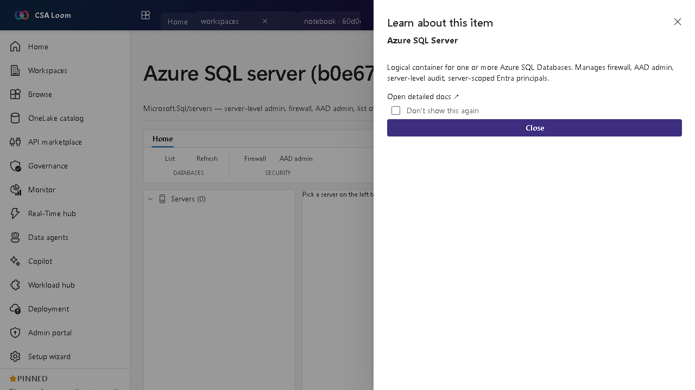

<!-- auto-generated by tools/uat-report.mjs — edits below this line are preserved on re-gen -->
# Tutorial: Azure SQL server editor

> CSA Loom `azure-sql-server` editor — verified working against a live console by the UAT harness on 2026-07-01.

## Open the editor

1. Sign in to your **CSA Loom Console** (for example `https://<your-console-host>`).
2. Open or create a workspace from the **Workspaces** page.
3. Click **+ New item** and choose **Azure SQL server** from the catalog.
4. The editor opens at `/items/azure-sql-server/<id>`:

## What this editor does

An Azure SQL server (Microsoft.Sql/servers) is the logical container for databases — server-level admin, firewall, AAD admin, and the database list. In Loom it is read via ARM REST through the azure-sql-client.

## Getting started

1. **List servers** — The editor lists logical servers via ARM.
2. **Manage firewall** — Review and manage server firewall rules.
3. **Set AAD admin** — Configure the Entra (AAD) admin for the server.
4. **Drill to databases** — Open the database list to manage individual databases.

## Learn more

- Microsoft Learn reference: [https://learn.microsoft.com/azure/azure-sql/database/logical-servers](https://learn.microsoft.com/azure/azure-sql/database/logical-servers)

## Verified by the UAT harness

- Tested at: `2026-05-26T13:56:05.795Z`
- Verdict: **A** (renders cleanly, real backend responded)
- Test source: [`apps/fiab-console/e2e/editors.uat.ts`](https://github.com/fgarofalo56/csa-inabox/blob/main/apps/fiab-console/e2e/editors.uat.ts)

<!-- end auto-generated -->