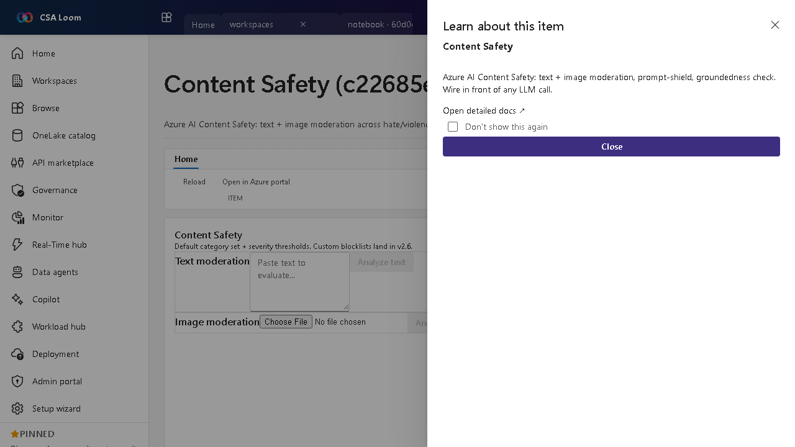

<!-- auto-generated by tools/uat-report.mjs — edits below this line are preserved on re-gen -->
# Tutorial: Content Safety editor

> CSA Loom `content-safety` editor — verified working against a live console by the UAT harness on 2026-07-01.

## Open the editor

1. Sign in to your **CSA Loom Console** (for example `https://<your-console-host>`).
2. Open or create a workspace from the **Workspaces** page.
3. Click **+ New item** and choose **Content Safety** from the catalog.
4. The editor opens at `/items/content-safety/<id>`:

## What this editor does

Content Safety is Azure AI Content Safety — text and image moderation across hate/violence/sexual/self-harm with severity thresholds. In Loom you configure thresholds and wire it in front of any LLM call.

## Getting started

1. **Set categories** — Enable the harm categories you want screened (hate, violence, sexual, self-harm).
2. **Tune severity thresholds** — Set the severity threshold per category that should block content.
3. **Test content** — Run sample text or images through to see the severity scores.
4. **Wire in front of the LLM** — Place Content Safety ahead of prompt flow or agent calls to filter inputs and outputs.

## Learn more

- Microsoft Learn reference: [https://learn.microsoft.com/azure/ai-services/content-safety/overview](https://learn.microsoft.com/azure/ai-services/content-safety/overview)

## Verified by the UAT harness

- Tested at: `2026-05-26T13:54:35.221Z`
- Verdict: **A** (renders cleanly, real backend responded)
- Test source: [`apps/fiab-console/e2e/editors.uat.ts`](https://github.com/fgarofalo56/csa-inabox/blob/main/apps/fiab-console/e2e/editors.uat.ts)

<!-- end auto-generated -->