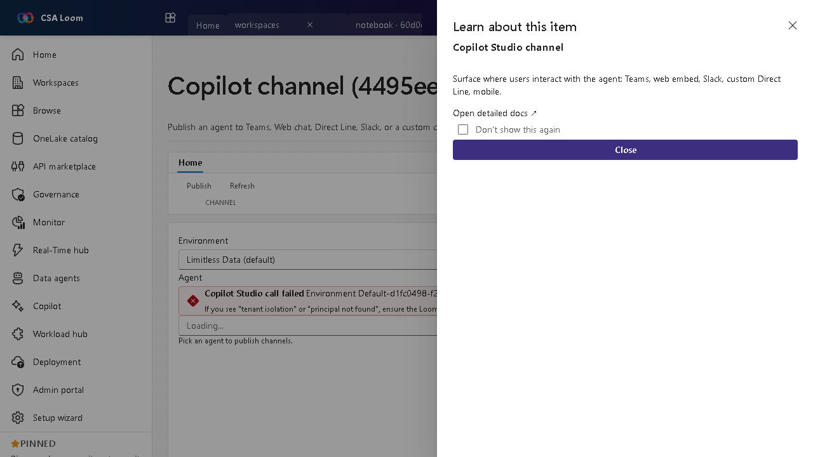

# copilot-studio-channel editor

> Auto-generated from the Loom UAT harness on 2026-05-26. Edits welcome.

Auto-captured walkthrough of the copilot-studio-channel editor in CSA Loom. Confirmed working against v3.18 of the console on 2026-05-26.

## Walkthrough

### Step 1 — Open the copilot-studio-channel editor from the +New menu in any workspace.

