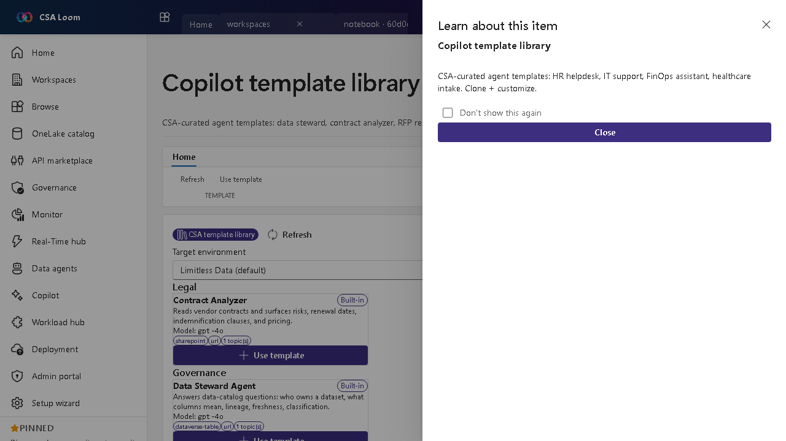

<!-- auto-generated by tools/uat-report.mjs — edits below this line are preserved on re-gen -->
# Tutorial: Copilot template library editor

> CSA Loom `copilot-template-library` editor — verified working against a live console by the UAT harness on 2026-07-01.

## Open the editor

1. Sign in to your **CSA Loom Console** (for example `https://<your-console-host>`).
2. Open or create a workspace from the **Workspaces** page.
3. Click **+ New item** and choose **Copilot template library** from the catalog.
4. The editor opens at `/items/copilot-template-library/<id>`:

## What this editor does

The Copilot template library is a CSA-curated gallery of agent templates — data steward, contract analyzer, RFP responder, and more. In Loom templates are Cosmos-backed and Use template creates an agent in the selected environment.

## Getting started

1. **Browse templates** — Scan the CSA-curated gallery for a fitting starting point.
2. **Pick an environment** — Choose the Power Platform environment the new agent should live in.
3. **Use template** — Use template creates an agent from the template in that environment.
4. **Customize** — Open the new agent and adapt its instructions, knowledge, and actions.

## Learn more

- Microsoft Learn reference: [https://learn.microsoft.com/microsoft-copilot-studio/template-fundamentals](https://learn.microsoft.com/microsoft-copilot-studio/template-fundamentals)

## Verified by the UAT harness

- Tested at: `2026-05-26T13:55:27.288Z`
- Verdict: **A** (renders cleanly, real backend responded)
- Test source: [`apps/fiab-console/e2e/editors.uat.ts`](https://github.com/fgarofalo56/csa-inabox/blob/main/apps/fiab-console/e2e/editors.uat.ts)

<!-- end auto-generated -->