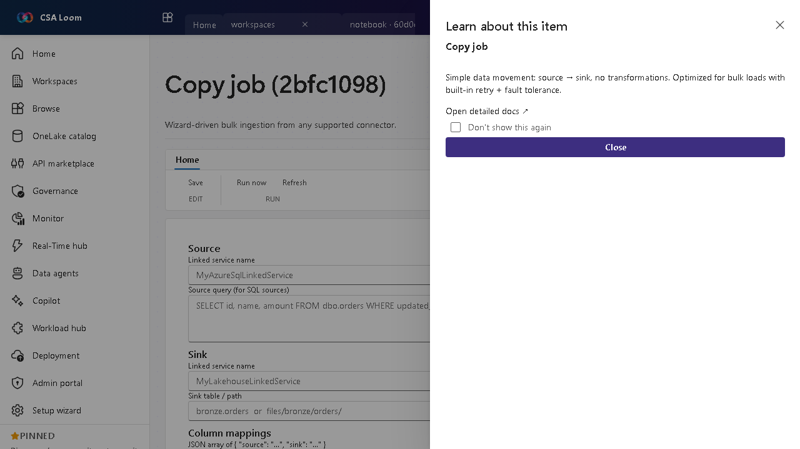

<!-- auto-generated by tools/uat-report.mjs — edits below this line are preserved on re-gen -->
# Tutorial: Copy job editor

> CSA Loom `copy-job` editor — verified working against a live console by the UAT harness on 2026-07-01.

## Open the editor

1. Sign in to your **CSA Loom Console** (for example `https://<your-console-host>`).
2. Open or create a workspace from the **Workspaces** page.
3. Click **+ New item** and choose **Copy job** from the catalog.
4. The editor opens at `/items/copy-job/<id>`:

## What this editor does

A Copy job is wizard-driven bulk ingestion from any supported connector — source to sink, no transforms. In Loom a run materializes a Synapse pipeline and triggers it, with run history sourced from queryPipelineRuns.

## Getting started

1. **Pick source and sink** — Choose a source connector and a destination; the wizard handles the mapping for bulk movement.
2. **Choose full or incremental** — Configure full copy or incremental load with a watermark column where supported.
3. **Run the job** — Run materializes a Synapse pipeline behind the scenes and triggers it.
4. **Review run history** — The runs list reads real pipeline run records so you can confirm rows moved and retry on failure.

## Learn more

- Microsoft Learn reference: [https://learn.microsoft.com/fabric/data-factory/what-is-copy-job](https://learn.microsoft.com/fabric/data-factory/what-is-copy-job)

## Verified by the UAT harness

- Tested at: `2026-05-26T13:51:12.248Z`
- Verdict: **A** (renders cleanly, real backend responded)
- Test source: [`apps/fiab-console/e2e/editors.uat.ts`](https://github.com/fgarofalo56/csa-inabox/blob/main/apps/fiab-console/e2e/editors.uat.ts)

<!-- end auto-generated -->