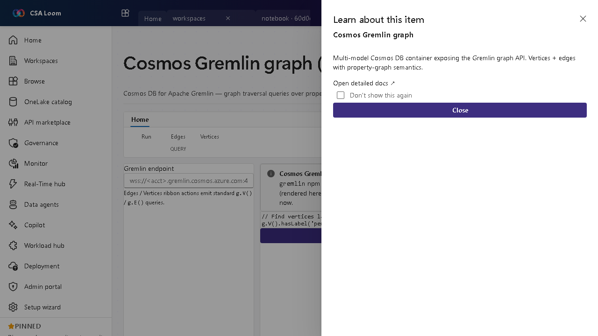

<!-- auto-generated by tools/uat-report.mjs — edits below this line are preserved on re-gen -->
# Tutorial: Cosmos Gremlin graph editor

> CSA Loom `cosmos-gremlin-graph` editor — verified working against a live console by the UAT harness on 2026-07-01.

## Open the editor

1. Sign in to your **CSA Loom Console** (for example `https://<your-console-host>`).
2. Open or create a workspace from the **Workspaces** page.
3. Click **+ New item** and choose **Cosmos Gremlin graph** from the catalog.
4. The editor opens at `/items/cosmos-gremlin-graph/<id>`:

## What this editor does

A Cosmos Gremlin graph is Cosmos DB for Apache Gremlin — graph traversal over property graphs. In Loom queries run via /api/items/cosmos-gremlin-graph/[id]/query (the gremlin npm client with AAD or account-key auth); a 501 surfaces if the runtime isn't configured.

## Getting started

1. **Connect the account** — The query route uses the gremlin client with AAD or account-key auth against the Cosmos Gremlin account.
2. **Write a traversal** — Author Gremlin steps (g.V().has(...).out(...)) over your property graph.
3. **Run the query** — Submit to the real query route; results render in the force-directed graph view.
4. **Handle not-configured** — If the runtime isn't configured the editor surfaces the 501 deferred message rather than faking data.

## Learn more

- Microsoft Learn reference: [https://learn.microsoft.com/azure/cosmos-db/gremlin/introduction](https://learn.microsoft.com/azure/cosmos-db/gremlin/introduction)

## Verified by the UAT harness

- Tested at: `2026-05-26T13:56:39.513Z`
- Verdict: **A** (renders cleanly, real backend responded)
- Test source: [`apps/fiab-console/e2e/editors.uat.ts`](https://github.com/fgarofalo56/csa-inabox/blob/main/apps/fiab-console/e2e/editors.uat.ts)

<!-- end auto-generated -->