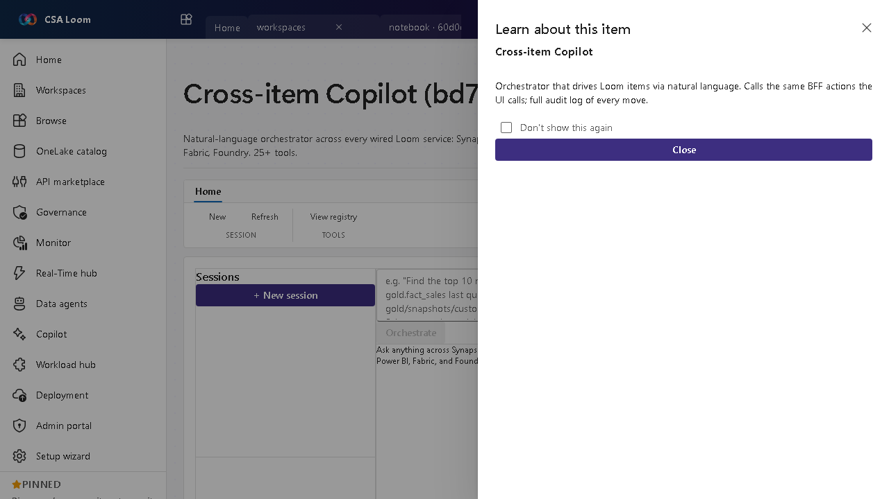

<!-- auto-generated by tools/uat-report.mjs — edits below this line are preserved on re-gen -->
# Tutorial: Cross-item Copilot editor

> CSA Loom `cross-item-copilot` editor — verified working against a live console by the UAT harness on 2026-07-01.

## Open the editor

1. Sign in to your **CSA Loom Console** (for example `https://<your-console-host>`).
2. Open or create a workspace from the **Workspaces** page.
3. Click **+ New item** and choose **Cross-item Copilot** from the catalog.
4. The editor opens at `/items/cross-item-copilot/<id>`:

## What this editor does

The Cross-item Copilot is a natural-language orchestrator across every wired Loom service — Synapse, Lakehouse, Databricks, APIM, ADX, ADF, Power BI, Fabric, Foundry (25+ tools). In Loom it streams from POST /api/copilot/orchestrate via SSE and calls the same BFF actions the UI calls, with a full audit log.

## Getting started

1. **Start a session** — Open a session in the left rail; the right rail lists registered tools grouped by service.
2. **Ask in natural language** — Describe the task; the orchestrator streams its plan and steps live via SSE.
3. **Watch tool calls** — Each step calls the same BFF action the UI uses against real services.
4. **Audit every move** — Review the full audit log of actions the Copilot performed.

## Learn more

- Microsoft Learn reference: [https://learn.microsoft.com/fabric/fundamentals/copilot-fabric-overview](https://learn.microsoft.com/fabric/fundamentals/copilot-fabric-overview)

## Verified by the UAT harness

- Tested at: `2026-05-26T13:56:01.395Z`
- Verdict: **A** (renders cleanly, real backend responded)
- Test source: [`apps/fiab-console/e2e/editors.uat.ts`](https://github.com/fgarofalo56/csa-inabox/blob/main/apps/fiab-console/e2e/editors.uat.ts)

<!-- end auto-generated -->