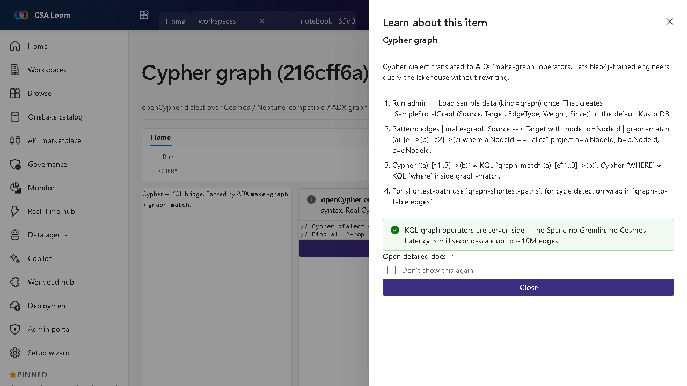

<!-- auto-generated by tools/uat-report.mjs — edits below this line are preserved on re-gen -->
# Tutorial: Cypher graph editor

> CSA Loom `cypher-graph` editor — verified working against a live console by the UAT harness on 2026-07-01.

## Open the editor

1. Sign in to your **CSA Loom Console** (for example `https://<your-console-host>`).
2. Open or create a workspace from the **Workspaces** page.
3. Click **+ New item** and choose **Cypher graph** from the catalog.
4. The editor opens at `/items/cypher-graph/<id>`:

## What this editor does

A Cypher graph lets Neo4j-trained engineers use the openCypher dialect; in Loom it is translated to ADX make-graph/graph-match operators and dispatched via the KQL database query route — server-side, no Spark or Gremlin, millisecond-scale up to ~10M edges.

## Getting started

1. **Load sample data** — Run admin Load sample data (kind=graph) once to create SampleSocialGraph in the default Kusto DB.
2. **Write Cypher** — Author Cypher patterns; (a)-[*1..3]->(b) maps to KQL graph-match (a)-[e*1..3]->(b).
3. **Run via KQL backend** — The translator emits make-graph + graph-match and dispatches to the KQL database query route.
4. **Use path operators** — For shortest path use graph-shortest-paths; results render in the graph view.

## Learn more

- Microsoft Learn reference: [https://learn.microsoft.com/azure/data-explorer/kusto/query/graph-operators](https://learn.microsoft.com/azure/data-explorer/kusto/query/graph-operators)

## Verified by the UAT harness

- Tested at: `2026-05-26T13:56:43.549Z`
- Verdict: **A** (renders cleanly, real backend responded)
- Test source: [`apps/fiab-console/e2e/editors.uat.ts`](https://github.com/fgarofalo56/csa-inabox/blob/main/apps/fiab-console/e2e/editors.uat.ts)

<!-- end auto-generated -->