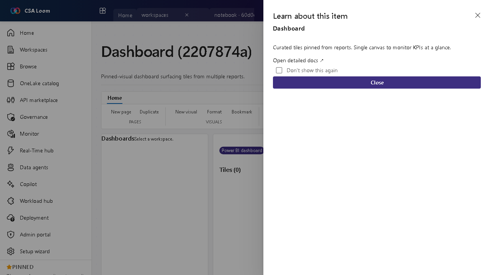

<!-- auto-generated by tools/uat-report.mjs — edits below this line are preserved on re-gen -->
# Tutorial: Dashboard editor

> CSA Loom `dashboard` editor — verified working against a live console by the UAT harness on 2026-07-01.

## Open the editor

1. Sign in to your **CSA Loom Console** (for example `https://<your-console-host>`).
2. Open or create a workspace from the **Workspaces** page.
3. Click **+ New item** and choose **Dashboard** from the catalog.
4. The editor opens at `/items/dashboard/<id>`:

## What this editor does

A Dashboard is a pinned-visual canvas surfacing tiles from multiple reports. In Loom it is wired against live Power BI REST via the Console UAMI. Use it to monitor KPIs at a glance across reports.

## Getting started

1. **Pin tiles** — Pin visuals from one or more reports onto the dashboard canvas.
2. **Arrange the layout** — Size and position tiles so the most important KPIs read first.
3. **Embed and view** — Loom embeds the dashboard for in-console monitoring.
4. **Mind tenant gating** — If the Console UAMI isn't yet registered in the Power BI tenant or workspace, the editor surfaces the 401/403 with a remediation hint.

## Learn more

- Microsoft Learn reference: [https://learn.microsoft.com/power-bi/create-reports/service-dashboards](https://learn.microsoft.com/power-bi/create-reports/service-dashboards)

## Verified by the UAT harness

- Tested at: `2026-05-26T13:51:57.206Z`
- Verdict: **A** (renders cleanly, real backend responded)
- Test source: [`apps/fiab-console/e2e/editors.uat.ts`](https://github.com/fgarofalo56/csa-inabox/blob/main/apps/fiab-console/e2e/editors.uat.ts)

<!-- end auto-generated -->