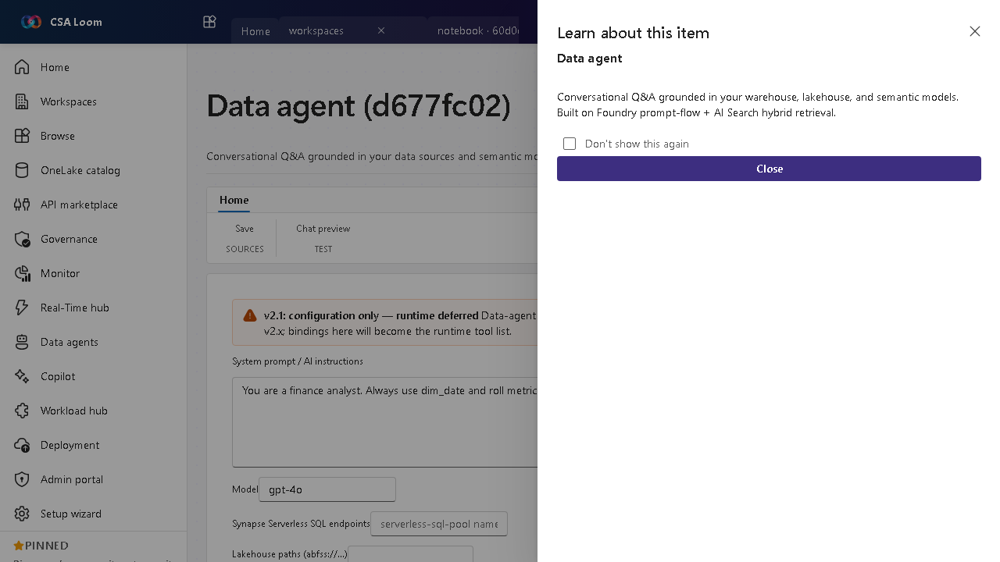

<!-- auto-generated by tools/uat-report.mjs — edits below this line are preserved on re-gen -->
# Tutorial: Data agent editor

> CSA Loom `data-agent` editor — verified working against a live console by the UAT harness on 2026-07-01.

## Open the editor

1. Sign in to your **CSA Loom Console** (for example `https://<your-console-host>`).
2. Open or create a workspace from the **Workspaces** page.
3. Click **+ New item** and choose **Data agent** from the catalog.
4. The editor opens at `/items/data-agent/<id>`:

## What this editor does

A Data agent is conversational Q&A grounded in your data sources — warehouse, lakehouse, KQL, AI Search, graph, and semantic models. In Loom the **Build** tab binds up to 5 sources, each scoped with a real schema tree; **Config Copilot**, **Test chat**, **Evaluate**, **Publish**, **Consume**, **Run inspector**, and **Monitoring** round out the lifecycle. Azure-native — no Microsoft Fabric required.

## Getting started

1. **Pick data sources** — On the **Build** tab bind up to 5 sources — warehouse, lakehouse, KQL / Eventhouse, AI Search, graph, or semantic model — and give each instructions and example questions.
2. **Scope the schema** — Expand each source's schema tree — real Tables / Views / Functions / Fields read live from the backend (Synapse INFORMATION_SCHEMA, ADX `.show tables`, AI Search index) — and check exactly which objects the agent may query. No freeform table strings.
3. **Draft with Config Copilot** — The **Config Copilot** tab drafts instructions and source descriptions from your bound schema so grounding starts strong.
4. **Test questions** — Use **Test chat** to ask sample business questions and verify the agent queries the right sources; the **Run inspector** shows each tool call and query.
5. **Evaluate and publish** — Score the agent against a question set on **Evaluate**, then **Publish** and share the **Consume** endpoint; **Monitoring** tracks usage over time.

## Learn more

- Microsoft Learn reference: [https://learn.microsoft.com/fabric/fundamentals/fabric-iq](https://learn.microsoft.com/fabric/fundamentals/fabric-iq)

## Verified by the UAT harness

- Tested at: `2026-05-26T13:52:55.447Z`
- Verdict: **A** (renders cleanly, real backend responded)
- Test source: [`apps/fiab-console/e2e/editors.uat.ts`](https://github.com/fgarofalo56/csa-inabox/blob/main/apps/fiab-console/e2e/editors.uat.ts)

<!-- end auto-generated -->