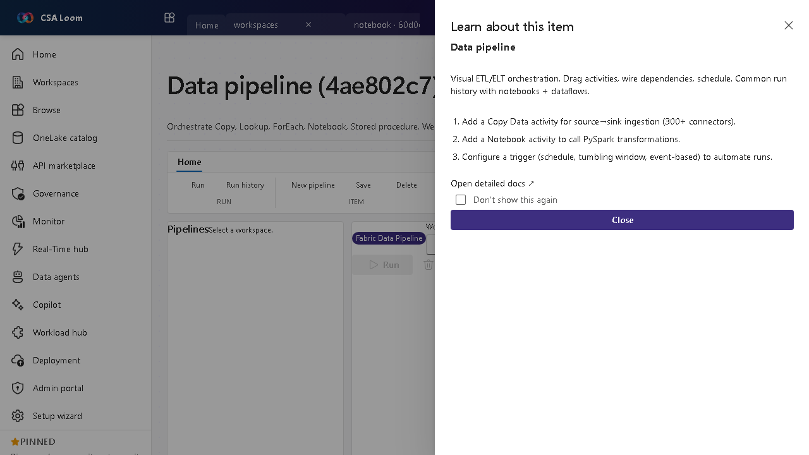

<!-- auto-generated by tools/uat-report.mjs — edits below this line are preserved on re-gen -->
# Tutorial: Data pipeline editor

> CSA Loom `data-pipeline` editor — verified working against a live console by the UAT harness on 2026-07-01.

## Open the editor

1. Sign in to your **CSA Loom Console** (for example `https://<your-console-host>`).
2. Open or create a workspace from the **Workspaces** page.
3. Click **+ New item** and choose **Data pipeline** from the catalog.
4. The editor opens at `/items/data-pipeline/<id>`:

## What this editor does

A Data pipeline is visual ETL/ELT orchestration — Copy, Lookup, ForEach, Notebook, Stored procedure, Web and more. Azure-native by default: authored on the standalone Azure Data Factory runtime (or a Synapse workspace), with Microsoft Fabric available as an opt-in runtime. Shares run history with notebooks and dataflows.

## Getting started

1. **Add a Copy activity** — Use Copy Data for source-to-sink ingestion across the supported connector set.
2. **Call a Notebook** — Add a Notebook activity to run PySpark transformations inline in the orchestration.
3. **Wire dependencies** — Connect activities with success/failure conditions on the designer canvas to control flow.
4. **Schedule a trigger** — Configure a schedule, tumbling window, or event-based trigger to automate runs and review run history.

## Learn more

- Microsoft Learn reference: [https://learn.microsoft.com/fabric/data-factory/data-factory-overview](https://learn.microsoft.com/fabric/data-factory/data-factory-overview)

## Verified by the UAT harness

- Tested at: `2026-05-26T13:50:45.325Z`
- Verdict: **A** (renders cleanly, real backend responded)
- Test source: [`apps/fiab-console/e2e/editors.uat.ts`](https://github.com/fgarofalo56/csa-inabox/blob/main/apps/fiab-console/e2e/editors.uat.ts)

<!-- end auto-generated -->