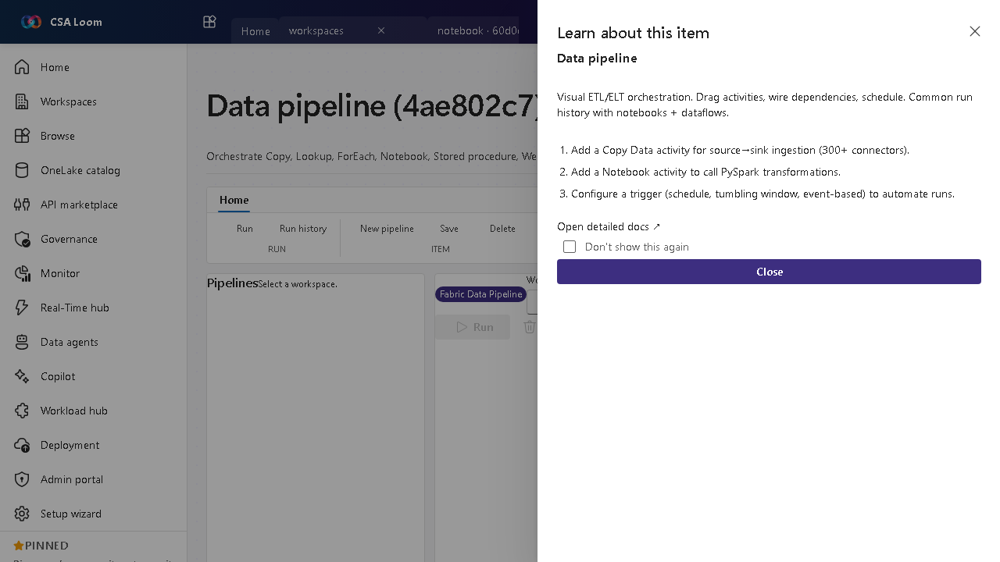

<!-- auto-generated by tools/uat-report.mjs — this block is REGENERATED from the item's catalog `learnContent`; hand-written sections BELOW the end marker are preserved -->
# Tutorial: Data pipeline editor

> CSA Loom `data-pipeline` editor — verified working against a live console by the UAT harness on 2026-07-01.

## Open the editor

1. Sign in to your **CSA Loom Console** (for example `https://<your-console-host>`).
2. Open or create a workspace from the **Workspaces** page.
3. Click **+ New item** and choose **Data pipeline** from the catalog.
4. The editor opens at `/items/data-pipeline/<id>`:

## What this editor does

A Data pipeline is visual ETL/ELT orchestration — Copy, Lookup, ForEach, Notebook, Stored procedure, Web and more. Azure-native by default: authored on the standalone Azure Data Factory runtime (or a Synapse workspace), with Microsoft Fabric available as an opt-in runtime. Shares run history with notebooks and dataflows.

## Getting started

1. **Add a Copy activity** — Use Copy Data for source-to-sink ingestion across the supported connector set.
2. **Call a Notebook** — Add a Notebook activity to run PySpark transformations inline in the orchestration.
3. **Wire dependencies** — Connect activities with success/failure conditions on the designer canvas to control flow.
4. **Publish, then Debug** — Publish deploys the pipeline to Azure Data Factory so it can run. Debug dispatches a run and streams its receipts back onto the canvas: each activity node paints its live run status, the run strip shows overall progress with Rerun from failed, and the eyeglass on a node opens the run's input / output / error JSON.
5. **Schedule a trigger** — Configure a schedule, tumbling window, or event-based trigger to automate runs and review run history.

## Learn more

- Microsoft Learn reference: [https://learn.microsoft.com/azure/data-factory/introduction](https://learn.microsoft.com/azure/data-factory/introduction)

## Verified by the UAT harness

- Tested at: `2026-05-26T13:50:45.325Z`
- Verdict: **A** (renders cleanly, real backend responded)
- Test source: [`apps/fiab-console/e2e/editors.uat.ts`](https://github.com/fgarofalo56/csa-inabox/blob/main/apps/fiab-console/e2e/editors.uat.ts)

<!-- end auto-generated -->

## Debug runs on the canvas

**Home → Run** has three actions in order: **Publish** (deploy the pipeline to
Azure Data Factory), **Run** (queue a real trigger run), and **Debug**
(dispatch a debug run). All three are enabled as soon as a pipeline is selected
or created. You do not have to remember to publish: if Run or Debug hits a
pipeline with no ADF backing yet, the editor toasts "Publishing to ADF first…",
publishes, and retries the dispatch once.

**Run** queues the trigger run and switches to the Output tab. **Debug** keeps
you on the canvas and streams its receipts **onto** it, not only into a table:

- **Per-activity status on the node.** Each activity node's status chip switches
  to that activity's run status — queued / running / succeeded / failed /
  skipped / cancelled — with a detail line: `Running…` while it is in flight,
  the error code when it fails, and the elapsed duration once it finishes.
- **The run strip.** A compact banner over the canvas shows a short run id, the
  derived overall status, an `N/M activities` progress count, and a spinner
  while the poller is still streaming. If the run ends **Failed**, the strip
  offers **Rerun from failed** — a real ADF recovery run
  (`isRecovery` + `startFromFailure`) against the same run id. Dismiss clears
  the overlay.
- **The eyeglass.** Hover or select a node that has a receipt and its action bar
  leads with **View run details**, which opens that activity's status, duration,
  and the input / output / error JSON the ADF `queryActivityRuns` API returned.
  Where the host wires it, the dialog also offers **Rerun from this activity**
  (`isRecovery` + `startActivityName`).

Both pipeline canvases carry this — the data-pipeline editor's own canvas and
the shared **PipelineDesigner** used by the other pipeline-hosting editors.

## The Output dock

**Output → Show output dock** docks the Output pane (Monitor + Debug run tables
over the same `queryPipelineRuns` / `queryActivityRuns` calls) directly under
the graph, so a run's receipts and the canvas are visible together. A Debug
dispatch opens it automatically instead of navigating away to the Output tab
and hiding the graph.

The dock's height is drag-resizable (pointer or keyboard) and the size persists
per user under `loom.canvasHeight.data-pipeline-output-dock`.
**Output → Open Output tab** still switches to the full-page Output view, and
**Pin output** keeps it open across runs.

## One run path

The canvas overlay does not run anything itself. The existing surfaces — the
ribbon **Debug** dispatch, the Debug run panel's poller, and the Monitor
drill-down — publish the rows they already fetched from the `/output` and
`/runs` BFF routes into a small store keyed by the pipeline item id, and the
canvas subscribes to it. There is exactly one run path and one set of ADF /
Synapse calls behind everything above.

### Kill-switch

The on-canvas paint is behind the default-ON runtime flag
`u13-pipeline-run-overlay` (Admin → Runtime flags). Turning it OFF reverts both
canvases to the pre-U13 glyph-less rendering on the next render. The Output
pane, the Debug dispatch, recovery reruns, and every `/output` and `/runs`
route keep working — only the canvas paint is gated.

## No Fabric required

The default runtime is a standalone Azure Data Factory (Synapse is the other
Azure-native option). Fabric is selectable at create time as an opt-in runtime
and is never required for a pipeline to author, publish, debug, run, or
schedule.
