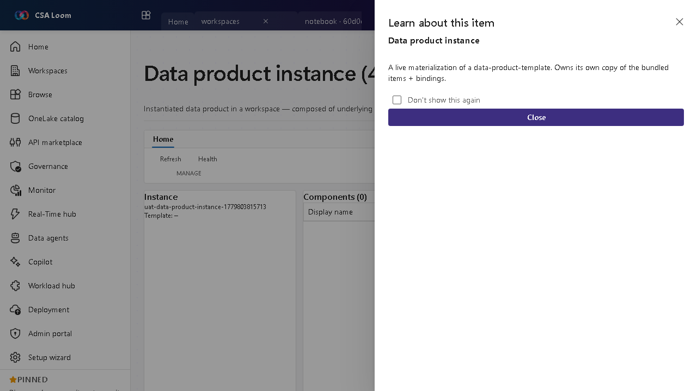

<!-- auto-generated by tools/uat-report.mjs — edits below this line are preserved on re-gen -->
# Tutorial: Data product instance editor

> CSA Loom `data-product-instance` editor — verified working against a live console by the UAT harness on 2026-07-01.

## Open the editor

1. Sign in to your **CSA Loom Console** (for example `https://<your-console-host>`).
2. Open or create a workspace from the **Workspaces** page.
3. Click **+ New item** and choose **Data product instance** from the catalog.
4. The editor opens at `/items/data-product-instance/<id>`:

## What this editor does

A Data product instance is an instantiated data product in a workspace — composed of underlying items (pipelines, lakehouses, indexes). In Loom it shows the spawned components and a status table; health is best-effort from child items' updatedAt.

## Getting started

1. **Review components** — See the items spawned for this instance and their bindings.
2. **Check status** — The status table summarizes each component's state.
3. **Read health** — Health is best-effort, peeking at child items' updatedAt to flag staleness.
4. **Open a component** — Drill into any underlying item (pipeline, lakehouse, index) to operate it.

## Learn more

- Microsoft Learn reference: [https://learn.microsoft.com/purview/concept-data-products](https://learn.microsoft.com/purview/concept-data-products)

## Verified by the UAT harness

- Tested at: `2026-05-26T13:56:59.496Z`
- Verdict: **A** (renders cleanly, real backend responded)
- Test source: [`apps/fiab-console/e2e/editors.uat.ts`](https://github.com/fgarofalo56/csa-inabox/blob/main/apps/fiab-console/e2e/editors.uat.ts)

<!-- end auto-generated -->