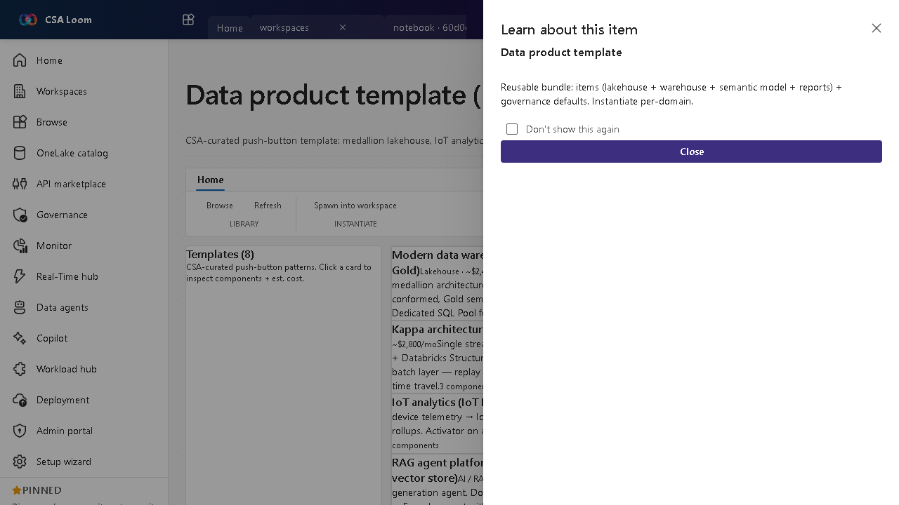

<!-- auto-generated by tools/uat-report.mjs — edits below this line are preserved on re-gen -->
# Tutorial: Data product template editor

> CSA Loom `data-product-template` editor — verified working against a live console by the UAT harness on 2026-07-01.

## Open the editor

1. Sign in to your **CSA Loom Console** (for example `https://<your-console-host>`).
2. Open or create a workspace from the **Workspaces** page.
3. Click **+ New item** and choose **Data product template** from the catalog.
4. The editor opens at `/items/data-product-template/<id>`:

## What this editor does

A Data product template is a CSA-curated push-button bundle — medallion lakehouse, IoT analytics, federated mesh, RAG agent, geospatial. In Loom Instantiate POSTs to /api/items/data-product-template/[slug]/instantiate to spawn the underlying items.

## Getting started

1. **Browse the gallery** — Templates render as a grid of CSA-curated patterns.
2. **Open a template** — Click to see its components and estimated cost.
3. **Instantiate** — Instantiate POSTs to the instantiate route, spawning the bundled items in your workspace.
4. **Manage the instance** — Track the resulting data-product instance for status and health.

## Learn more

- Microsoft Learn reference: [https://learn.microsoft.com/purview/concept-data-products](https://learn.microsoft.com/purview/concept-data-products)

## Verified by the UAT harness

- Tested at: `2026-05-26T13:56:55.459Z`
- Verdict: **A** (renders cleanly, real backend responded)
- Test source: [`apps/fiab-console/e2e/editors.uat.ts`](https://github.com/fgarofalo56/csa-inabox/blob/main/apps/fiab-console/e2e/editors.uat.ts)

<!-- end auto-generated -->