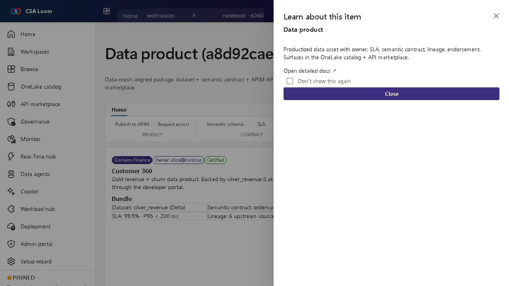

<!-- auto-generated by tools/uat-report.mjs — edits below this line are preserved on re-gen -->
# Tutorial: Data product editor

> CSA Loom `data-product` editor — verified working against a live console by the UAT harness on 2026-07-01.

## Open the editor

1. Sign in to your **CSA Loom Console** (for example `https://<your-console-host>`).
2. Open or create a workspace from the **Workspaces** page.
3. Click **+ New item** and choose **Data product** from the catalog.
4. The editor opens at `/items/data-product/<id>`:

## What this editor does

A Data product is a data-mesh-aligned package — dataset plus semantic contract, an APIM API, an access policy, and an owner — listed in the marketplace. In Loom the Publish-to-APIM button POSTs a real product as an idempotent upsert.

## Getting started

1. **Define the contract** — Describe the dataset, its semantic contract, owner, and SLA.
2. **Set the access policy** — Define who can subscribe and under what terms.
3. **Publish to APIM** — Publish-to-APIM POSTs a real APIM product (idempotent upsert) fronting the data product.
4. **List in the marketplace** — The product surfaces in the Purview / Loom catalog and the API marketplace for discovery.

## Learn more

- Microsoft Learn reference: [https://learn.microsoft.com/purview/concept-data-products](https://learn.microsoft.com/purview/concept-data-products)

## Verified by the UAT harness

- Tested at: `2026-05-26T13:54:13.398Z`
- Verdict: **A** (renders cleanly, real backend responded)
- Test source: [`apps/fiab-console/e2e/editors.uat.ts`](https://github.com/fgarofalo56/csa-inabox/blob/main/apps/fiab-console/e2e/editors.uat.ts)

<!-- end auto-generated -->