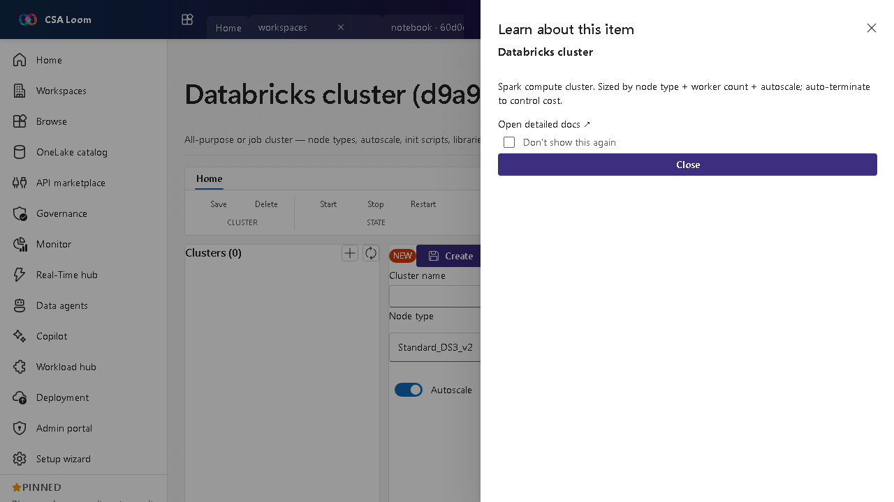

<!-- auto-generated by tools/uat-report.mjs — edits below this line are preserved on re-gen -->
# Tutorial: Databricks cluster editor

> CSA Loom `databricks-cluster` editor — verified working against a live console by the UAT harness on 2026-07-01.

## Open the editor

1. Sign in to your **CSA Loom Console** (for example `https://<your-console-host>`).
2. Open or create a workspace from the **Workspaces** page.
3. Click **+ New item** and choose **Databricks cluster** from the catalog.
4. The editor opens at `/items/databricks-cluster/<id>`:

## What this editor does

A Databricks cluster is all-purpose or job Spark compute — node types, autoscale, init scripts, libraries. In Loom it is managed against the Loom-deployed Databricks workspace. Auto-terminate controls cost.

## Getting started

1. **Pick node type and size** — Choose driver/worker node types and a fixed or autoscaling worker count.
2. **Add libraries and init scripts** — Attach libraries and init scripts the workloads need at startup.
3. **Set auto-terminate** — Configure an idle auto-terminate window so the cluster stops billing when unused.
4. **Start and attach** — Start the cluster and attach notebooks or jobs to it.

## Learn more

- Microsoft Learn reference: [https://learn.microsoft.com/azure/databricks/compute/](https://learn.microsoft.com/azure/databricks/compute/)

## Verified by the UAT harness

- Tested at: `2026-05-26T13:53:32.207Z`
- Verdict: **A** (renders cleanly, real backend responded)
- Test source: [`apps/fiab-console/e2e/editors.uat.ts`](https://github.com/fgarofalo56/csa-inabox/blob/main/apps/fiab-console/e2e/editors.uat.ts)

<!-- end auto-generated -->