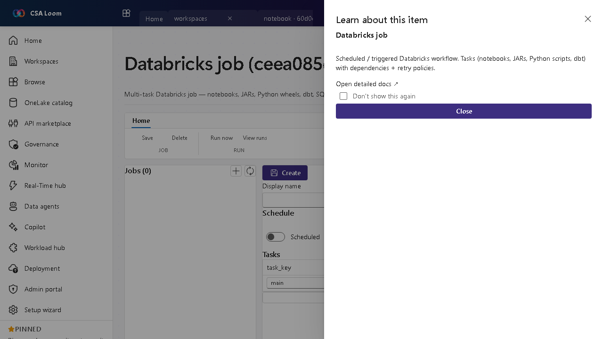

<!-- auto-generated by tools/uat-report.mjs — edits below this line are preserved on re-gen -->
# Tutorial: Databricks job editor

> CSA Loom `databricks-job` editor — verified working against a live console by the UAT harness on 2026-07-01.

## Open the editor

1. Sign in to your **CSA Loom Console** (for example `https://<your-console-host>`).
2. Open or create a workspace from the **Workspaces** page.
3. Click **+ New item** and choose **Databricks job** from the catalog.
4. The editor opens at `/items/databricks-job/<id>`:

## What this editor does

A Databricks job is a multi-task workflow — notebooks, JARs, Python wheels, dbt, SQL — with dependencies and retry policies. In Loom it runs against the Loom-deployed Databricks workspace via the jobs API.

## Getting started

1. **Add tasks** — Compose tasks from notebooks, JARs, Python wheels, dbt, or SQL.
2. **Wire dependencies** — Set task dependencies and per-task retry policies.
3. **Trigger run-now** — Run the job on demand or schedule it; runs surface from jobs/runs/list.
4. **Inspect runs** — Review real run records to see task status, output, and failures.

## Learn more

- Microsoft Learn reference: [https://learn.microsoft.com/azure/databricks/jobs/](https://learn.microsoft.com/azure/databricks/jobs/)

## Verified by the UAT harness

- Tested at: `2026-05-26T13:53:23.082Z`
- Verdict: **A** (renders cleanly, real backend responded)
- Test source: [`apps/fiab-console/e2e/editors.uat.ts`](https://github.com/fgarofalo56/csa-inabox/blob/main/apps/fiab-console/e2e/editors.uat.ts)

<!-- end auto-generated -->