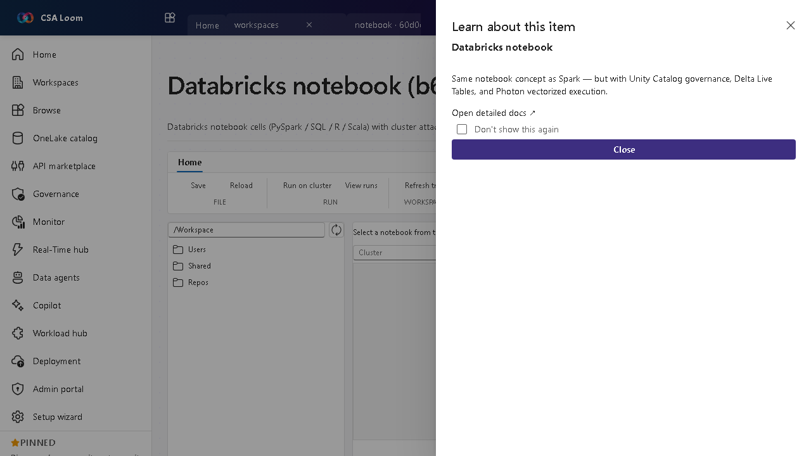

<!-- auto-generated by tools/uat-report.mjs — edits below this line are preserved on re-gen -->
# Tutorial: Databricks notebook editor

> CSA Loom `databricks-notebook` editor — verified working against a live console by the UAT harness on 2026-07-01.

## Open the editor

1. Sign in to your **CSA Loom Console** (for example `https://<your-console-host>`).
2. Open or create a workspace from the **Workspaces** page.
3. Click **+ New item** and choose **Databricks notebook** from the catalog.
4. The editor opens at `/items/databricks-notebook/<id>`:

## What this editor does

A Databricks notebook runs PySpark/SQL/R/Scala cells with cluster attach, Unity Catalog governance, and Photon execution. In Loom it is wired against the Loom-deployed Databricks workspace via Container App MI and AAD bearer tokens.

## Getting started

1. **Attach a cluster** — Attach the notebook to an all-purpose or job cluster before running cells.
2. **Use Unity Catalog** — Read and write tables governed by Unity Catalog three-part names (catalog.schema.table).
3. **Run cells** — Execute PySpark, SQL, R, or Scala cells; Photon accelerates SQL.
4. **Promote to a job** — Schedule the notebook as a task in a Databricks job for unattended runs.

## Learn more

- Microsoft Learn reference: [https://learn.microsoft.com/azure/databricks/notebooks/](https://learn.microsoft.com/azure/databricks/notebooks/)

## Verified by the UAT harness

- Tested at: `2026-05-26T13:53:18.996Z`
- Verdict: **A** (renders cleanly, real backend responded)
- Test source: [`apps/fiab-console/e2e/editors.uat.ts`](https://github.com/fgarofalo56/csa-inabox/blob/main/apps/fiab-console/e2e/editors.uat.ts)

<!-- end auto-generated -->