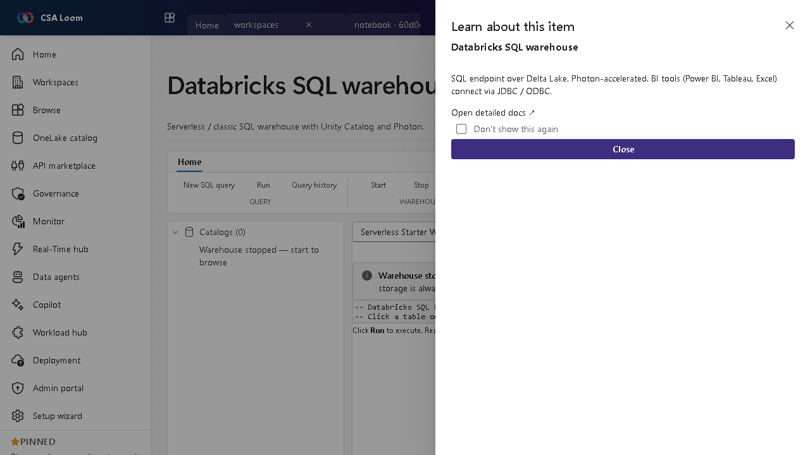

<!-- auto-generated by tools/uat-report.mjs — edits below this line are preserved on re-gen -->
# Tutorial: Databricks SQL warehouse editor

> CSA Loom `databricks-sql-warehouse` editor — verified working against a live console by the UAT harness on 2026-07-01.

## Open the editor

1. Sign in to your **CSA Loom Console** (for example `https://<your-console-host>`).
2. Open or create a workspace from the **Workspaces** page.
3. Click **+ New item** and choose **Databricks SQL warehouse** from the catalog.
4. The editor opens at `/items/databricks-sql-warehouse/<id>`:

## What this editor does

A Databricks SQL warehouse is a serverless or classic SQL endpoint over Delta Lake with Unity Catalog and Photon. In Loom it lists real warehouses and runs statements via /api/2.0/sql against the Loom-deployed workspace.

## Getting started

1. **Start a warehouse** — Lists real warehouses; start/stop via the /start and /stop endpoints.
2. **Browse Unity Catalog** — Run SHOW CATALOGS/SCHEMAS/TABLES to navigate governed data.
3. **Run SQL** — Execute statements via /api/2.0/sql/statements with result polling.
4. **Connect BI tools** — Point Power BI, Tableau, or Excel at the warehouse via JDBC/ODBC.

## Learn more

- Microsoft Learn reference: [https://learn.microsoft.com/azure/databricks/sql/admin/sql-endpoints](https://learn.microsoft.com/azure/databricks/sql/admin/sql-endpoints)

## Verified by the UAT harness

- Tested at: `2026-05-26T13:53:36.426Z`
- Verdict: **A** (renders cleanly, real backend responded)
- Test source: [`apps/fiab-console/e2e/editors.uat.ts`](https://github.com/fgarofalo56/csa-inabox/blob/main/apps/fiab-console/e2e/editors.uat.ts)

<!-- end auto-generated -->