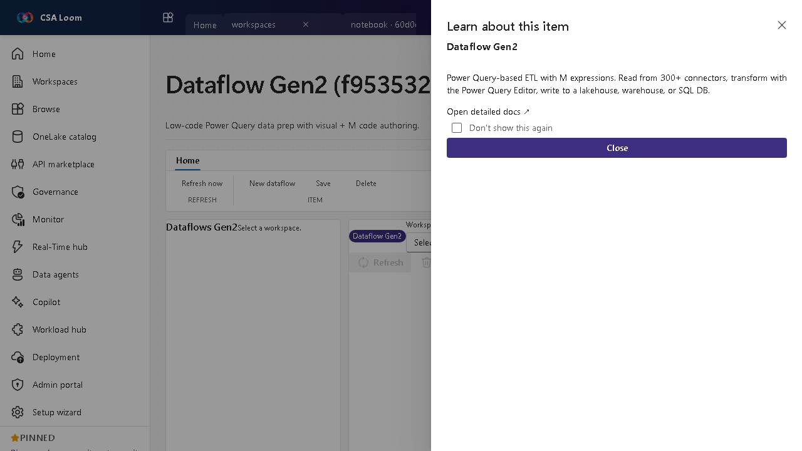

<!-- auto-generated by tools/uat-report.mjs — edits below this line are preserved on re-gen -->
# Tutorial: Dataflow Gen2 editor

> CSA Loom `dataflow` editor — verified working against a live console by the UAT harness on 2026-07-01.

## Open the editor

1. Sign in to your **CSA Loom Console** (for example `https://<your-console-host>`).
2. Open or create a workspace from the **Workspaces** page.
3. Click **+ New item** and choose **Dataflow Gen2** from the catalog.
4. The editor opens at `/items/dataflow/<id>`:

## What this editor does

Dataflow Gen2 is low-code Power Query data prep with visual and M-code authoring. In Loom you read from the supported connector set, transform in the Power Query editor, and write to a lakehouse, warehouse, or SQL DB.

## Getting started

1. **Connect a source** — Pick a connector and authenticate; the Power Query editor previews the data.
2. **Shape with Power Query** — Apply transform steps visually or drop into the M expression bar for fine control.
3. **Set a destination** — Map the output to a Lakehouse, Warehouse, or SQL database table.
4. **Refresh and schedule** — Run a refresh to materialize the output and schedule recurring refreshes.

## Learn more

- Microsoft Learn reference: [https://learn.microsoft.com/fabric/data-factory/dataflows-gen2-overview](https://learn.microsoft.com/fabric/data-factory/dataflows-gen2-overview)

## Verified by the UAT harness

- Tested at: `2026-05-26T13:50:49.330Z`
- Verdict: **A** (renders cleanly, real backend responded)
- Test source: [`apps/fiab-console/e2e/editors.uat.ts`](https://github.com/fgarofalo56/csa-inabox/blob/main/apps/fiab-console/e2e/editors.uat.ts)

<!-- end auto-generated -->