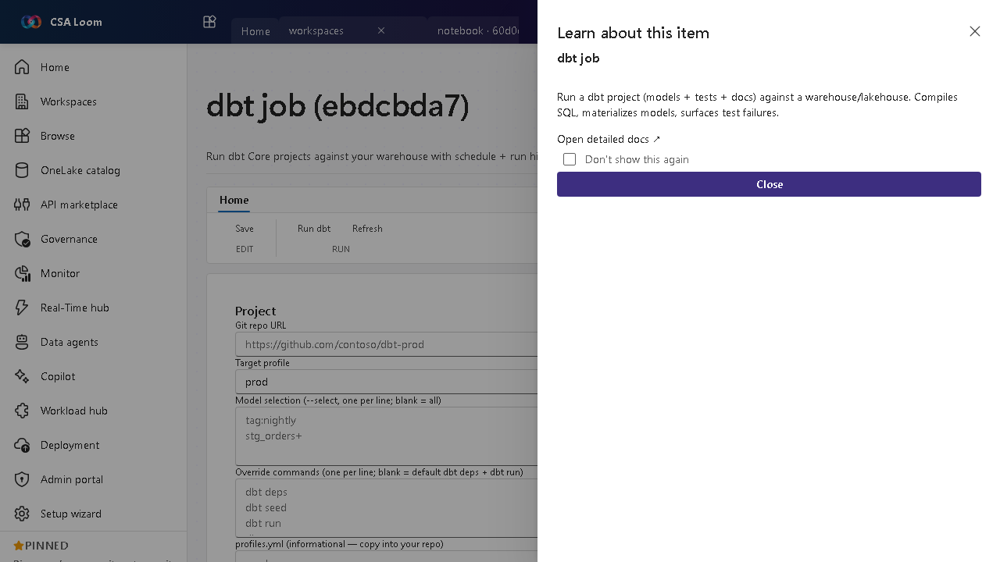

<!-- auto-generated by tools/uat-report.mjs — edits below this line are preserved on re-gen -->
# Tutorial: dbt job editor

> CSA Loom `dbt-job` editor — verified working against a live console by the UAT harness on 2026-07-01.

## Open the editor

1. Sign in to your **CSA Loom Console** (for example `https://<your-console-host>`).
2. Open or create a workspace from the **Workspaces** page.
3. Click **+ New item** and choose **dbt job** from the catalog.
4. The editor opens at `/items/dbt-job/<id>`:

## What this editor does

A dbt job is a visual dbt model/project builder. Draw a medallion DAG on a canvas — sources feed bronze/silver/gold models with materializations and tests — and Loom generates a real dbt Core project (dbt_project.yml, profiles.yml, models, schema.yml). Runs execute Azure-native: the Databricks target runs natively as a Databricks Job dbt_task; the Synapse dedicated SQL pool (and opt-in Fabric Warehouse) run in the loom-dbt-runner Container App (dbt-synapse + ODBC). No Microsoft Fabric dependency.

## Getting started

1. **Draw the model graph** — Add Source nodes, then Bronze/Silver/Gold model nodes. Wire ref()/source() lineage by selecting upstream models/sources; pick a materialization (view/table/incremental/ephemeral) and add column + model tests.
2. **Pick a target** — Choose the run target adapter: Databricks (Azure-native default), Synapse dedicated SQL pool, or opt-in Fabric Warehouse. The same project runs on any of them by swapping only the profiles.yml adapter.
3. **Generate project files** — Generate the real dbt project files from the graph and preview every file (dbt_project.yml, profiles.yml, per-layer model SQL, sources.yml, schema.yml) before running.
4. **Run + inspect** — Run dbt. Databricks runs push the project to a workspace folder and trigger a Job dbt_task; Synapse/Fabric runs return the dbt log + per-node results. The runs list reads real Databricks run records.

## Learn more

- Microsoft Learn reference: [https://docs.getdbt.com/docs/build/projects](https://docs.getdbt.com/docs/build/projects)

## Verified by the UAT harness

- Tested at: `2026-05-26T13:51:16.586Z`
- Verdict: **A** (renders cleanly, real backend responded)
- Test source: [`apps/fiab-console/e2e/editors.uat.ts`](https://github.com/fgarofalo56/csa-inabox/blob/main/apps/fiab-console/e2e/editors.uat.ts)

<!-- end auto-generated -->