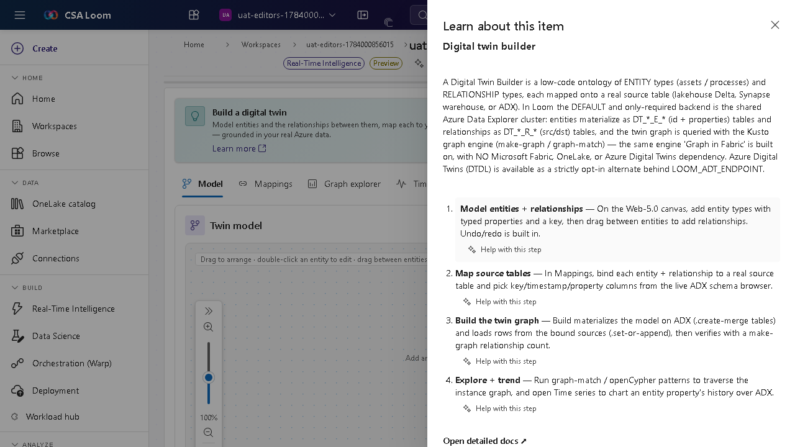

# digital-twin editor

> Auto-generated from the Loom UAT harness on 2026-07-14. Edits welcome.

Auto-captured walkthrough of the digital-twin editor in CSA Loom. Confirmed working against v3.18 of the console on 2026-07-14.

## Walkthrough

### Step 1 — Open the digital-twin editor from the +New menu in any workspace.

