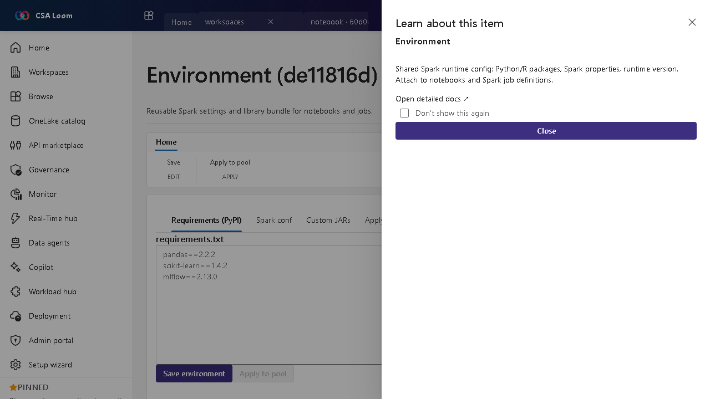

<!-- auto-generated by tools/uat-report.mjs — edits below this line are preserved on re-gen -->
# Tutorial: Environment editor

> CSA Loom `environment` editor — verified working against a live console by the UAT harness on 2026-07-01.

## Open the editor

1. Sign in to your **CSA Loom Console** (for example `https://<your-console-host>`).
2. Open or create a workspace from the **Workspaces** page.
3. Click **+ New item** and choose **Environment** from the catalog.
4. The editor opens at `/items/environment/<id>`:

## What this editor does

An Environment is a reusable bundle of Spark settings and libraries that you attach to notebooks and Spark job definitions. In Loom the spec persists to Cosmos and Apply to pool PUTs it onto the Synapse Spark pool.

## Getting started

1. **Define libraries** — List the Python/R packages and Spark properties you want standardized across notebooks.
2. **Set the runtime version** — Pin the Spark runtime version so jobs are reproducible across the team.
3. **Apply to a pool** — Use Apply to pool to push the environment spec onto the Synapse Spark pool via its PUT endpoint.
4. **Attach to items** — Reference the environment from notebooks and Spark job definitions so they all share the same runtime.

## Learn more

- Microsoft Learn reference: [https://learn.microsoft.com/fabric/data-engineering/environment-manage-customization](https://learn.microsoft.com/fabric/data-engineering/environment-manage-customization)

## Verified by the UAT harness

- Tested at: `2026-05-26T13:51:01.923Z`
- Verdict: **A** (renders cleanly, real backend responded)
- Test source: [`apps/fiab-console/e2e/editors.uat.ts`](https://github.com/fgarofalo56/csa-inabox/blob/main/apps/fiab-console/e2e/editors.uat.ts)

<!-- end auto-generated -->